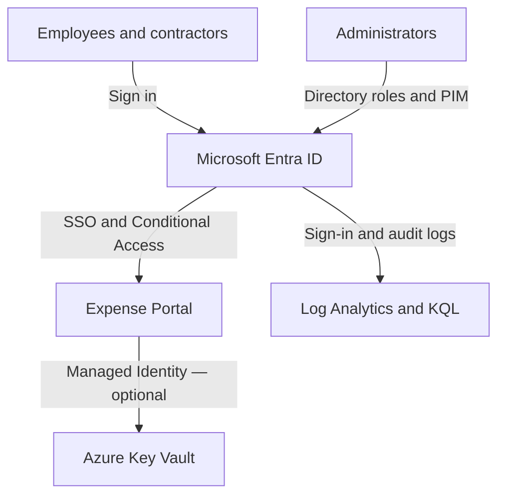

# Microsoft Entra ID — Secure Employee & Contractor Access

An identity and access management lab focused on employee onboarding, secure application access, privileged administration, and offboarding using Microsoft Entra ID.

The project supports preparation for [SC-300: Microsoft Identity and Access Administrator](https://learn.microsoft.com/en-us/credentials/certifications/resources/study-guides/sc-300) and builds on knowledge from AZ-500. The goal is to demonstrate practical configuration, access decisions, automation, and validation evidence.

**Status: Work in progress.** The current phase is the tenant and identity baseline. Later capabilities are planned; implementation and test results will be documented as each phase is completed.

## Business scenario

**Baltic Finance Lab** is a fictional company with Finance, HR, and IT departments. Employees will use an **Expense Portal** to submit reimbursement requests. A designated Finance approver will review and approve those requests. External contractors will receive access appropriate to their engagement.

The project addresses five operational needs:

- Give new employees the access required for their role.
- Update access when an employee changes departments.
- Remove access when employment or a contractor engagement ends.
- Provide administrators with controlled, time-limited privileged access.
- Record enough evidence to explain who changed access and whether the controls worked.

All business scenarios and employee identities in the lab are fictional.

## Implementation roadmap

| Phase | Scope | Status |
|---|---|---|
| 1. Identity baseline | Tenant and license inventory, cloud-only users, security groups, delegated administration, and emergency access preparation | In progress |
| 2. Application access | Expense Portal, App Registration, Enterprise Application, OpenID Connect SSO, and application roles | Planned |
| 3. Authentication and Conditional Access | MFA, pilot groups, policy evaluation, controlled enforcement, and troubleshooting | Planned |
| 4. Identity lifecycle | Joiner–Mover–Leaver processes using Microsoft Graph PowerShell | Planned |
| 5. Privileged access | PIM eligible assignments, activation requirements, approvals, and expiration | Planned |
| 6. External access and governance | B2B collaboration, employee Access Packages, and Access Reviews within available licensing | Planned |
| 7. Monitoring and evidence | Sign-in and audit log analysis, Log Analytics, and KQL queries | Planned |
| 8. Azure workload extension | Managed Identity access to Key Vault and Bicep deployment of supporting Azure resources | Optional / planned |

## Planned architecture

The diagram shows the intended identity relationships. The Key Vault integration is an optional extension.

Microsoft Entra ID will authenticate users and evaluate access policies. The application will enforce its business roles, including permission to approve reimbursement requests. Directory roles, application roles, and Azure resource permissions will be documented separately.

## Day 1 baseline

The initial plan includes six employee accounts, one delegated administrator, two emergency access accounts, and seven security groups.

| Group | Intended purpose |
|---|---|
| `SG-Dept-Finance` | Finance department membership |
| `SG-Dept-HR` | HR department membership |
| `SG-Dept-IT` | IT department membership |
| `SG-App-Expense-Users` | Future assignment to the application's employee role |
| `SG-App-Expense-Approvers` | Future assignment to the application's approver role |
| `SG-CA-Pilot` | Controlled Conditional Access testing |
| `SG-External-Contractors` | Future contractor access assignments |

Application permissions and Conditional Access policies will be connected to these groups in later phases. Group creation alone does not establish those controls.

## Validation plan

Tests will record the acting identity, prerequisites, expected result, observed result, and supporting evidence. The scenarios below are planned acceptance criteria, not completed test results.

| Scenario | Expected result |
|---|---|
| Delegated administration | The lab User Administrator can manage ordinary users and groups but cannot assign Microsoft Entra administrator roles. |
| Application authorization | An employee can submit a request; only an assigned approver can approve it. |
| Department change | Outdated departmental membership is removed and the new membership is applied. |
| Offboarding | New access is blocked; previously established application sessions are checked and their behavior documented. |
| Privileged access | The selected administrative task is available during an approved PIM activation and is checked again after expiration. |
| Access review | A denied review decision results in removal of the reviewed access when the outcome is applied. |
| Contractor lifecycle | The external identity receives only the intended access, which is removed when the engagement ends. |
| Optional workload access | The application can read the intended Key Vault secret only with the required Managed Identity authorization. |

For offboarding, the evidence will distinguish blocked new sign-ins from the behavior of existing tokens and application sessions. [Microsoft guidance on revoking user access](https://learn.microsoft.com/en-us/entra/identity/users/users-revoke-access).

## Tools and implementation approach

| Tool or service | Planned use |
|---|---|
| Microsoft Entra admin center | Initial configuration and validation of identity controls |
| Microsoft Graph PowerShell SDK | Repeatable lifecycle operations and access reporting |
| Azure Monitor, Log Analytics, and KQL | Investigation of identity activity |
| Bicep | Deployment of supporting Azure resources |
| Git and GitHub | Version history, documentation, and review of changes |

The workflow starts with a small configuration in the portal, validates its behavior, and then automates repeatable operations. Scripts will include input validation, error handling, change previews, and checks to avoid duplicate changes when run again.

## Planned repository layout

Supporting files will be added as their corresponding work is completed.

| Path | Purpose |
|---|---|
| `README.md` | Project overview and current progress |
| `docs/scenario.md` | Business requirements and assumptions |
| `docs/access-matrix.md` | Identities, group membership, and access assignments |
| `docs/day-01.md` | Baseline configuration, decisions, and limitations |
| `docs/` | Additional implementation notes and operational procedures |
| `scripts/` | Microsoft Graph PowerShell automation |
| `infra/` | Bicep files and example parameters |
| `monitoring/` | KQL queries and investigation notes |
| `tests/` | Test procedures and observed results |
| `evidence/` | Sanitized screenshots and supporting records |

Each implementation note will explain the requirement, configuration, required permissions, validation outcome, and recovery or cleanup procedure.

## Licensing and cost

Azure consumption and Microsoft Entra licensing will be tracked separately. Azure trial credit does not automatically provide Entra premium licenses. Conditional Access requires P1 or an appropriate higher entitlement; PIM and governance scenarios require suitable premium licensing. Feature availability will be checked before each premium phase. [Microsoft Entra licensing](https://learn.microsoft.com/en-us/entra/fundamentals/licensing).

The lab will use a small set of test identities and resources. Selected Azure service tiers, observed costs, and cleanup steps will be documented when resources are deployed.

## Published evidence

Published configuration examples will use placeholders for environment-specific values. Credentials, tokens, MFA registration material, and personal or billing information will be excluded from repository content.

Screenshots will include a short explanation of what they demonstrate. Successful configuration, tested behavior, and remaining limitations will be recorded separately so that readers can assess the actual implementation.
