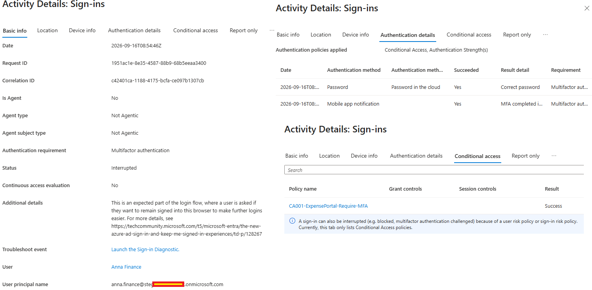
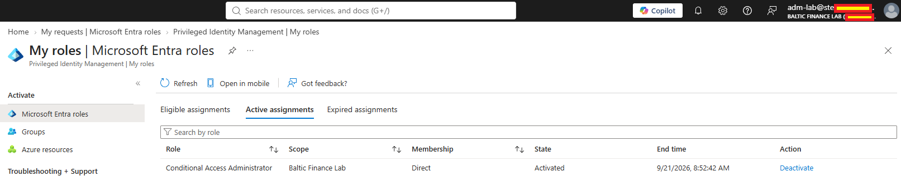
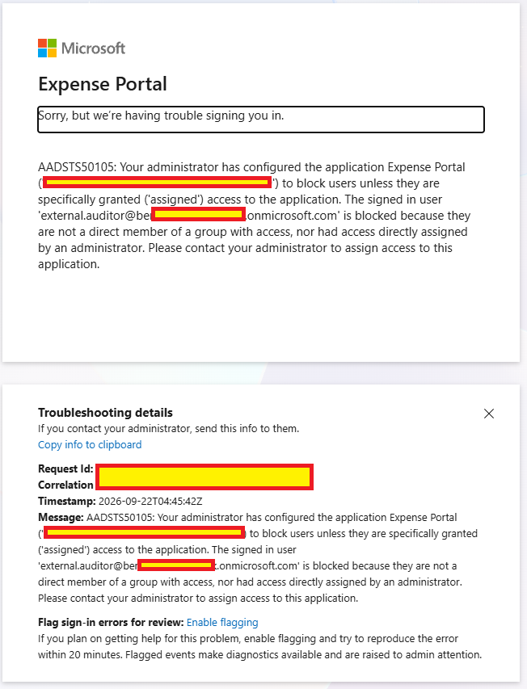
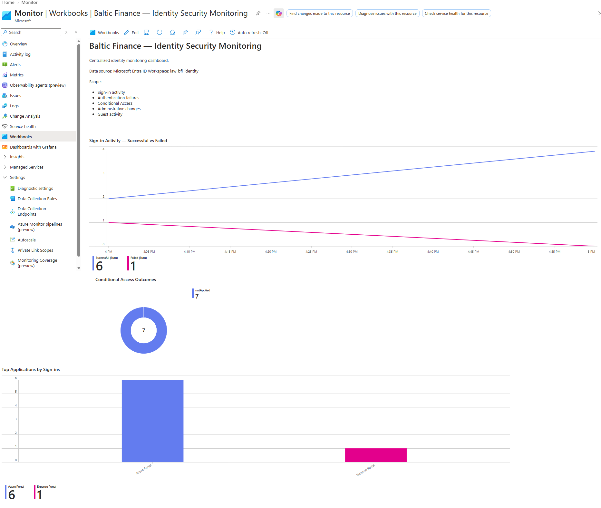
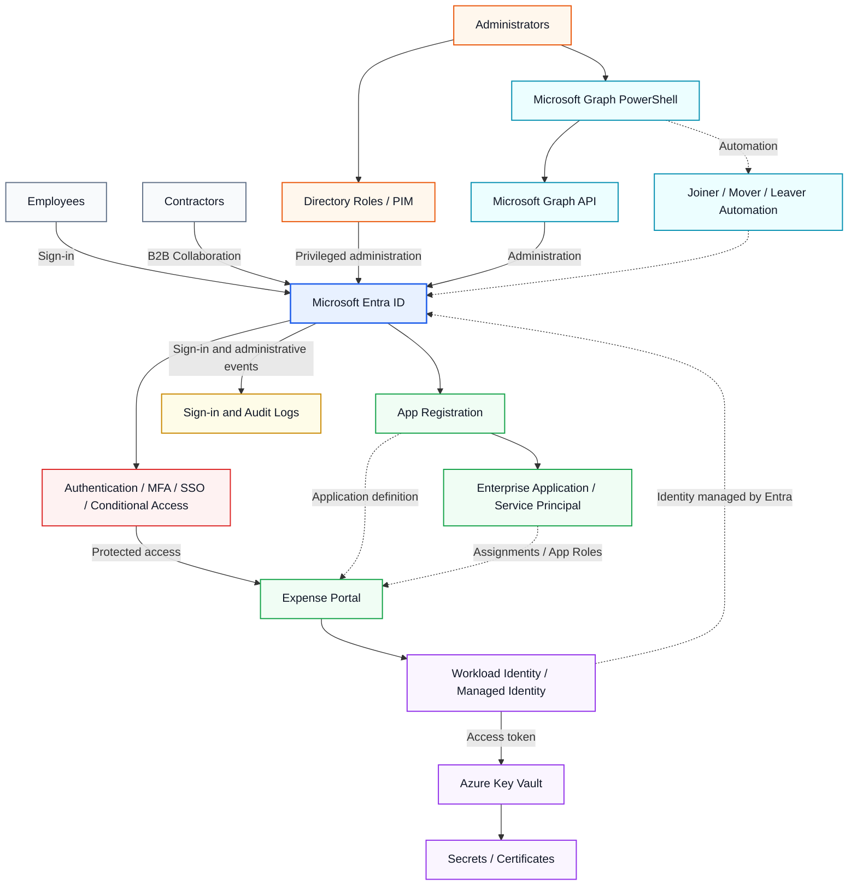
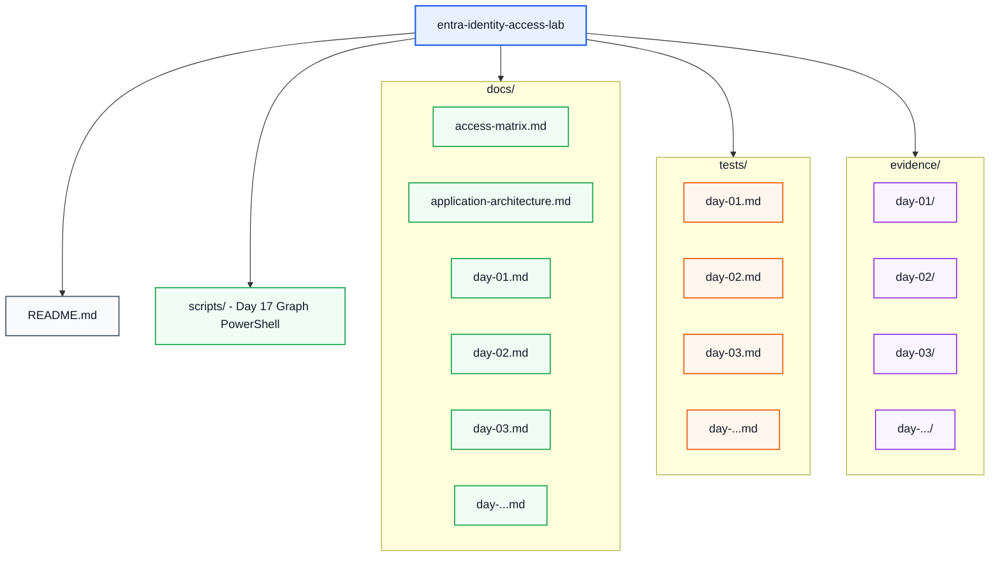

  

<h1 align="center">Microsoft Entra Identity &amp; Access Lab</h1>

  
  
  

  
  
  
  
  

  <a href="#project-overview">Overview</a> ·
  <a href="#target-architecture">Architecture</a> ·
  <a href="#featured-implementation-evidence">Featured evidence</a> ·
  <a href="#implementation-progress">Lab roadmap</a> ·
  <a href="#supporting-documentation">Documentation</a> ·
  <a href="#security-design-principles">Security principles</a>

I'm building this hands-on Microsoft Entra ID lab while preparing for the SC-300 Microsoft Identity and Access Administrator certification, after previously passing AZ-500.

The project simulates identity and access management for a fictional financial organization and focuses on designing, implementing and validating enterprise-style IAM controls.

## Project Overview

The goal of the project is to build and secure a Microsoft Entra ID environment covering the major identity, authentication, application access, privileged access and governance scenarios expected from an Identity and Access Administrator.

The project is based on practical implementation rather than configuration screenshots alone.

Each phase includes:

* design decisions
* implementation
* positive and negative validation tests
* Microsoft Entra log verification
* supporting evidence
* troubleshooting where applicable

## Explore the Project

| 🏗️ Architecture | 🔐 Implementation | 🧪 Validation | 📸 Evidence |
|:---:|:---:|:---:|:---:|
| [View design](#target-architecture) | [Browse labs](#implementation-progress) | [Open tests](tests/) | [Open screenshots](evidence/) |
| Identity and access flows | Documented lab scenarios | Positive and negative testing | Redacted implementation proof |

## Technologies and Concepts

The project covers or will cover:

* Microsoft Entra ID
* Identity and group management
* Least-privilege administration
* Emergency / break-glass accounts
* Microsoft Entra Conditional Access
* Authentication Strengths
* Multifactor Authentication
* Temporary Access Pass
* Passkeys / FIDO2
* Self-Service Password Reset
* App Registrations
* Enterprise Applications / Service Principals
* App Roles
* Group-based application access
* B2B collaboration and External Identities
* Joiner / Mover / Leaver lifecycle management
* Administrative Units
* Hybrid Identity
* Microsoft Entra Connect Sync
* Password Hash Synchronization
* Microsoft Entra device identities
* Microsoft Entra registered / joined / hybrid joined devices
* Privileged Identity Management
* Entitlement Management
* Access Reviews
* Microsoft Graph
* PowerShell automation
* Workload identities
* Managed Identities
* Azure Key Vault
* Sign-in and Audit Logs
* Identity monitoring
* OAuth 2.0 and delegated / application permissions
* SAML, OIDC, Linked SSO and Password-based SSO
* Microsoft Entra Application Proxy
* SCIM application provisioning and deprovisioning
* Access package governance and access recertification
* Azure Automation and Storage data-plane RBAC

---

## Current Implementation

The currently implemented environment includes:

### Identity Foundation

* Workforce identities
* Department and access groups
* Dedicated administrative accounts
* Least-privilege role assignments
* Two emergency access accounts
* Permission-boundary validation
* Audit Log verification

### Expense Portal Identity Integration

* Azure App Service protected by Microsoft Entra authentication
* Single-tenant App Registration
* Enterprise Application / Service Principal
* App Roles
* Group-based application assignment
* `Assignment required`
* Positive and negative application access testing
* Sign-in log validation

### Conditional Access

* Pilot-based Conditional Access deployment
* MFA enforcement
* Authentication Strengths
* Emergency access exclusions
* Report-only validation
* Conditional Access What If testing
* High sign-in risk policy evaluation
* Sign-in log verification

### Authentication Hardening

* Authentication Methods Policy
* Microsoft Authenticator
* SMS
* Temporary Access Pass
* Passkey / FIDO2
* Passwordless onboarding
* Phishing-resistant MFA
* Authentication hardening pilot groups
* Positive and negative authentication testing
* Self-Service Password Reset

### External Identities and Cross-Tenant Access

* Microsoft Entra B2B collaboration
* Guest invitation and redemption
* Dedicated external contractor access group
* Group-based Expense Portal assignment
* Cross-tenant inbound and outbound access settings
* MFA trust from the partner tenant
* Positive and negative cross-tenant access testing
* Audit Log and Sign-in Log validation

### Identity Lifecycle and Scoped Administration

* Joiner / Mover / Leaver lifecycle scenarios
* Group-based application entitlement
* Access removal during department changes
* Leaver account disablement and entitlement removal
* Administrative Units
* Administrative Unit-scoped `User Administrator`
* Positive and negative delegated administration testing

### Hybrid Identity

* Active Directory Domain Services lab environment
* Microsoft Entra Connect Sync
* Organizational Unit filtering
* Password Hash Synchronization
* Synchronized users and groups
* Hybrid identity authentication
* Conditional Access for synchronized identities
* Microsoft Entra Connect Health validation

### Device Identities and Conditional Access

* Microsoft Entra registered device
* Microsoft Entra joined device
* Microsoft Entra hybrid joined device
* `dsregcmd /status` verification
* Microsoft Entra device inventory validation
* Conditional Access device filters
* Device trust-based application access
* Positive and negative device-state testing
* Separation of device join state from compliance

### Privileged Identity Management

* Eligible Conditional Access Administrator assignment
* Just-in-Time activation with MFA, justification and separate approval
* One-hour activation window and automatic expiry
* Access-boundary testing before and after activation
* PIM Resource audit validation

### Entitlement Management and Access Reviews

* Partner-scoped connected organization and access catalog
* Time-limited access package with group and application resource roles
* External request, independent approval and delivered assignment
* Terms of Use for external application access
* Manual package revocation and application access denial
* Guest group Access Review, justified Deny decision and applied removal

### OAuth 2.0 and Microsoft Graph

* Delegated `User.Read` integration in Expense Portal
* Microsoft Graph profile retrieval for signed-in users
* Temporary app-only `User.Read.All` and Client Credentials Flow
* App-only `GET /users` success and `GET /me` negative test
* Least-privilege cleanup and delegated-access regression test

### Workload Identities and Managed Identity

* Azure Automation with System-assigned and User-assigned Managed Identities
* Microsoft Entra authentication to private Azure Blob Storage
* Storage Blob Data Reader authorization
* Negative read-before-RBAC and read-only write-denial tests
* Runbook execution and Managed identity sign-in monitoring

### SSO, Application Proxy and Provisioning

* Existing Expense Portal sign-in and separate SAML SSO test
* Linked SSO and Password-based SSO with a test application
* Internal IIS application published through Microsoft Entra Application Proxy
* Microsoft Entra pre-authentication, group assignment and Conditional Access evaluation
* Positive and negative external access tests
* Pilot-scoped SCIM attribute update and target-application disable

### Microsoft Graph PowerShell Automation

* Six delegated Microsoft Graph PowerShell scripts for connection, lab-user provisioning, security-group creation, group membership, controlled directory role assignment and selected tenant-state CSV export
* Repeat-safe provisioning and membership checks, explicit privileged-operation confirmation and separate privileged operator
* Real role authorization troubleshooting: `adm-lab` received `403 Forbidden`, while `roleops-lab` completed the authorized assignment
* Separate App Registration, Service Principal and Conditional Access inventory, and successful Add-user Audit Log correlation
* Local CSV exports excluded from Git; captured tenant export omitted CA because `Policy.Read.All` was absent in that run, and role-assignment cleanup is not evidenced

---

## Featured Implementation Evidence

Selected, redacted screenshots from the lab. Each image links to its full evidence set.

<table>
<tr>
<td width="50%" align="center">
   
  <strong>Conditional Access &amp; MFA</strong> 
  <a href="docs/day-03.md">Day 03 documentation</a> · <a href="evidence/day-03/">Evidence</a>
</td>
<td width="50%" align="center">
   
  <strong>Privileged Identity Management</strong> 
  <a href="docs/day-09.md">Day 09 documentation</a> · <a href="evidence/day-09/">Evidence</a>
</td>
</tr>
<tr>
<td width="50%" align="center">
   
  <strong>Access Review &amp; Revocation</strong> 
  <a href="docs/day-11.md">Day 11 documentation</a> · <a href="evidence/day-11/">Evidence</a>
</td>
<td width="50%" align="center">
   
  <strong>Security Monitoring &amp; KQL</strong> 
  <a href="docs/day-16.md">Day 16 documentation</a> · <a href="evidence/day-16/">Evidence</a>
</td>
</tr>
</table>

## Target Architecture

The following diagram represents the target architecture of the complete lab.

The diagram combines implemented identity and application flows with the target state. Microsoft Graph PowerShell administration and the manual Joiner / Mover / Leaver labs are implemented; broader lifecycle automation and Azure Key Vault integration remain planned. The Managed Identity lab currently demonstrates Azure Blob Storage access.

---

## Implementation Progress

### Quick Lab Index

| Lab | Topic | Documentation | Tests | Evidence |
|:---:|---|:---:|:---:|:---:|
| 01 | Identity Foundation | [Docs](docs/day-01.md) | [Tests](tests/day-01.md) | [Screens](evidence/day-01/) |
| 02 | Application Identity and Access | [Docs](docs/day-02.md) | [Tests](tests/day-02.md) | [Screens](evidence/day-02/) |
| 03 | Conditional Access and MFA | [Docs](docs/day-03.md) | [Tests](tests/day-03.md) | [Screens](evidence/day-03/) |
| 04 | Authentication Hardening | [Docs](docs/day-04.md) | [Tests](tests/day-04.md) | [Screens](evidence/day-04/) |
| 05 | External Identities and Cross-Tenant Access | [Docs](docs/day-05.md) | [Tests](tests/day-05.md) | [Screens](evidence/day-05/) |
| 06 | Identity Lifecycle and Administrative Units | [Docs](docs/day-06.md) | [Tests](tests/day-06.md) | [Screens](evidence/day-06/) |
| 07 | Hybrid Identity | [Docs](docs/day-07.md) | [Tests](tests/day-07.md) | [Screens](evidence/day-07/) |
| 08 | Device Identities and Conditional Access | [Docs](docs/day-08.md) | [Tests](tests/day-08.md) | [Screens](evidence/day-08/) |
| 09 | Privileged Identity Management | [Docs](docs/day-09.md) | [Tests](tests/day-09.md) | [Screens](evidence/day-09/) |
| 10 | Entitlement Management | [Docs](docs/day-10.md) | [Tests](tests/day-10.md) | [Screens](evidence/day-10/) |
| 11 | Access Reviews | [Docs](docs/day-11.md) | [Tests](tests/day-11.md) | [Screens](evidence/day-11/) |
| 12 | OAuth 2.0 and Microsoft Graph | [Docs](docs/day-12.md) | [Tests](tests/day-12.md) | [Screens](evidence/day-12/) |
| 13 | Workload Identities and Managed Identity | [Docs](docs/day-13.md) | [Tests](tests/day-13.md) | [Screens](evidence/day-13/) |
| 14 | SSO, Application Proxy and Provisioning | [Docs](docs/day-14.md) | [Tests](tests/day-14.md) | [Screens](evidence/day-14/) |
| 15 | Global Secure Access and Defender for Cloud Apps | [Docs](docs/day-15.md) | [Tests](tests/day-15.md) | [Screens](evidence/day-15/) |
| 16 | Monitoring, KQL, Workbooks and Identity Secure Score | [Docs](docs/day-16.md) | [Tests](tests/day-16.md) | [Screens](evidence/day-16/) |
| 17 | Microsoft Graph PowerShell Automation | [Docs](docs/day-17.md) | [Tests](tests/day-17.md) | [Screens](evidence/day-17/) |

Day 15's Cloud Discovery extension and some Day 17 follow-up evidence remain outstanding; see the individual lab notes.

### Detailed Lab Notes

Select a day to expand its original implementation checklist and supporting links.

<strong>Day 01 — Identity Foundation</strong> · implementation, tests &amp; evidence

* [x] Workforce users
* [x] Security groups
* [x] Administrative separation
* [x] Least-privilege administration
* [x] Emergency access accounts
* [x] Permission-boundary testing
* [x] Audit Log verification

Documentation: [`docs/day-01.md`](docs/day-01.md)

Tests: [`tests/day-01.md`](tests/day-01.md)

Evidence: [`evidence/day-01/`](evidence/day-01/)

---

<strong>Day 02 — Application Identity and Access</strong> · implementation, tests &amp; evidence

* [x] Azure App Service
* [x] Microsoft Entra authentication
* [x] Single-tenant App Registration
* [x] Enterprise Application / Service Principal
* [x] Application roles
* [x] Group-based application assignment
* [x] Assignment required
* [x] Admin consent
* [x] Positive authentication and authorization tests
* [x] Negative access test
* [x] Sign-in log verification

Documentation: [`docs/day-02.md`](docs/day-02.md)

Tests: [`tests/day-02.md`](tests/day-02.md)

Evidence: [`evidence/day-02/`](evidence/day-02/)

---

<strong>Day 03 — Conditional Access and MFA</strong> · implementation, tests &amp; evidence

* [x] Conditional Access Administrator delegation
* [x] Reports Reader delegation
* [x] Conditional Access pilot group
* [x] Emergency access exclusion
* [x] MFA authentication strength
* [x] Report-only deployment
* [x] Conditional Access What If validation
* [x] Enforced MFA
* [x] Sign-in log verification
* [x] High sign-in risk policy evaluation

Documentation: [`docs/day-03.md`](docs/day-03.md)

Tests: [`tests/day-03.md`](tests/day-03.md)

Evidence: [`evidence/day-03/`](evidence/day-03/)

---

<strong>Day 04 — Authentication Hardening</strong> · implementation, tests &amp; evidence

* [x] Authentication Methods Policy
* [x] Microsoft Authenticator
* [x] SMS
* [x] Temporary Access Pass
* [x] Passkey / FIDO2
* [x] Passwordless pilot group
* [x] Authentication hardening pilot group
* [x] Phishing-resistant MFA Authentication Strength
* [x] Conditional Access enforcement
* [x] Positive passkey authentication test
* [x] Negative weak-authentication test
* [x] Sign-in log verification
* [x] Self-Service Password Reset

Documentation: [`docs/day-04.md`](docs/day-04.md)

Tests: [`tests/day-04.md`](tests/day-04.md)

Evidence: [`evidence/day-04/`](evidence/day-04/)

---

<strong>Day 05 — External Identities and Cross-Tenant Access</strong> · implementation, tests &amp; evidence

* [x] Microsoft Entra B2B collaboration
* [x] Guest invitation and redemption
* [x] Dedicated external contractor group
* [x] Group-based Expense Portal assignment
* [x] Cross-tenant inbound access configuration
* [x] Cross-tenant outbound access configuration
* [x] MFA trust from the partner tenant
* [x] Positive external application access test
* [x] Negative application assignment test
* [x] Negative cross-tenant access test
* [x] Audit Log and Sign-in Log verification

Documentation: [`docs/day-05.md`](docs/day-05.md)

Tests: [`tests/day-05.md`](tests/day-05.md)

Evidence: [`evidence/day-05/`](evidence/day-05/)

---

<strong>Day 06 — Identity Lifecycle and Administrative Units</strong> · implementation, tests &amp; evidence

* [x] Group-based application entitlement
* [x] Joiner provisioning
* [x] Mover access transition
* [x] Leaver deprovisioning
* [x] Administrative Unit creation
* [x] Administrative Unit-scoped User Administrator
* [x] Positive scoped administration test
* [x] Negative out-of-scope administration test
* [x] Positive and negative lifecycle access validation

Documentation: [`docs/day-06.md`](docs/day-06.md)

Tests: [`tests/day-06.md`](tests/day-06.md)

Evidence: [`evidence/day-06/`](evidence/day-06/)

---

<strong>Day 07 — Hybrid Identity</strong> · implementation, tests &amp; evidence

* [x] Active Directory Domain Services
* [x] Dedicated hybrid synchronization scope
* [x] Microsoft Entra Connect Sync
* [x] Organizational Unit filtering
* [x] Password Hash Synchronization
* [x] Synchronized hybrid user and group
* [x] Cloud authentication with synchronized credentials
* [x] Conditional Access for hybrid identity
* [x] Expense Portal authorization
* [x] Sign-in Log verification
* [x] Microsoft Entra Connect Health validation

Documentation: [`docs/day-07.md`](docs/day-07.md)

Tests: [`tests/day-07.md`](tests/day-07.md)

Evidence: [`evidence/day-07/`](evidence/day-07/)

---

<strong>Day 08 — Device Identities and Conditional Access</strong> · implementation, tests &amp; evidence

* [x] Microsoft Entra registered device
* [x] Microsoft Entra joined device
* [x] Microsoft Entra hybrid joined device
* [x] `dsregcmd` device-state verification
* [x] Microsoft Entra device inventory validation
* [x] Conditional Access device filter
* [x] Report-only registered-device test
* [x] Negative Entra-joined device access test
* [x] Positive hybrid-joined device access test
* [x] Sign-in Log and Conditional Access verification
* [x] Join state vs compliance distinction

Documentation: [`docs/day-08.md`](docs/day-08.md)

Tests: [`tests/day-08.md`](tests/day-08.md)

Evidence: [`evidence/day-08/`](evidence/day-08/)

---

<strong>Day 09 — Privileged Identity Management</strong> · implementation, tests &amp; evidence

* [x] Eligible Conditional Access Administrator assignment
* [x] One-hour Just-in-Time role activation
* [x] MFA, justification and separate approver
* [x] Negative access test before activation
* [x] Temporary privileged administration
* [x] PIM audit and automatic expiration verification

Documentation: [`docs/day-09.md`](docs/day-09.md)

Tests: [`tests/day-09.md`](tests/day-09.md)

Evidence: [`evidence/day-09/`](evidence/day-09/)

---

<strong>Day 10 — Entitlement Management</strong> · implementation, tests &amp; evidence

* [x] Connected organization and external access catalog
* [x] Access Package with group and application resource roles
* [x] Scoped self-service request and separate approval
* [x] 30-day assignment configuration and delivered access
* [x] Terms of Use and Conditional Access validation
* [x] Manual revocation and negative application access test

Documentation: [`docs/day-10.md`](docs/day-10.md)

Tests: [`tests/day-10.md`](tests/day-10.md)

Evidence: [`evidence/day-10/`](evidence/day-10/)

---

<strong>Day 11 — Access Reviews</strong> · implementation, tests &amp; evidence

* [x] Guest group membership review
* [x] Independent business reviewer and justified Deny decision
* [x] Recommendation versus reviewer decision validation
* [x] Access test before applying review results
* [x] Applied review results and group membership removal
* [x] Negative application access test and audit verification

Documentation: [`docs/day-11.md`](docs/day-11.md)

Tests: [`tests/day-11.md`](tests/day-11.md)

Evidence: [`evidence/day-11/`](evidence/day-11/)

---

<strong>Day 12 — OAuth 2.0 and Microsoft Graph</strong> · implementation, tests &amp; evidence

* [x] Delegated `User.Read` and admin consent
* [x] Expense Portal Microsoft Graph profile integration
* [x] Separate application roles and Graph permissions
* [x] Temporary app-only `User.Read.All` Client Credentials Flow
* [x] App-only `GET /users` success and `GET /me` negative test
* [x] Permission cleanup and delegated-access regression test

Documentation: [`docs/day-12.md`](docs/day-12.md)

Tests: [`tests/day-12.md`](tests/day-12.md)

Evidence: [`evidence/day-12/`](evidence/day-12/)

---

<strong>Day 13 — Workload Identities and Managed Identity</strong> · implementation, tests &amp; evidence

* [x] System-assigned and User-assigned Managed Identities
* [x] Azure Automation authentication to private Blob Storage
* [x] Negative read test before Storage data-plane RBAC
* [x] `Storage Blob Data Reader` assignment and successful read
* [x] Negative write test under read-only authorization
* [x] Published Runbook and Managed identity sign-in verification

Documentation: [`docs/day-13.md`](docs/day-13.md)

Tests: [`tests/day-13.md`](tests/day-13.md)

Evidence: [`evidence/day-13/`](evidence/day-13/)

---

<strong>Day 14 — SSO, Application Proxy and Provisioning</strong> · implementation, tests &amp; evidence

* [x] Existing Expense Portal sign-in and SAML SSO validation
* [x] Linked SSO and Password-based SSO with test credentials
* [x] Private IIS application and active Application Proxy connector
* [x] Microsoft Entra pre-authentication and group-based access
* [x] Positive and negative external access tests
* [x] Application-specific MFA policy evaluation
* [x] SCIM pilot scope, attribute update and logged target disable

Documentation: [`docs/day-14.md`](docs/day-14.md)

Tests: [`tests/day-14.md`](tests/day-14.md)

Evidence: [`evidence/day-14/`](evidence/day-14/)

---

<strong>Day 15 — Global Secure Access and Defender for Cloud Apps</strong> · implementation, tests &amp; evidence

* [x] Scoped GSA pilot and three forwarding profiles
* [x] Private Access application and verified client tunnel
* [x] Internet Access filtering and traffic-log observations
* [x] Defender for Cloud Apps session policy blocking a named SharePoint download
* [ ] Cloud Discovery (deferred)

Documentation: [`docs/day-15.md`](docs/day-15.md)

Tests: [`tests/day-15.md`](tests/day-15.md)

Evidence: [`evidence/day-15/`](evidence/day-15/)

---

<strong>Day 16 — Monitoring, KQL, Workbooks and Identity Secure Score</strong> · implementation, tests &amp; evidence

* [x] Entra sign-in and audit investigations
* [x] Diagnostic Settings to Log Analytics
* [x] KQL investigations with ingested events
* [x] Microsoft Conditional Access and custom monitoring Workbooks
* [x] Identity Secure Score baseline and recommendations review

Documentation: [`docs/day-16.md`](docs/day-16.md)

Tests: [`tests/day-16.md`](tests/day-16.md)

Evidence: [`evidence/day-16/`](evidence/day-16/)

---

<strong>Day 17 — Microsoft Graph PowerShell Automation</strong> · implementation, tests &amp; evidence

* [x] PowerShell SDK and delegated Microsoft Graph sign-in
* [x] User, group and membership provisioning with repeat-safe checks
* [x] Privileged role dry run, `403 Forbidden` negative test and authorized assignment
* [x] Selected local tenant-state export; captured CA CSV export was skipped
* [x] Separate application, service principal and Conditional Access queries
* [x] Add-user audit event correlation
* [ ] Privileged role cleanup and post-fix CA CSV export not evidenced

Documentation: [`docs/day-17.md`](docs/day-17.md)

Tests: [`tests/day-17.md`](tests/day-17.md)

Evidence: [`evidence/day-17/`](evidence/day-17/)

Scripts: [`scripts/`](scripts/)

---

## Supporting Documentation

* [Access Matrix](docs/access-matrix.md)
* [Expense Portal Application Architecture](docs/application-architecture.md)

---

## Planned Implementation

The next phases of the project will expand the environment with:

* [ ] Cloud Discovery extension for Defender for Cloud Apps (deferred in Day 15)
* [ ] Broader joiner / mover / leaver automation beyond Day 17's scoped test-user provisioning
* [ ] Azure Key Vault integration for workload identities
* [ ] Further identity governance and automation scenarios

---

## Security Design Principles

The lab follows several core identity security principles:

**Least privilege**

Routine administrative accounts receive only the roles required for their tasks.

**Separation of duties**

Identity administration, application administration, privileged role management and emergency access are separated.

**Pilot before enforcement**

Security controls such as Conditional Access and stronger authentication requirements are tested with limited pilot groups before wider deployment.

**Emergency access protection**

Dedicated break-glass accounts are maintained separately and excluded from restrictive Conditional Access policies.

**Group-based access**

Application authorization is assigned through security groups rather than directly to individual users.

**Authentication and authorization separation**

Successful authentication does not automatically grant application permissions. Application access remains controlled through assignments and App Roles.

**Verification and auditability**

Configuration changes and access scenarios are validated using Microsoft Entra Sign-in Logs, Audit Logs, Conditional Access evaluation and documented test evidence.

---

## Repository Structure

The repository will continue to evolve as additional Microsoft Entra identity governance, privileged access, workload identity and automation scenarios are implemented.
