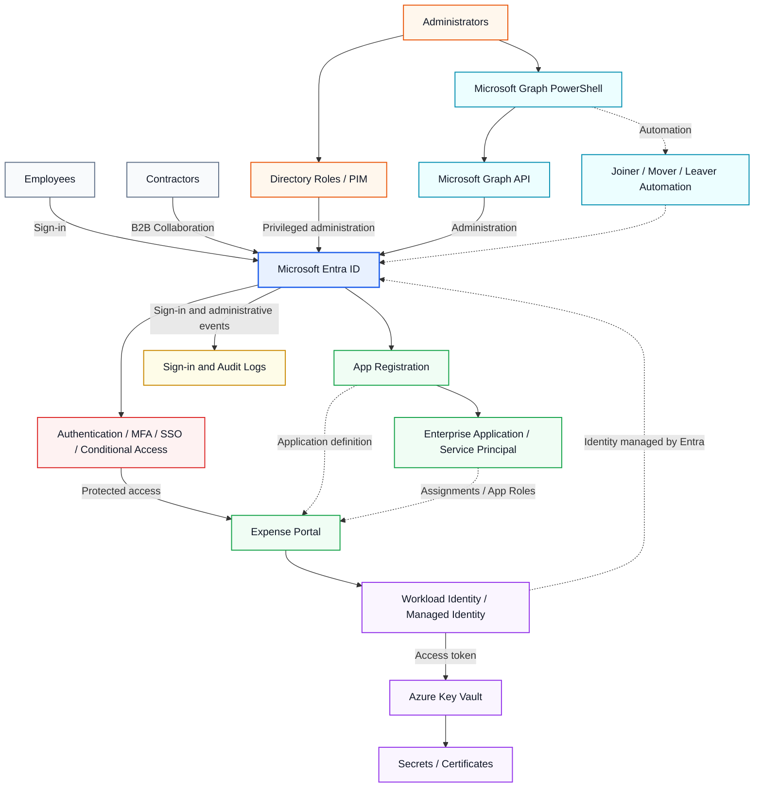
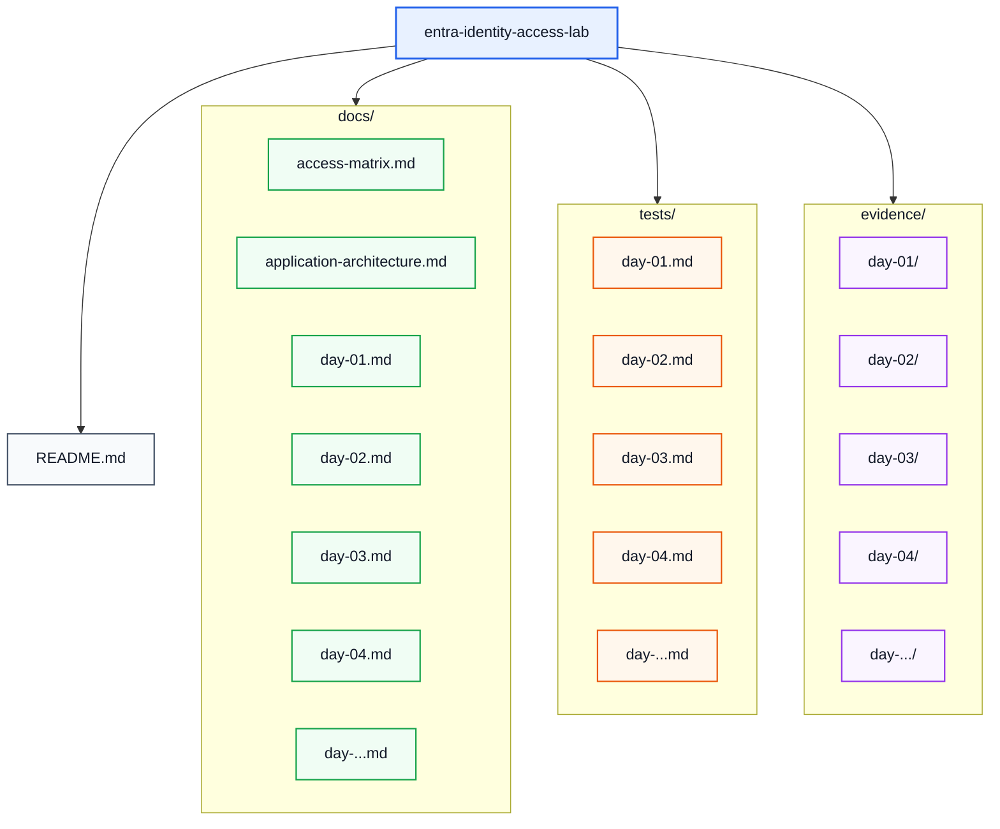

# Microsoft Entra Identity & Access Lab

I'm building this hands-on Microsoft Entra ID lab while preparing for the SC-300 Microsoft Identity and Access Administrator certification, after previously passing AZ-500.

The project simulates identity and access management for a fictional financial organization and focuses on designing, implementing and validating enterprise-style IAM controls.

## Project Overview

The goal of the project is to build and secure a Microsoft Entra ID environment covering the major identity, authentication, application access, privileged access and governance scenarios expected from an Identity and Access Administrator.

The project is based on practical implementation rather than configuration screenshots alone.

Each phase includes:

* design decisions
* implementation
* positive and negative validation tests
* Microsoft Entra log verification
* supporting evidence
* troubleshooting where applicable

## Technologies and Concepts

The project covers or will cover:

* Microsoft Entra ID
* Identity and group management
* Least-privilege administration
* Emergency / break-glass accounts
* Microsoft Entra Conditional Access
* Authentication Strengths
* Multifactor Authentication
* Temporary Access Pass
* Passkeys / FIDO2
* Self-Service Password Reset
* App Registrations
* Enterprise Applications / Service Principals
* App Roles
* Group-based application access
* B2B collaboration and External Identities
* Joiner / Mover / Leaver lifecycle management
* Administrative Units
* Hybrid Identity
* Microsoft Entra Connect Sync
* Password Hash Synchronization
* Microsoft Entra device identities
* Microsoft Entra registered / joined / hybrid joined devices
* Privileged Identity Management
* Entitlement Management
* Access Reviews
* Microsoft Graph
* PowerShell automation
* Workload identities
* Managed Identities
* Azure Key Vault
* Sign-in and Audit Logs
* Identity monitoring

---

## Current Implementation

The currently implemented environment includes:

### Identity Foundation

* Workforce identities
* Department and access groups
* Dedicated administrative accounts
* Least-privilege role assignments
* Two emergency access accounts
* Permission-boundary validation
* Audit Log verification

### Expense Portal Identity Integration

* Azure App Service protected by Microsoft Entra authentication
* Single-tenant App Registration
* Enterprise Application / Service Principal
* App Roles
* Group-based application assignment
* `Assignment required`
* Positive and negative application access testing
* Sign-in log validation

### Conditional Access

* Pilot-based Conditional Access deployment
* MFA enforcement
* Authentication Strengths
* Emergency access exclusions
* Report-only validation
* Conditional Access What If testing
* High sign-in risk policy evaluation
* Sign-in log verification

### Authentication Hardening

* Authentication Methods Policy
* Microsoft Authenticator
* SMS
* Temporary Access Pass
* Passkey / FIDO2
* Passwordless onboarding
* Phishing-resistant MFA
* Authentication hardening pilot groups
* Positive and negative authentication testing
* Self-Service Password Reset

### External Identities and Cross-Tenant Access

* Microsoft Entra B2B collaboration
* Guest invitation and redemption
* Dedicated external contractor access group
* Group-based Expense Portal assignment
* Cross-tenant inbound and outbound access settings
* MFA trust from the partner tenant
* Positive and negative cross-tenant access testing
* Audit Log and Sign-in Log validation

### Identity Lifecycle and Scoped Administration

* Joiner / Mover / Leaver lifecycle scenarios
* Group-based application entitlement
* Access removal during department changes
* Leaver account disablement and entitlement removal
* Administrative Units
* Administrative Unit-scoped `User Administrator`
* Positive and negative delegated administration testing

### Hybrid Identity

* Active Directory Domain Services lab environment
* Microsoft Entra Connect Sync
* Organizational Unit filtering
* Password Hash Synchronization
* Synchronized users and groups
* Hybrid identity authentication
* Conditional Access for synchronized identities
* Microsoft Entra Connect Health validation

### Device Identities and Conditional Access

* Microsoft Entra registered device
* Microsoft Entra joined device
* Microsoft Entra hybrid joined device
* `dsregcmd /status` verification
* Microsoft Entra device inventory validation
* Conditional Access device filters
* Device trust-based application access
* Positive and negative device-state testing
* Separation of device join state from compliance

---

## Target Architecture

The following diagram represents the target architecture of the complete lab.

Some components shown below are planned for later phases and are not yet implemented.

---

## Implementation Progress

### Day 01 — Identity Foundation

* [x] Workforce users
* [x] Security groups
* [x] Administrative separation
* [x] Least-privilege administration
* [x] Emergency access accounts
* [x] Permission-boundary testing
* [x] Audit Log verification

Documentation: [`docs/day-01.md`](docs/day-01.md)

Tests: [`tests/day-01.md`](tests/day-01.md)

Evidence: [`evidence/day-01/`](evidence/day-01/)

---

### Day 02 — Application Identity and Access

* [x] Azure App Service
* [x] Microsoft Entra authentication
* [x] Single-tenant App Registration
* [x] Enterprise Application / Service Principal
* [x] Application roles
* [x] Group-based application assignment
* [x] Assignment required
* [x] Admin consent
* [x] Positive authentication and authorization tests
* [x] Negative access test
* [x] Sign-in log verification

Documentation: [`docs/day-02.md`](docs/day-02.md)

Tests: [`tests/day-02.md`](tests/day-02.md)

Evidence: [`evidence/day-02/`](evidence/day-02/)

---

### Day 03 — Conditional Access and MFA

* [x] Conditional Access Administrator delegation
* [x] Reports Reader delegation
* [x] Conditional Access pilot group
* [x] Emergency access exclusion
* [x] MFA authentication strength
* [x] Report-only deployment
* [x] Conditional Access What If validation
* [x] Enforced MFA
* [x] Sign-in log verification
* [x] High sign-in risk policy evaluation

Documentation: [`docs/day-03.md`](docs/day-03.md)

Tests: [`tests/day-03.md`](tests/day-03.md)

Evidence: [`evidence/day-03/`](evidence/day-03/)

---

### Day 04 — Authentication Hardening

* [x] Authentication Methods Policy
* [x] Microsoft Authenticator
* [x] SMS
* [x] Temporary Access Pass
* [x] Passkey / FIDO2
* [x] Passwordless pilot group
* [x] Authentication hardening pilot group
* [x] Phishing-resistant MFA Authentication Strength
* [x] Conditional Access enforcement
* [x] Positive passkey authentication test
* [x] Negative weak-authentication test
* [x] Sign-in log verification
* [x] Self-Service Password Reset

Documentation: [`docs/day-04.md`](docs/day-04.md)

Tests: [`tests/day-04.md`](tests/day-04.md)

Evidence: [`evidence/day-04/`](evidence/day-04/)

---

### Day 05 — External Identities and Cross-Tenant Access

* [x] Microsoft Entra B2B collaboration
* [x] Guest invitation and redemption
* [x] Dedicated external contractor group
* [x] Group-based Expense Portal assignment
* [x] Cross-tenant inbound access configuration
* [x] Cross-tenant outbound access configuration
* [x] MFA trust from the partner tenant
* [x] Positive external application access test
* [x] Negative application assignment test
* [x] Negative cross-tenant access test
* [x] Audit Log and Sign-in Log verification

Documentation: [`docs/day-05.md`](docs/day-05.md)

Tests: [`tests/day-05.md`](tests/day-05.md)

Evidence: [`evidence/day-05/`](evidence/day-05/)

---

### Day 06 — Identity Lifecycle and Administrative Units

* [x] Group-based application entitlement
* [x] Joiner provisioning
* [x] Mover access transition
* [x] Leaver deprovisioning
* [x] Administrative Unit creation
* [x] Administrative Unit-scoped User Administrator
* [x] Positive scoped administration test
* [x] Negative out-of-scope administration test
* [x] Positive and negative lifecycle access validation

Documentation: [`docs/day-06.md`](docs/day-06.md)

Tests: [`tests/day-06.md`](tests/day-06.md)

Evidence: [`evidence/day-06/`](evidence/day-06/)

---

### Day 07 — Hybrid Identity

* [x] Active Directory Domain Services
* [x] Dedicated hybrid synchronization scope
* [x] Microsoft Entra Connect Sync
* [x] Organizational Unit filtering
* [x] Password Hash Synchronization
* [x] Synchronized hybrid user and group
* [x] Cloud authentication with synchronized credentials
* [x] Conditional Access for hybrid identity
* [x] Expense Portal authorization
* [x] Sign-in Log verification
* [x] Microsoft Entra Connect Health validation

Documentation: [`docs/day-07.md`](docs/day-07.md)

Tests: [`tests/day-07.md`](tests/day-07.md)

Evidence: [`evidence/day-07/`](evidence/day-07/)

---

### Day 08 — Device Identities and Conditional Access

* [x] Microsoft Entra registered device
* [x] Microsoft Entra joined device
* [x] Microsoft Entra hybrid joined device
* [x] `dsregcmd` device-state verification
* [x] Microsoft Entra device inventory validation
* [x] Conditional Access device filter
* [x] Report-only registered-device test
* [x] Negative Entra-joined device access test
* [x] Positive hybrid-joined device access test
* [x] Sign-in Log and Conditional Access verification
* [x] Join state vs compliance distinction

Documentation: [`docs/day-08.md`](docs/day-08.md)

Tests: [`tests/day-08.md`](tests/day-08.md)

Evidence: [`evidence/day-08/`](evidence/day-08/)

---

## Supporting Documentation

* [Access Matrix](docs/access-matrix.md)
* [Expense Portal Application Architecture](docs/application-architecture.md)

---

## Planned Implementation

The next phases of the project will expand the environment with:

* [ ] Privileged Identity Management
* [ ] Entitlement Management
* [ ] Access Reviews
* [ ] Workload identities
* [ ] Managed Identity
* [ ] Microsoft Graph
* [ ] PowerShell automation
* [ ] Azure Key Vault integration
* [ ] Extended identity monitoring and log analysis
* [ ] Additional identity governance and automation scenarios

---

## Security Design Principles

The lab follows several core identity security principles:

**Least privilege**

Routine administrative accounts receive only the roles required for their tasks.

**Separation of duties**

Identity administration, application administration, privileged role management and emergency access are separated.

**Pilot before enforcement**

Security controls such as Conditional Access and stronger authentication requirements are tested with limited pilot groups before wider deployment.

**Emergency access protection**

Dedicated break-glass accounts are maintained separately and excluded from restrictive Conditional Access policies.

**Group-based access**

Application authorization is assigned through security groups rather than directly to individual users.

**Authentication and authorization separation**

Successful authentication does not automatically grant application permissions. Application access remains controlled through assignments and App Roles.

**Verification and auditability**

Configuration changes and access scenarios are validated using Microsoft Entra Sign-in Logs, Audit Logs, Conditional Access evaluation and documented test evidence.

---

## Repository Structure

The repository will continue to evolve as additional Microsoft Entra identity governance, privileged access, workload identity and automation scenarios are implemented.
