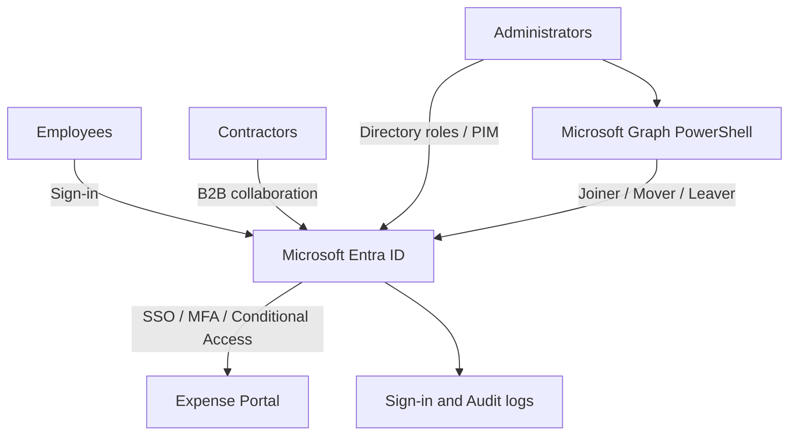

# Microsoft Entra Identity & Access Lab

I'm building this lab while preparing for SC-300, after passing AZ-500.
The aim is to configure identity controls and check how they behave
with different user accounts.

The scenario is a small company with Finance, HR and IT teams.
An Expense Portal will be used to test employee and approver access.

## Current focus

Users, security groups, delegated administration and emergency accounts.

- [Day 1 notes and checks](docs/day-01.md)
- [Users and groups](docs/access-matrix.md)

## Planned architecture

Entra ID handles authentication and access policies.
The Expense Portal enforces employee and approver application roles.

## Next steps

- Connect the Expense Portal to Entra ID.
- Configure MFA and Conditional Access.
- Automate onboarding and offboarding with Microsoft Graph PowerShell.
- Add PIM and access reviews where licensing allows.

Work in progress. All employee identities are fictional.
