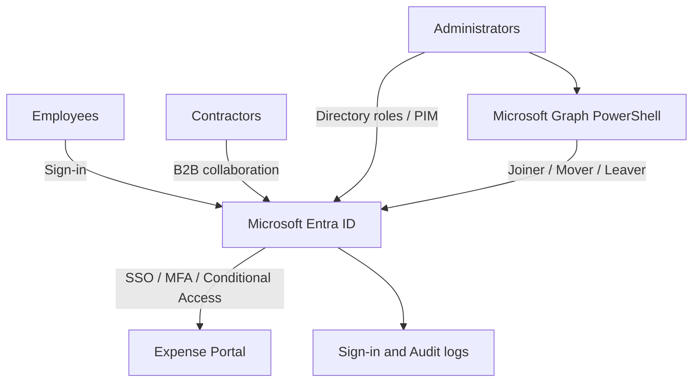

# Microsoft Entra Identity & Access Lab

I'm building this lab while preparing for SC-300, after passing AZ-500.
The aim is to configure identity controls and check how they behave
with different user accounts.

The scenario is a small company with Finance, HR and IT teams.
An Expense Portal will be used to test employee and approver access.

## Current focus

Users, security groups, delegated administration and emergency accounts.

- [Day 1 notes and checks](docs/day-01.md)
- [Users and groups](docs/access-matrix.md)

## Planned architecture

Entra ID handles authentication and access policies.
The Expense Portal enforces employee and approver application roles.

## Implementation Progress

### Day 01 — Identity Foundation

- [x] Workforce users
- [x] Security groups
- [x] Administrative separation
- [x] Emergency access accounts
- [x] Permission boundary testing
- [x] Audit log verification

### Day 02 — Application Identity and Access

- [x] Azure App Service
- [x] Microsoft Entra authentication
- [x] Single-tenant App Registration
- [x] Enterprise Application / Service Principal
- [x] Application roles
- [x] Group-based application assignment
- [x] Assignment required
- [x] Admin consent
- [x] Positive authentication tests
- [x] Sign-in log verification

### Planned

- [ ] Dynamic groups
- [ ] Joiner-Mover-Leaver lifecycle
- [ ] Conditional Access
- [ ] Identity Protection
- [ ] Privileged Identity Management
- [ ] B2B collaboration
- [ ] Entitlement Management
- [ ] Access Reviews
