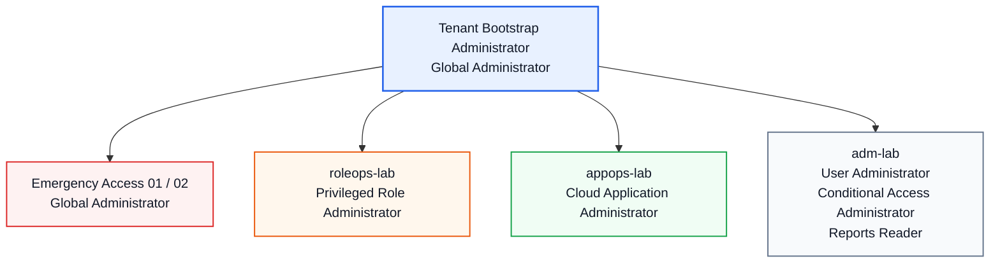

# Access Matrix

This document describes the identities, administrative roles, security groups and application access model used in the Baltic Finance Lab.

## Workforce Users

| Account            | Display Name     | Department | Directory Role |
| ------------------ | ---------------- | ---------- | -------------- |
| `anna.finance`     | Anna Finance     | Finance    | None           |
| `peter.finance`    | Peter Finance    | Finance    | None           |
| `eva.hr`           | Eva HR           | HR         | None           |
| `thomas.it`        | Thomas IT        | IT         | None           |
| `jan.mover`        | Jan Mover        | Finance    | None           |
| `alexandra.leaver` | Alexandra Leaver | Finance    | None           |

All workforce accounts are configured as Microsoft Entra `Member` users.

The `Usage location` for workforce users is Poland.

Peter Finance is configured as the manager for selected Finance users, including Anna Finance, Jan Mover and Alexandra Leaver.

---

## Administrative Accounts

| Account                  | Display Name                    | Directory Role                   | Purpose                                                    |
| ------------------------ | ------------------------------- | -------------------------------- | ---------------------------------------------------------- |
| `adm-lab`                | Lab Identity Administrator      | User Administrator               | Delegated day-to-day identity administration               |
| `adm-lab`                | Lab Identity Administrator      | Conditional Access Administrator | Conditional Access policy administration                   |
| `adm-lab`                | Lab Identity Administrator      | Reports Reader                   | Sign-in and authentication log review                      |
| `appops-lab`             | Cloud Application Administrator | Cloud Application Administrator  | App Registration and Enterprise Application administration |
| `roleops-lab`            | Privileged Role Administrator   | Privileged Role Administrator    | Privileged role assignment and PIM administration          |
| `bg01`                   | Emergency Access 01             | Global Administrator             | Emergency / break-glass access                             |
| `bg02`                   | Emergency Access 02             | Global Administrator             | Emergency / break-glass access                             |
| Tenant bootstrap account | Tenant Bootstrap Administrator  | Global Administrator             | Initial tenant administration and recovery                 |

Administrative accounts are separated from standard workforce identities.

`adm-lab` uses delegated administrative roles rather than `Global Administrator` for routine identity, Conditional Access and reporting tasks.

Emergency access accounts use permanent active `Global Administrator` assignments and are reserved for recovery scenarios.

---

## Security Groups

All groups are configured as:

* Group type: `Security`
* Role assignable: `No`

Unless stated otherwise, membership is currently managed manually using assigned membership.

| Group                      | Purpose                                                            | Members / Scope                                                  |
| -------------------------- | ------------------------------------------------------------------ | ---------------------------------------------------------------- |
| `SG-App-Expense-Approvers` | Expense Portal approval access                                     | `peter.finance`                                                  |
| `SG-App-Expense-Users`     | Expense Portal submitter access                                    | Workforce users                                                  |
| `SG-CA-Pilot`              | Pilot scope for Conditional Access testing                         | `anna.finance`, `thomas.it`                                      |
| `SG-Auth-Hardening-Pilot`  | Pilot scope for stronger authentication and phishing-resistant MFA | Includes selected authentication hardening test users            |
| `SG-Passwordless-Pilot`    | Pilot scope for Passkey (FIDO2) rollout                            | Includes selected passwordless test users                        |
| `SG-Dept-Finance`          | Finance department membership                                      | `anna.finance`, `peter.finance`, `jan.mover`, `alexandra.leaver` |
| `SG-Dept-HR`               | HR department membership                                           | `eva.hr`                                                         |
| `SG-Dept-IT`               | IT department membership                                           | `thomas.it`                                                      |
| `SG-Emergency-Access`      | Dedicated group for emergency / break-glass accounts               | `bg01`, `bg02`                                                   |
| `SG-External-Contractors`  | B2B contractor access                                              | Empty until the External Identities phase                        |

---

## Group Design

Department groups represent organizational membership:

* `SG-Dept-Finance`
* `SG-Dept-HR`
* `SG-Dept-IT`

Application groups control authorization to the Expense Portal:

* `SG-App-Expense-Users` → `Expense.Submitter`
* `SG-App-Expense-Approvers` → `Expense.Approver`

Conditional Access and authentication pilot groups provide controlled deployment scopes:

* `SG-CA-Pilot` → baseline Conditional Access and MFA testing
* `SG-Auth-Hardening-Pilot` → phishing-resistant authentication enforcement
* `SG-Passwordless-Pilot` → Passkey (FIDO2) registration and passwordless rollout

`SG-Emergency-Access` separates emergency access identities from standard administrative and workforce accounts and is excluded from restrictive Conditional Access policies.

`SG-External-Contractors` is reserved for future B2B collaboration scenarios.

---

## Expense Portal Access

| Group                      | Application Role    |
| -------------------------- | ------------------- |
| `SG-App-Expense-Users`     | `Expense.Submitter` |
| `SG-App-Expense-Approvers` | `Expense.Approver`  |

Application access is assigned through security groups instead of directly to individual users.

This supports centralized access management and prepares the environment for future Joiner / Mover / Leaver automation.

Authentication and authorization are intentionally separated.

Conditional Access determines whether a user is allowed to authenticate under the required security conditions, while App Roles determine what the authenticated user can do inside the Expense Portal.

---

## Conditional Access Scope

| Policy                                             | Scope                                                         | Control                                   |
| -------------------------------------------------- | ------------------------------------------------------------- | ----------------------------------------- |
| `CA001-ExpensePortal-Require-MFA`                  | Conditional Access pilot users accessing Expense Portal       | Require multifactor authentication        |
| `CA002-ExpensePortal-HighSignInRisk`               | High-risk Expense Portal sign-ins                             | Evaluate block access in Report-only mode |
| `CA003-ExpensePortal-Phishing-resistant-MFA-Pilot` | Authentication hardening pilot users accessing Expense Portal | Require phishing-resistant MFA            |

`SG-Emergency-Access` is excluded from restrictive Conditional Access policies to preserve emergency tenant access.

CA001 provides the general MFA baseline.

CA003 applies a stronger authentication requirement to selected pilot users without replacing the existing baseline policy.

---

## Authentication Pilot Model

### Passwordless Pilot

`SG-Passwordless-Pilot` is used to scope the initial Passkey (FIDO2) rollout.

Temporary Access Pass can be used as a bootstrap credential to allow a user to register a stronger passwordless authentication method.

### Authentication Hardening Pilot

`SG-Auth-Hardening-Pilot` is used to:

* require phishing-resistant MFA through Conditional Access,
* test access with strong authentication methods,
* validate negative access scenarios,
* scope Self-Service Password Reset configuration.

This allows authentication changes to be validated with a limited population before wider deployment.

---

## Administrative Model

The lab follows a separation-of-duties and least-privilege model:

The current model intentionally avoids assigning `Global Administrator` to routine administrative accounts.

Privileged access will be further hardened during the Privileged Identity Management phase.

