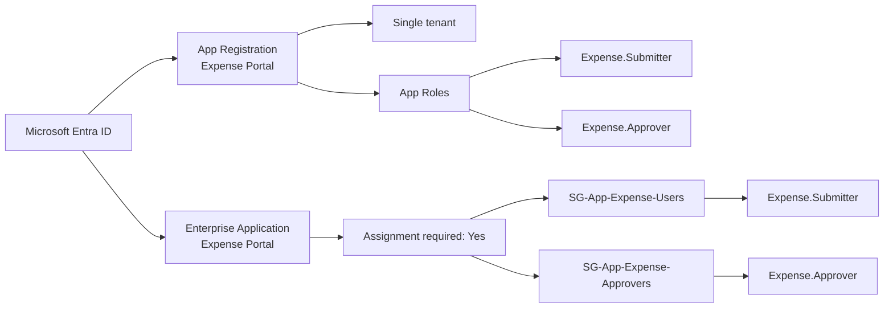

# Expense Portal — Application Architecture

The Expense Portal uses Microsoft Entra ID for authentication and role-based access control.

Application permissions are assigned through security groups rather than directly to individual users.

* `SG-App-Expense-Users` is assigned the `Expense.Submitter` app role.
* `SG-App-Expense-Approvers` is assigned the `Expense.Approver` app role.

This design keeps user access management separate from the application configuration and makes role assignments easier to maintain.
