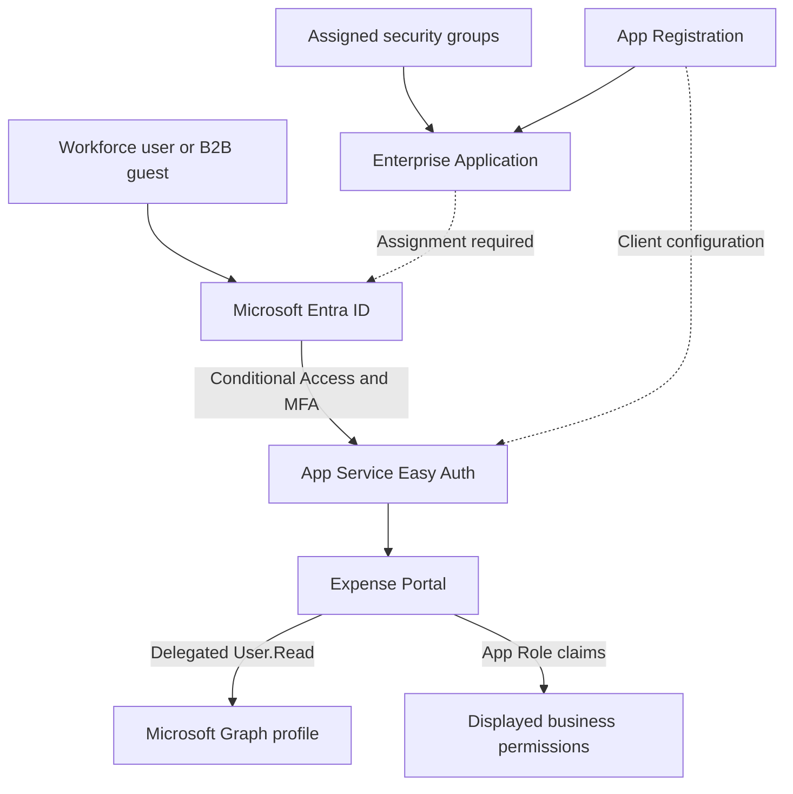

# Expense Portal — Application Architecture

Expense Portal is an Azure App Service protected by Microsoft Entra authentication (Easy Auth). The single-tenant App Registration defines the client and App Roles; the Enterprise Application controls assignments and records consent.



## Authorization and API Permissions

| Control | Purpose | Evidence |
| --- | --- | --- |
| Enterprise Application assignment | Determines which users can access the app | Days 02/05 positive access and `AADSTS50105` negative tests |
| `Expense.Submitter` App Role | Represents expense-submission permission | Anna's captured portal session |
| `Expense.Approver` App Role | Represents approval permission | Peter's captured portal session alongside Submitter |
| Graph `User.Read`, Delegated | Reads the signed-in user's own profile | Day 12 Anna/Peter results and Day 18 captured regression |
| Conditional Access | Applies the required sign-in conditions and authentication strength | Day 18 What If, real sign-in and KQL correlation |

The baseline assignments are `SG-App-Expense-Users` → `Expense.Submitter` and `SG-App-Expense-Approvers` → `Expense.Approver`. Later labs add Finance and external-access paths; see the [Access Matrix](access-matrix.md).

App Roles and Microsoft Graph permissions serve different purposes. The screenshots establish app access and displayed role claims. The repository does not yet contain the deployed application source or tests of a business approval API, so server-side expense-processing authorization is not independently reviewed here.

## Token Handling and Current Verification Boundary

Day 12 documents Token Store and these login parameters:

```text
response_type=code id_token
scope=openid offline_access profile https://graph.microsoft.com/User.Read
```

The application's `/graph/profile` endpoint returns selected profile fields. Day 18 shows delegated `User.Read`, no remaining App Registration credentials, and a successful Graph response in the captured session. Fresh code redemption and token renewal after credential cleanup require the [Easy Auth follow-up](remaining-work.md); the credential mechanism cannot be inferred from the permission list alone.

The separate Day 13 workload uses **Azure Automation managed identities → Azure Blob Storage**. It is not evidence that Expense Portal itself uses a managed identity or Key Vault. Key Vault integration remains a planned extension.

## Source and Related Labs

- [Day 02 — Application identity](day-02.md)
- [Day 12 — Graph integration](day-12.md)
- [Day 18 — Current assessment](day-18.md)
- [Missing deployment/source artifacts](remaining-work.md)
