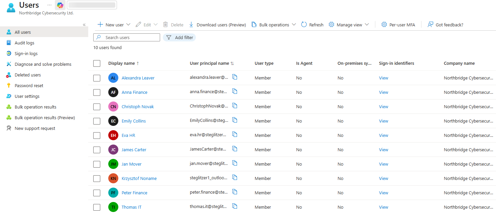
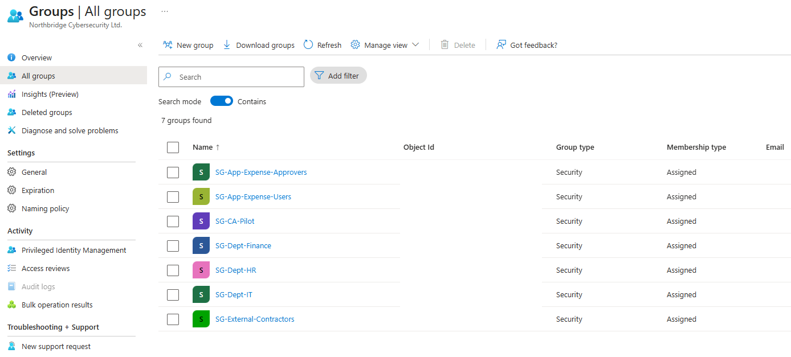
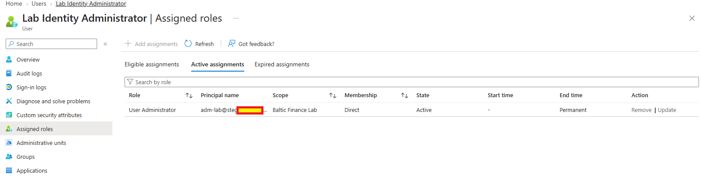
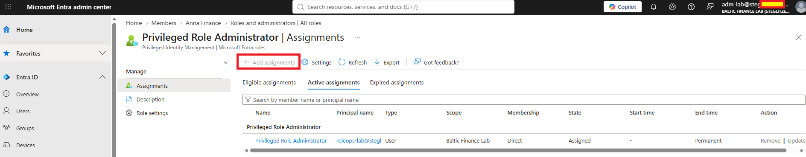
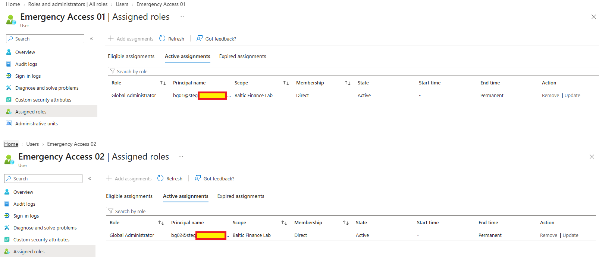
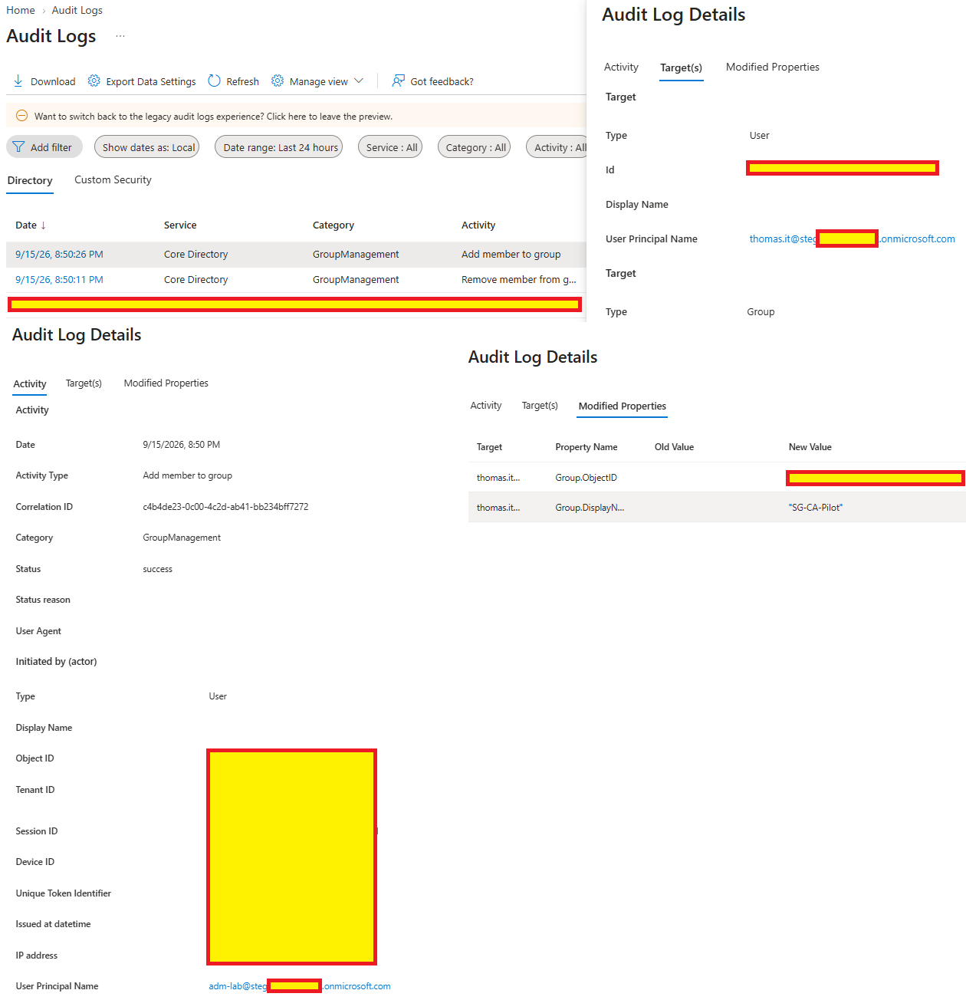
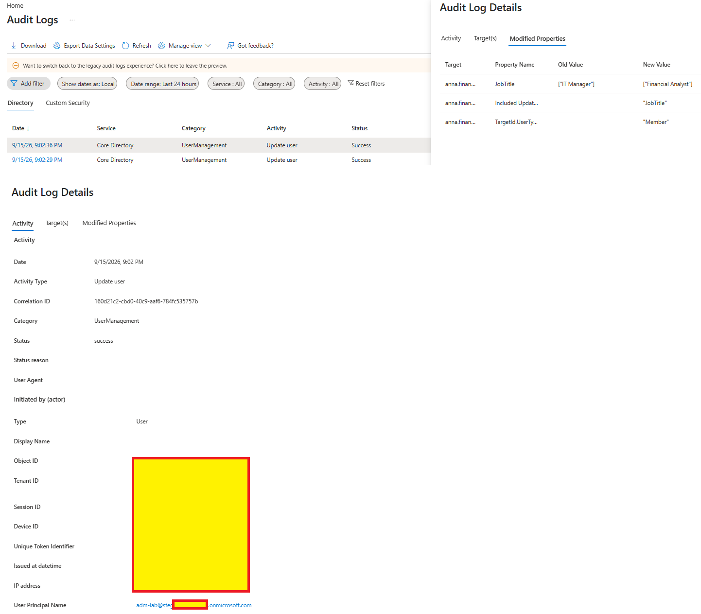
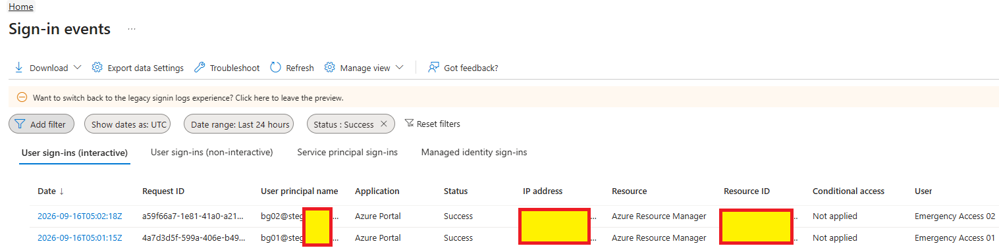

# Day 01 — Evidence

This folder contains evidence from the Day 01 identity foundation lab.

## 01 — Workforce and administrative identities

**Shows:** Ten Member accounts, including the workforce users, `adm-lab`, `bg01` and `bg02`, with on-premises synchronization shown as No.

**Why it matters:** Establishes the identity baseline and separation of workforce, routine administration and emergency access accounts.

## 02 — Security group baseline

**Shows:** Seven Security groups with Assigned membership, covering departments, Expense Portal roles, the Conditional Access pilot and external contractors.

**Why it matters:** Documents the group-based access model. Emergency-group membership, group owners and role-assignable status are not displayed in this inventory.

## 03 — Delegated User Administrator assignment

**Shows:** `adm-lab` with a direct, tenant-scoped `User Administrator` assignment marked Active and Permanent.

**Why it matters:** Documents the role used for routine identity administration without requiring a Global Administrator assignment for those tasks.

## 04 — Privileged role assignment boundary

**Shows:** The `Add assignments` control disabled for Privileged Role Administrator while signed in as `adm-lab`.

**Why it matters:** Demonstrates the portal permission boundary for the delegated administrator. No attempted Microsoft Graph role-assignment denial is captured here.

## 05 — Emergency account role assignments

**Shows:** `bg01` and `bg02` each holding a direct, tenant-scoped `Global Administrator` assignment marked Active and Permanent.

**Why it matters:** Documents the privileged role configuration for the two emergency access accounts; their sign-in results are shown separately below.

## 06 — Group membership audit trail

**Shows:** A successful `Add member to group` event by `adm-lab` for `thomas.it` and `SG-CA-Pilot`, with an earlier removal row also visible.

**Why it matters:** Links a membership change to its actor, target and result. The earlier removal event's result detail is not expanded.

## 07 — User attribute audit trail

**Shows:** A successful `Update user` event initiated by `adm-lab`, with Anna's `JobTitle` changing from `IT Manager` to `Financial Analyst`.

**Why it matters:** Demonstrates auditable delegated user administration, including the modified property and its old and new values.

## 08 — Emergency account sign-ins

**Shows:** Successful interactive Azure Portal sign-ins for both emergency accounts, with Azure Resource Manager as the resource and Conditional Access `Not applied`.

**Why it matters:** Supports successful emergency-account authentication at the captured time. It does not demonstrate recovery during an outage or reveal the authentication method.

Sensitive identifiers, IP addresses and tenant-specific values were redacted before publication.
