# Day 02 — Evidence

This folder contains evidence from the Day 02 Expense Portal identity integration lab.

## 01 — Expense Portal App Registration

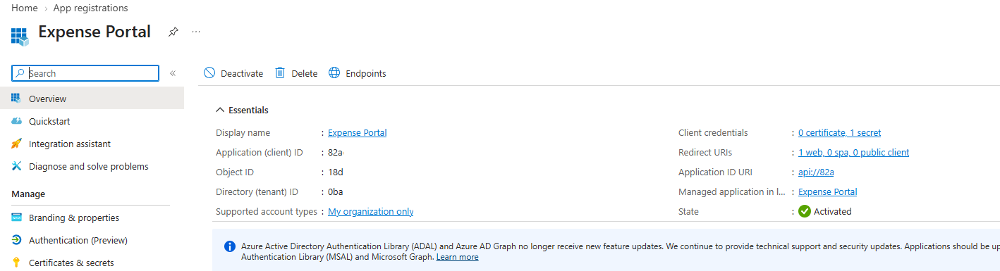

**Shows:** The Expense Portal App Registration with supported accounts set to `My organization only`, one web redirect URI and one client secret.

**Why it matters:** Documents the single-tenant application identity. Exact identifiers and redirect details are masked or truncated.

## 02 — Application role definitions

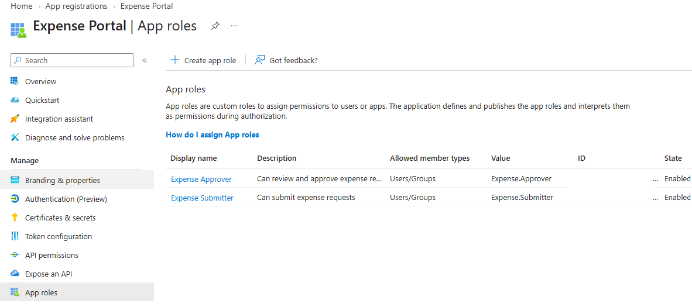

**Shows:** Enabled `Expense.Submitter` and `Expense.Approver` roles with Users/Groups as their allowed member types.

**Why it matters:** Defines the business roles used to distinguish submission and approval access in the lab.

## 03 — Enterprise Application

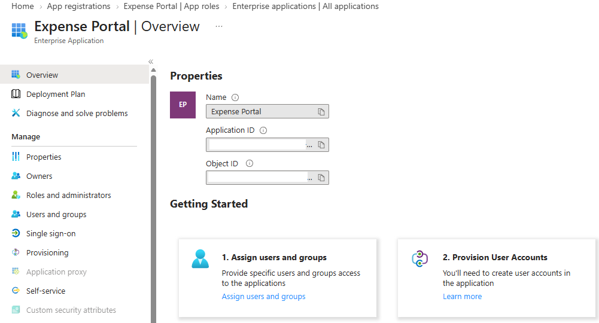

**Shows:** The Expense Portal Enterprise Application and its application and object ID fields, with identifiers redacted.

**Why it matters:** Documents the tenant's service-principal representation used for application assignments. Masking prevents exact ID correlation with the App Registration in this image.

## 04 — Group-to-role assignments

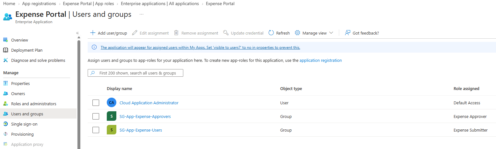

**Shows:** `SG-App-Expense-Users` assigned Expense Submitter and `SG-App-Expense-Approvers` assigned Expense Approver.

**Why it matters:** Connects security-group membership to application roles and provides the configuration behind the user-access tests.

## 05 — Explicit assignment requirement

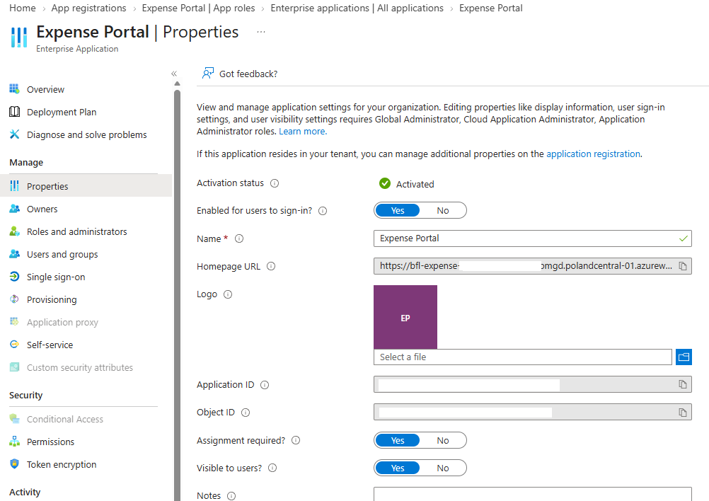

**Shows:** Expense Portal enabled for user sign-in with `Assignment required` set to Yes.

**Why it matters:** Documents the assignment gate whose enforcement is demonstrated by the unassigned-account denial below.

## 05a — App Service authentication

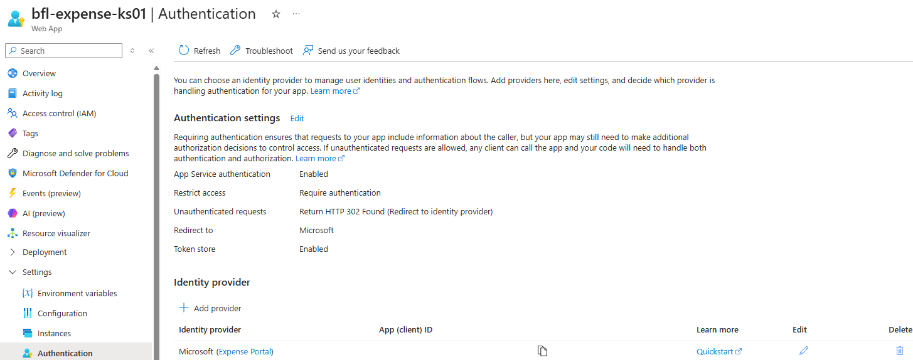

**Shows:** Authentication enabled on `bfl-expense-ks01`, access restricted to authenticated requests, HTTP 302 redirection to Microsoft, and the Expense Portal identity provider.

**Why it matters:** Shows how the deployed application routes unauthenticated requests into the Entra sign-in flow.

## 06 — Anna's Submitter session

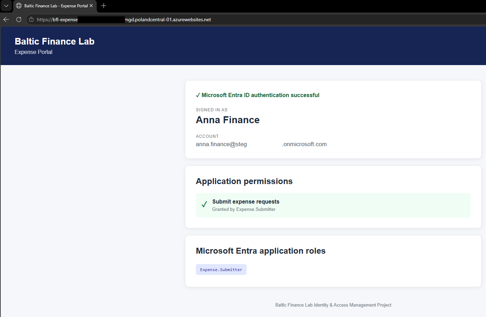

**Shows:** Anna Finance signed in to Expense Portal with `Expense.Submitter` displayed and no Approver role shown.

**Why it matters:** Demonstrates the expected role display for the submitter persona. The page does not show a completed expense operation or server-side authorization test.

## 07 — Peter's Submitter and Approver session

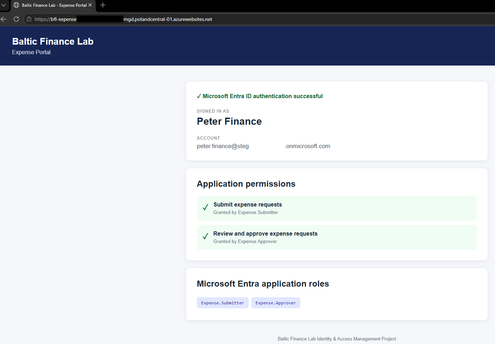

**Shows:** Peter Finance signed in with both `Expense.Submitter` and `Expense.Approver` and their corresponding permission labels.

**Why it matters:** Demonstrates the distinct approver persona. Displayed roles do not independently prove execution or enforcement of protected business operations.

## 08 — Delegated Graph consent

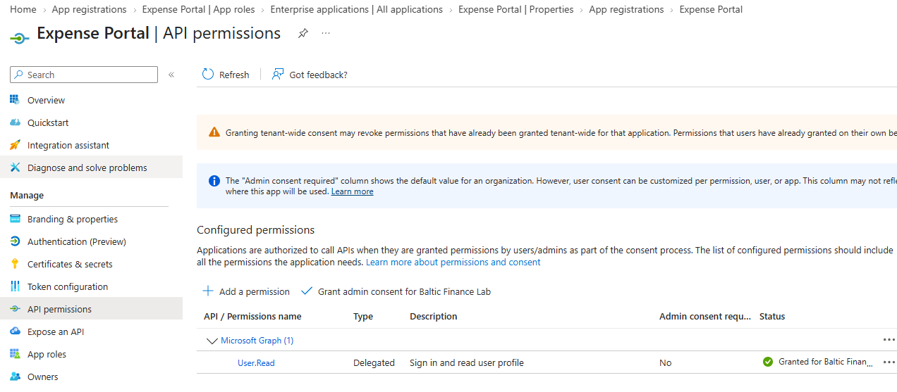

**Shows:** Microsoft Graph delegated `User.Read` granted for Baltic Finance Lab; its default `Admin consent required` column is No.

**Why it matters:** Records the actual permission type and tenant-wide grant, keeping Graph consent separate from Expense Portal business roles.

## 09 — User sign-in records

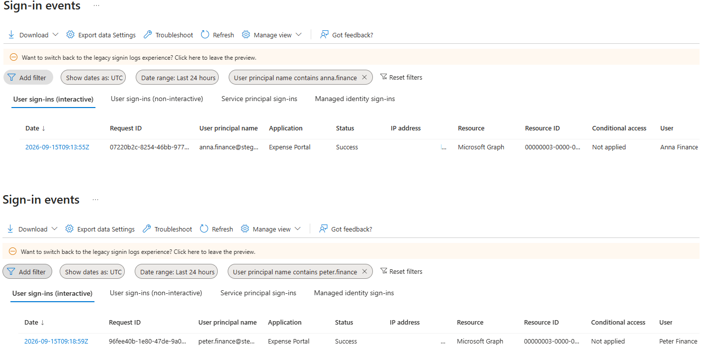

**Shows:** Successful interactive sign-ins for Anna and Peter, with Expense Portal as the application, Microsoft Graph as the resource and Conditional Access `Not applied`.

**Why it matters:** Corroborates application authentication with Entra logs; these records are not expense-operation audit events.

## 10 — Unassigned account denied

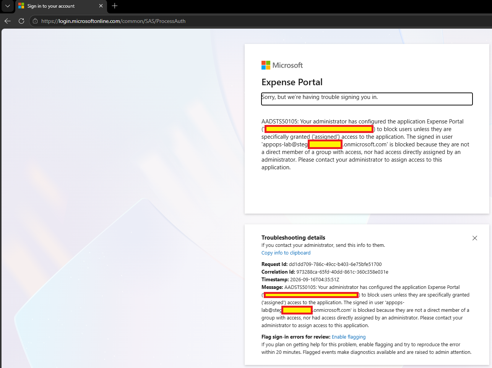

**Shows:** `appops-lab` denied Expense Portal access with `AADSTS50105` because neither a direct assignment nor direct membership in an assigned group was present.

**Why it matters:** Demonstrates enforcement of the explicit application-assignment requirement for the tested account.

Sensitive identifiers and tenant-specific values were redacted before publication.
