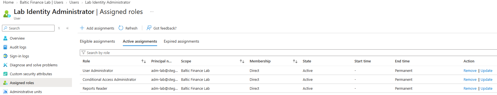
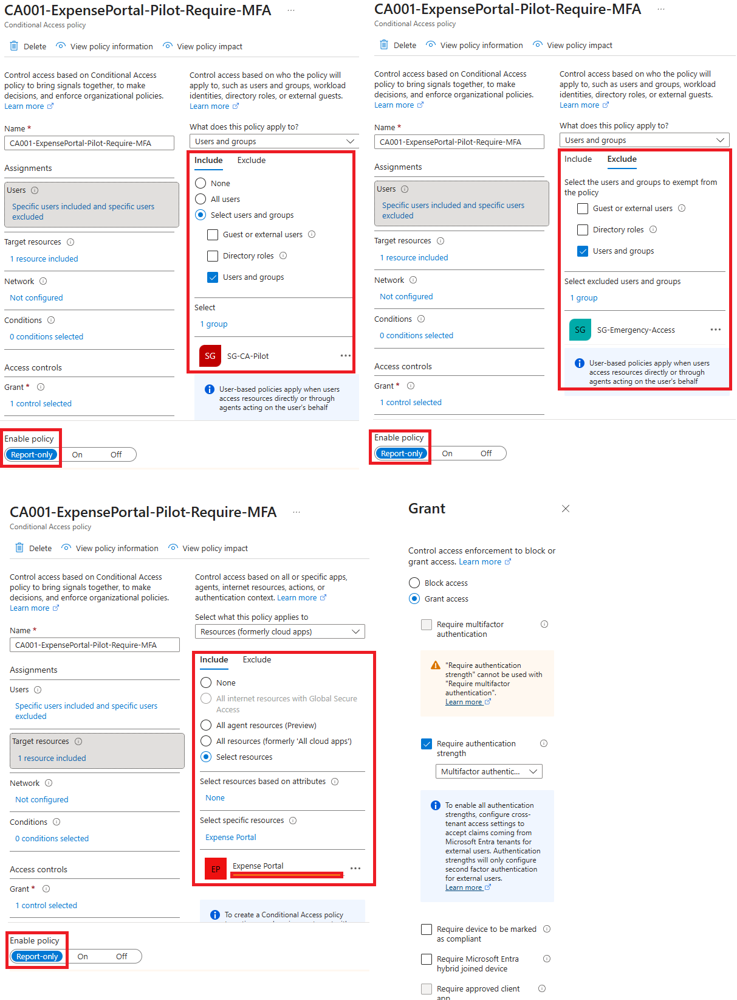
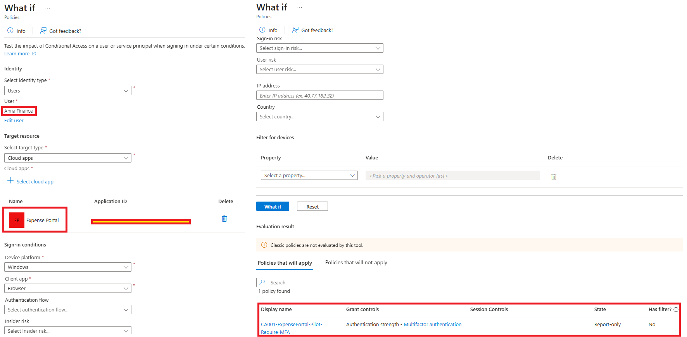
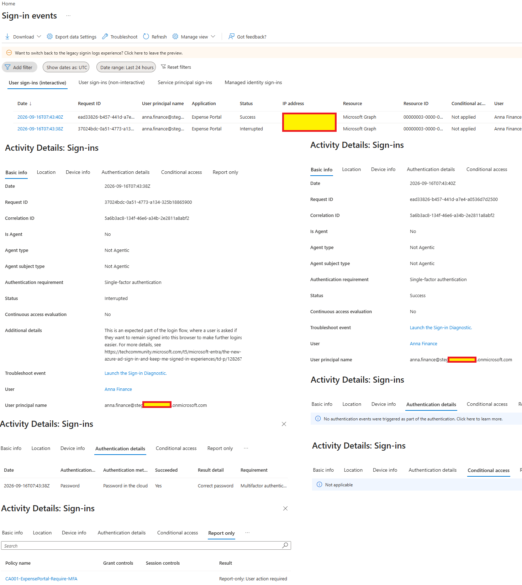
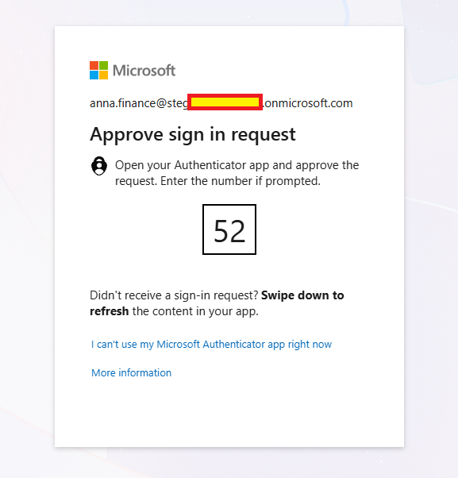
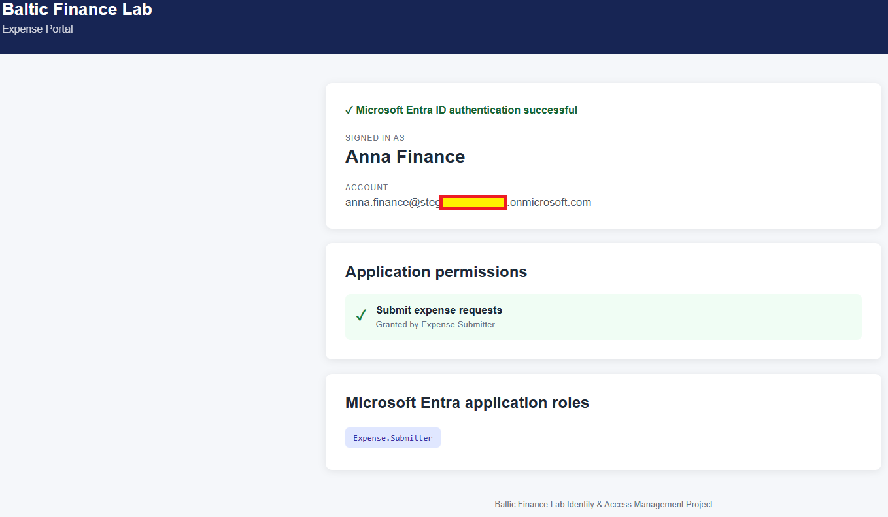
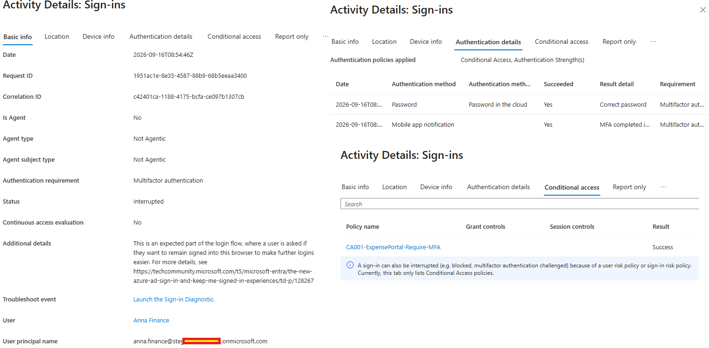
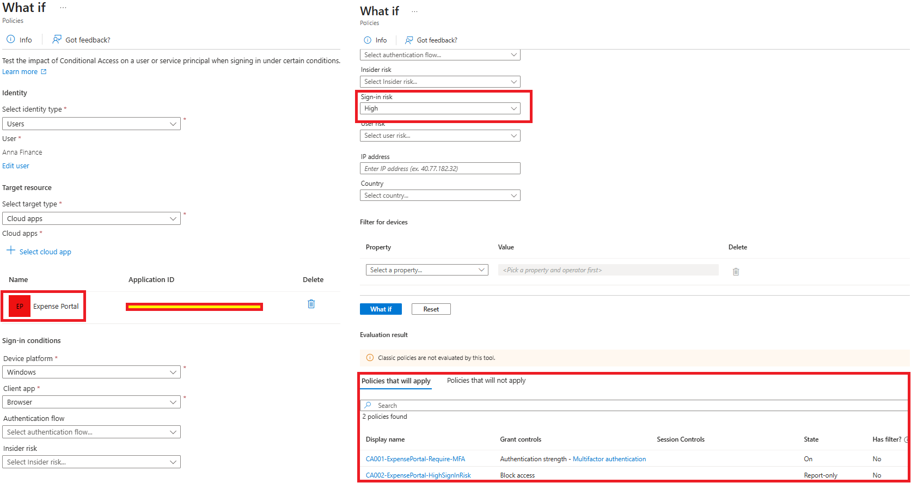

# Day 03 — Evidence

This folder contains evidence for the Day 03 Conditional Access and MFA implementation and validation.

## 01 — Conditional Access administrative roles

**Shows:** `adm-lab` with active, permanent assignments for User Administrator, Conditional Access Administrator and Reports Reader.

**Why it matters:** Documents the administrative permissions used to configure policies and inspect logs at this stage of the lab.

## 02 — CA001 report-only configuration

**Shows:** `CA001-ExpensePortal-Pilot-Require-MFA` targeting `SG-CA-Pilot` and Expense Portal, excluding `SG-Emergency-Access`, with an MFA authentication-strength grant and Report-only state.

**Why it matters:** Documents the pilot configuration before enforcement. This initial policy name includes `-Pilot-`; later captures use the shorter CA001 name.

## 03 — CA001 What If evaluation

**Shows:** Anna Finance, Expense Portal and Windows/Browser selected in What If, with CA001 matching in Report-only mode and requiring Multifactor authentication strength.

**Why it matters:** Checks policy applicability for the specified scenario. A What If result is a simulation rather than a completed sign-in.

## 04 — Report-only sign-in evaluation

**Shows:** Anna's Expense Portal sign-in sequence and CA001 returning `Report-only: User action required`; a subsequent event with the same correlation ID shows Success.

**Why it matters:** Demonstrates evaluation against a real sign-in while the policy remains non-enforcing. The overall Conditional Access column remains `Not applied`.

## 05 — Authenticator challenge

**Shows:** Anna Finance receiving a Microsoft Authenticator sign-in approval prompt with a number-matching challenge.

**Why it matters:** Captures the interactive MFA step in the documented scenario. The prompt alone does not identify the application, policy or final sign-in result.

## 06 — Expense Portal access after authentication

**Shows:** Anna's authenticated Expense Portal session displaying the `Expense.Submitter` role.

**Why it matters:** Shows application access in the MFA test sequence. The authentication method and policy evaluation are established by the separate sign-in evidence.

## 07 — Successful MFA and CA001 evaluation

**Shows:** Successful password and mobile-app-notification steps for Anna and `CA001-ExpensePortal-Require-MFA: Success`; Basic info marks the overall event `Interrupted` for the keep-me-signed-in prompt.

**Why it matters:** Demonstrates successful MFA and policy evaluation while distinguishing those results from the overall sign-in event status.

## 08 — High-risk What If scenario

**Shows:** A High sign-in risk simulation for Anna and Expense Portal matching CA001 On and CA002 `Block access` in Report-only mode.

**Why it matters:** Validates the simulated policy combination. It does not demonstrate a real risky sign-in or an enforced CA002 block.

Sensitive environment-specific values were redacted before publication.
