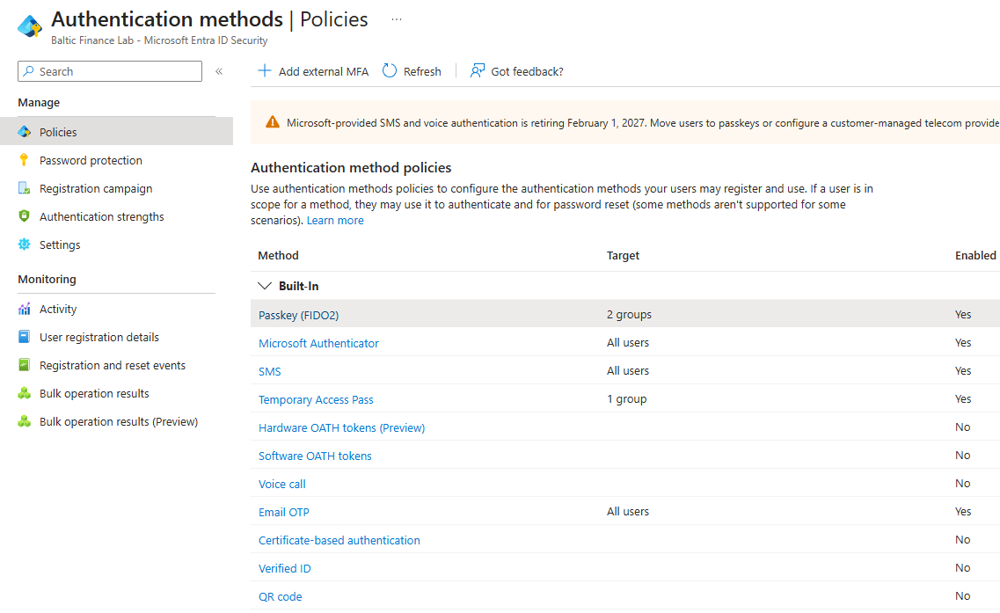
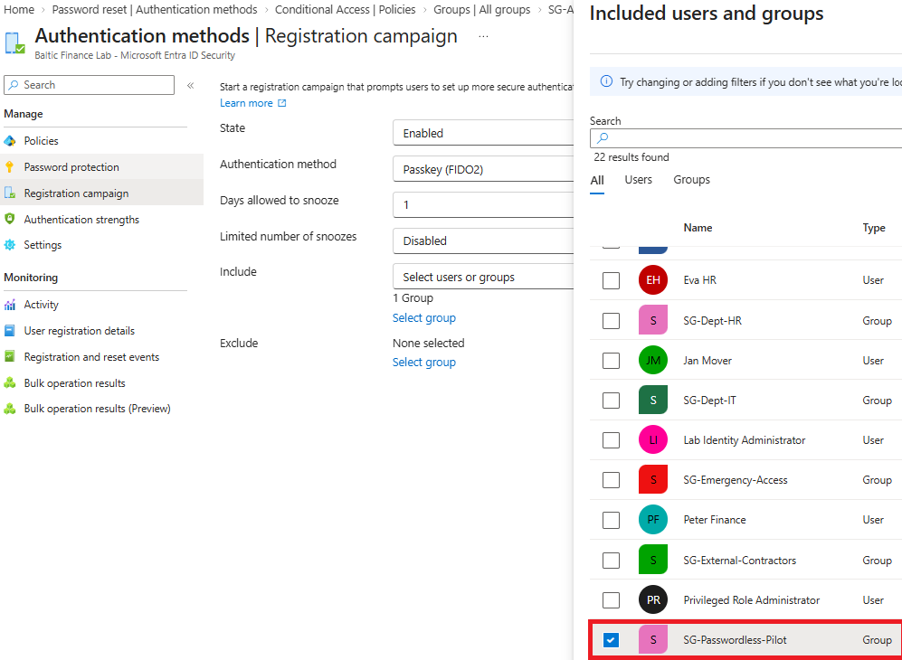
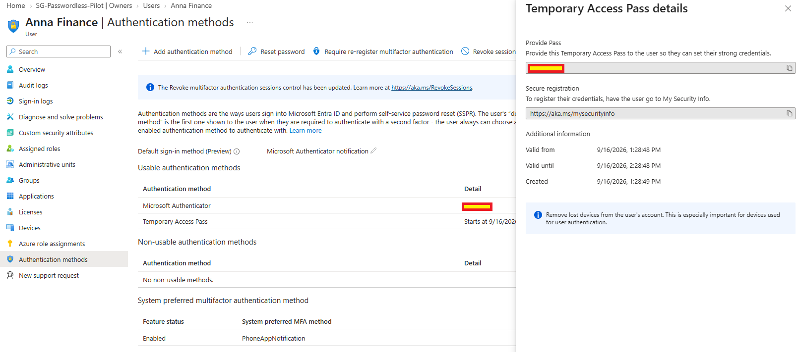
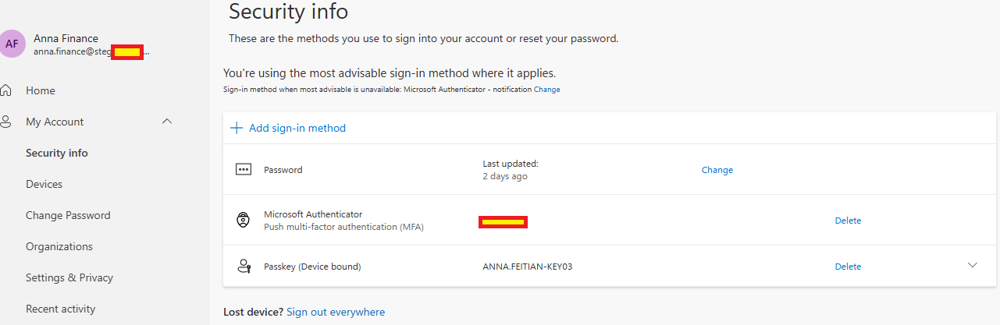
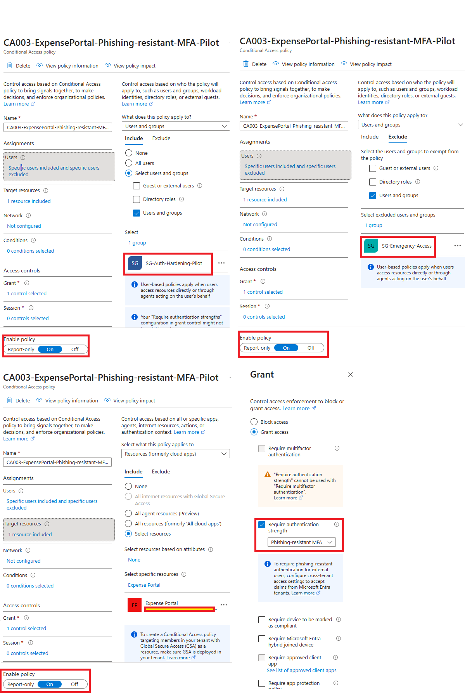
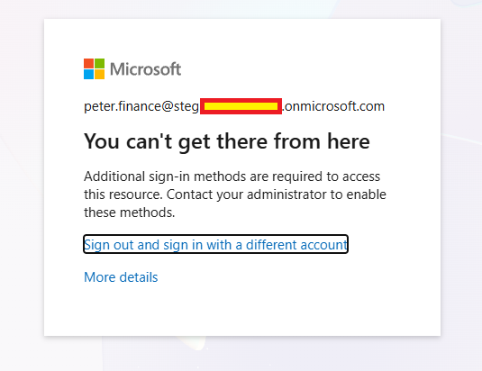
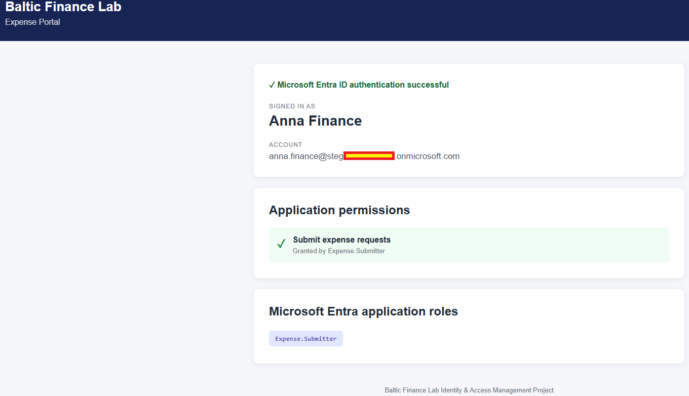
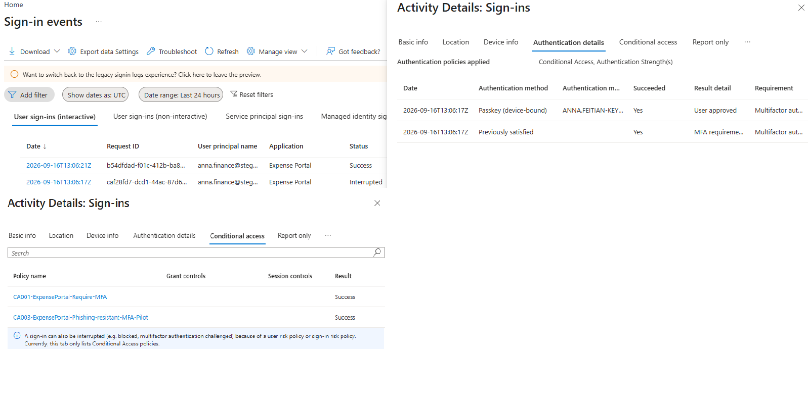
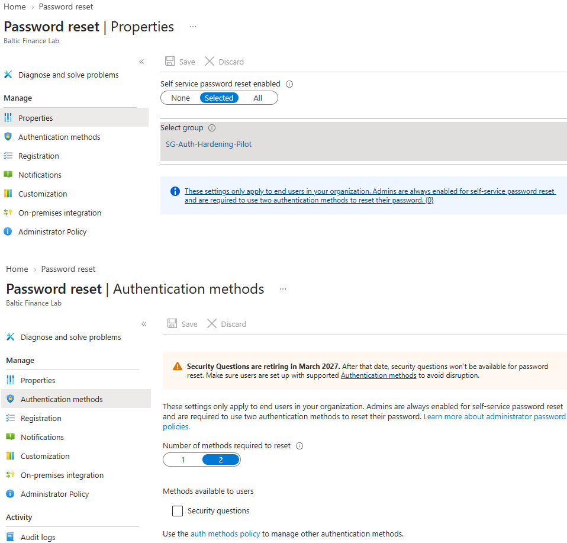

# Day 04 — Evidence

This folder contains evidence for the Day 04 authentication hardening and phishing-resistant MFA implementation and validation.

## 01 — Authentication Methods Policy

**Shows:** Authenticator and SMS enabled for all users, Passkey (FIDO2) for two groups and Temporary Access Pass for one group.

**Why it matters:** Documents method availability for the hardening lab. The TAP and Passkey target group names are not expanded in this view.

## 02 — Passkey registration campaign

**Shows:** An enabled Passkey (FIDO2) registration campaign with `SG-Passwordless-Pilot` selected.

**Why it matters:** Documents a controlled registration rollout. Campaign configuration alone does not show a user completing the registration prompt.

## 03 — Temporary Access Pass issuance

**Shows:** A Temporary Access Pass created for Anna Finance with a one-hour validity window and its credential value redacted.

**Why it matters:** Documents issuance of the intended bootstrap credential. The capture does not show TAP consumption or the authentication flow used to register the passkey.

## 04 — Registered device-bound passkey

**Shows:** Anna's Security info listing a device-bound passkey named `ANNA.FEITIAN-KEY03`, alongside Microsoft Authenticator and password.

**Why it matters:** Establishes that the passkey is registered to Anna's account; successful use is evidenced separately in the sign-in logs.

## 05 — Phishing-resistant MFA policy

**Shows:** CA003 On for `SG-Auth-Hardening-Pilot` and Expense Portal, excluding `SG-Emergency-Access`, with `Phishing-resistant MFA` authentication strength.

**Why it matters:** Documents the stronger authentication requirement for the pilot and its emergency-access exclusion.

## 06 — Additional authentication methods required

**Shows:** Peter Finance receiving a block message stating that additional sign-in methods are required.

**Why it matters:** Captures the negative authentication experience in the documented scenario. The image does not identify Expense Portal, CA003 or the exact failed method.

## 07 — Anna's authenticated portal session

**Shows:** Anna authenticated to Expense Portal with `Expense.Submitter` displayed.

**Why it matters:** Shows application access in the passkey test sequence while preserving the existing business role. The page itself does not identify the authentication method.

## 08 — Passkey and Conditional Access results

**Shows:** Successful device-bound passkey authentication for Anna, CA001 and CA003 returning Success, and an Expense Portal event list with Interrupted followed by Success.

**Why it matters:** Corroborates use of the strong method and successful policy evaluation with Entra sign-in evidence.

## 09 — Self-Service Password Reset pilot

**Shows:** SSPR enabled for `SG-Auth-Hardening-Pilot`, with two authentication methods required for password reset.

**Why it matters:** Documents recovery configuration. A completed reset, sign-in with the new password and hybrid password writeback are not shown.

Sensitive credentials, identifiers and tenant-specific values were redacted before publication.
