# Day 05 — Evidence

Screenshots documenting B2B collaboration between Baltic Finance Lab and Amber Audit Partners, including guest access, application authorization and cross-tenant access controls.

## 01 — External collaboration restrictions

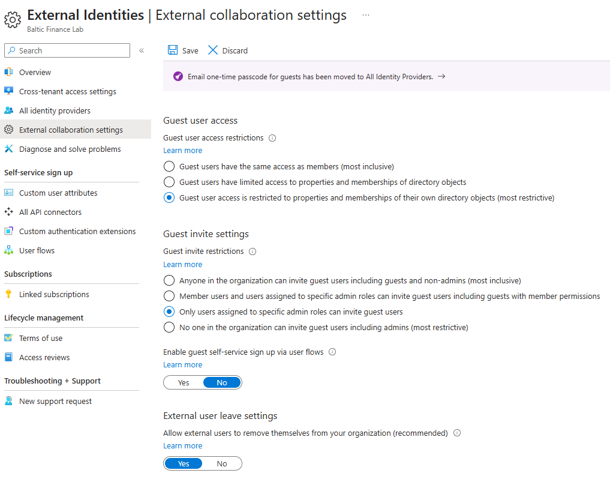

**Shows:** Guest directory access restricted to users' own objects, invitations limited to specified admin roles, and self-service signup set to No.

**Why it matters:** Documents the selected external-collaboration controls. The active Save control means this capture alone does not independently establish their persisted state.

## 02 — B2B onboarding audit events

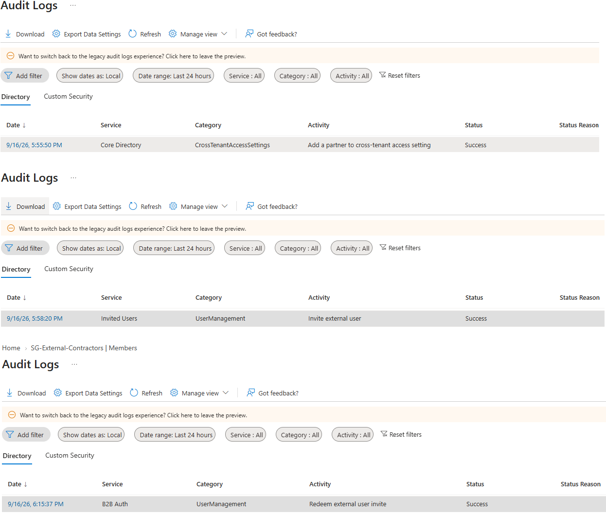

**Shows:** Successful `Add a partner`, `Invite external user` and `Redeem external user invite` audit rows.

**Why it matters:** Provides an audit trail for the onboarding sequence. Target and initiator details are not expanded, limiting exact user/partner correlation.

## 03 — Contractor application assignment

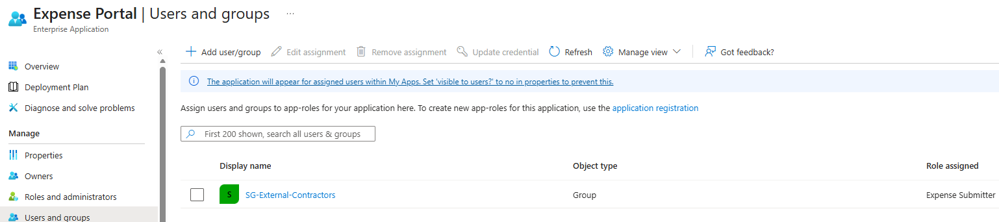

**Shows:** `SG-External-Contractors` assigned to Expense Portal with the Expense Submitter application role.

**Why it matters:** Documents the application entitlement used for the external-access scenario, separate from employee groups.

## 04 — Guest denied without assignment

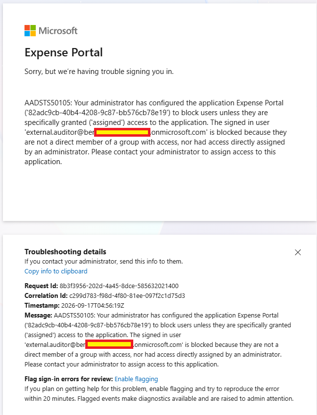

**Shows:** `external.auditor` denied Expense Portal access with `AADSTS50105`, citing no direct assignment or direct membership in an assigned group.

**Why it matters:** Demonstrates that a Guest identity alone does not provide application authorization.

## 05 — Contractor group membership

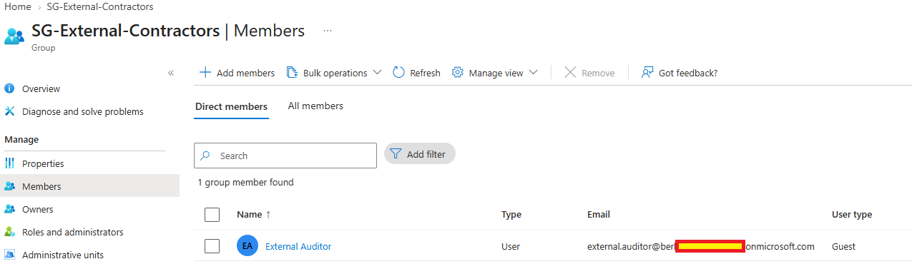

**Shows:** External Auditor listed as the one direct member of `SG-External-Contractors`, with user type Guest.

**Why it matters:** Connects the external identity to the group carrying the application entitlement at this point in the lab.

## 06 — Guest application access

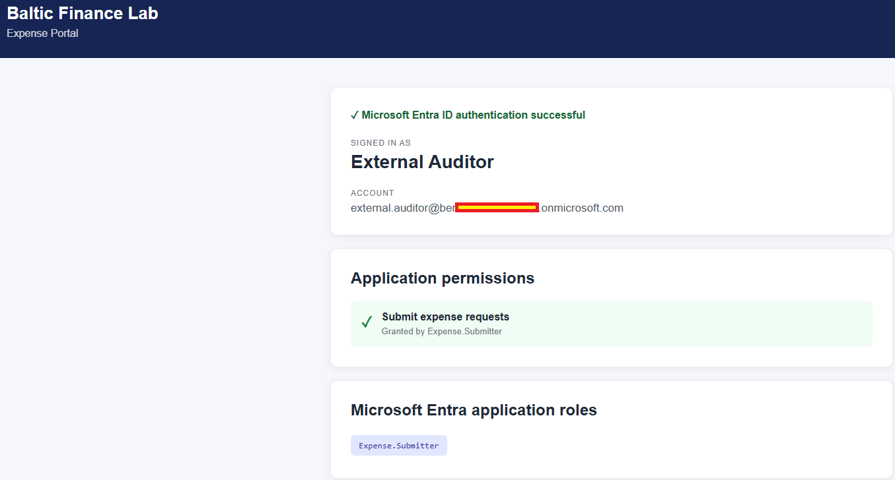

**Shows:** External Auditor signed in to Expense Portal with `Expense.Submitter` displayed.

**Why it matters:** Demonstrates the authorized guest session and role display. Submitter is a lab role choice, not evidence of read-only audit access or a completed expense operation.

## 07 — B2B sign-in record

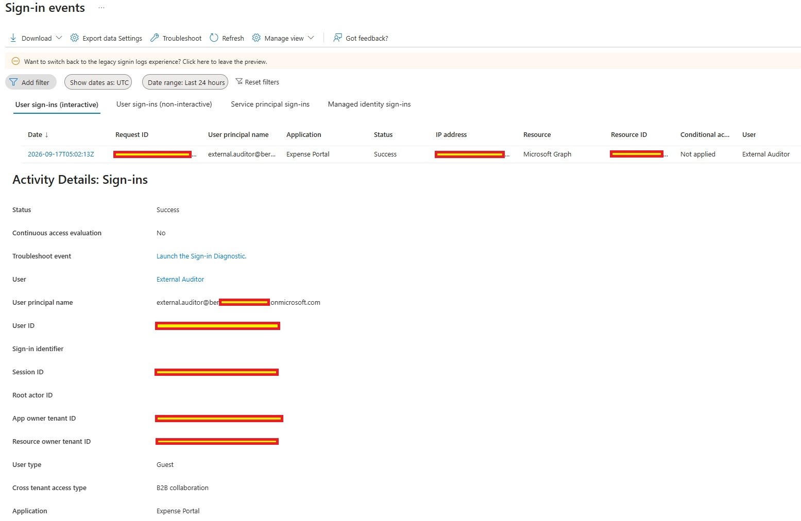

**Shows:** External Auditor's successful Expense Portal sign-in, user type Guest and cross-tenant access type B2B collaboration; the resource is Microsoft Graph.

**Why it matters:** Corroborates external authentication in Entra logs. Conditional Access is `Not applied`, and partner MFA-claim acceptance is not shown.

## 08 — Partner organization entry

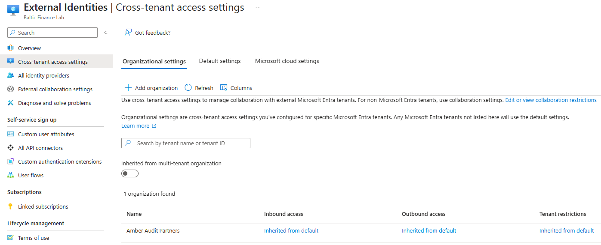

**Shows:** Amber Audit Partners in Baltic Finance's organizational settings, with inbound and outbound access inherited from default in this capture.

**Why it matters:** Establishes the partner entry. The later screenshots show the custom scopes used in the scenario.

## 09 — Baltic Finance inbound scope

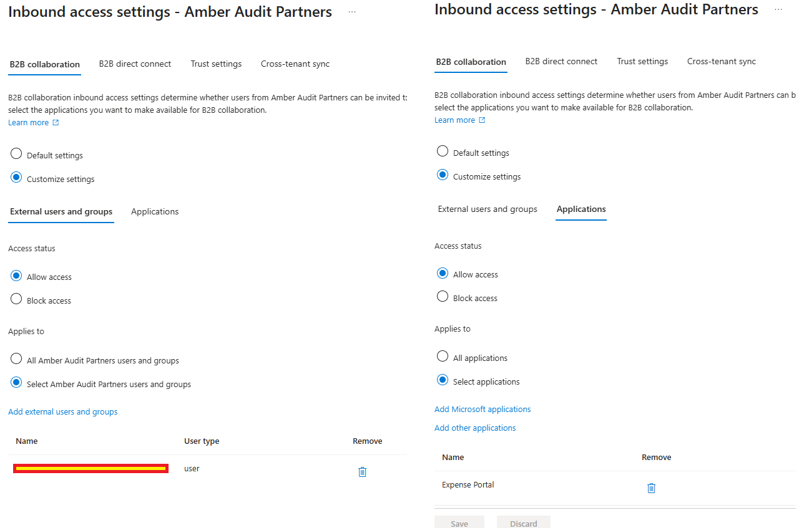

**Shows:** Custom inbound B2B Allow access scoped to one selected Amber Audit Partners user and Expense Portal.

**Why it matters:** Documents resource-side user/application scoping. The selected user's value is masked, so its exact identity cannot be checked here.

## 10 — Partner MFA trust configuration

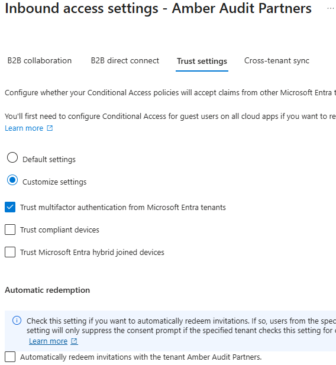

**Shows:** Customized inbound trust for Amber with MFA trust enabled and compliant-device and hybrid-joined-device trust disabled.

**Why it matters:** Records the intended trust boundary. Configuration alone does not prove that a partner MFA claim was accepted during a sign-in.

## 11 — Amber outbound scope

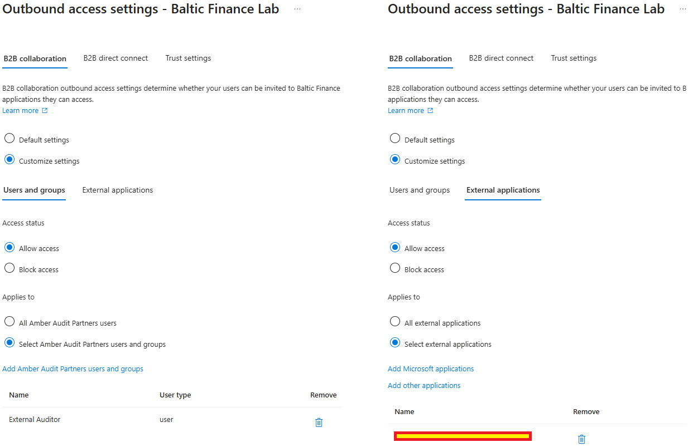

**Shows:** Outbound access toward Baltic Finance allowed for External Auditor and one selected external application.

**Why it matters:** Documents the home-tenant side of the B2B relationship. The application value is masked, preventing exact application verification in this capture.

## 12 — Inbound cross-tenant block

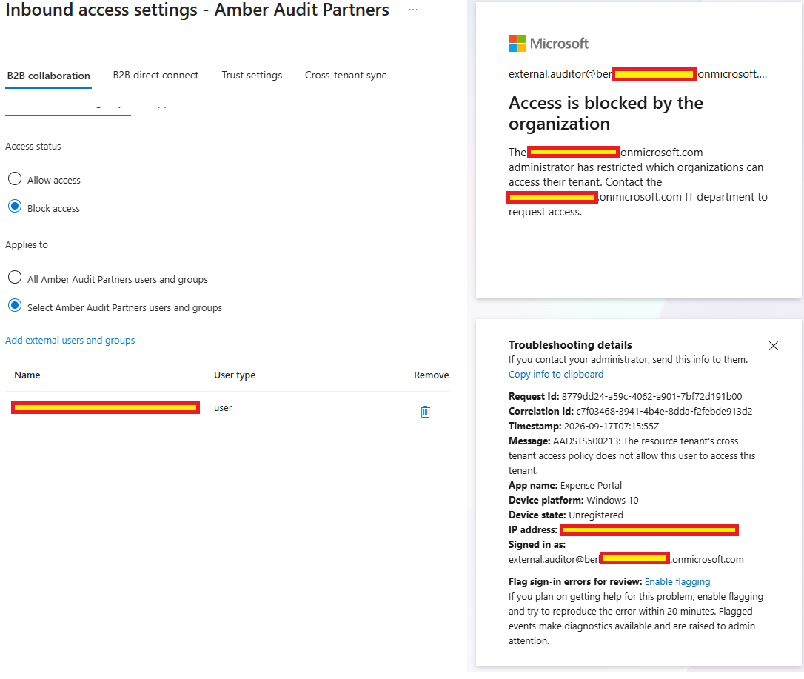

**Shows:** Inbound Block access selected and `external.auditor` denied Expense Portal with `AADSTS500213`, identifying the resource tenant's cross-tenant policy as the cause.

**Why it matters:** Demonstrates the cross-tenant access boundary independently of the earlier application-assignment denial.

## 13 — Access restored after the block test

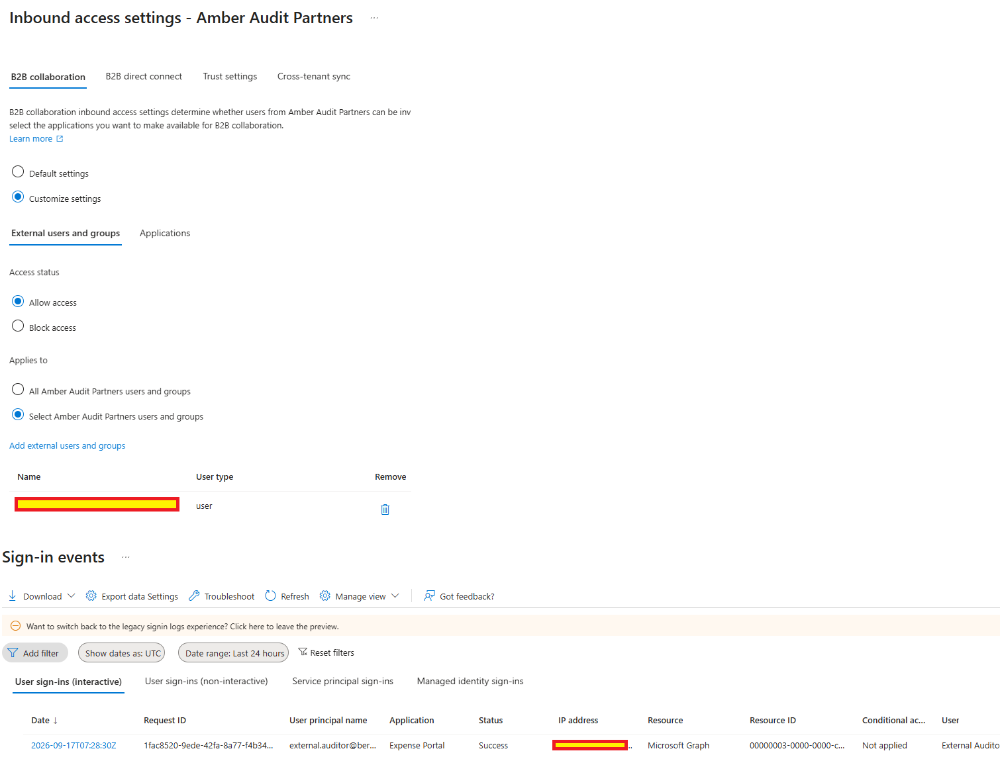

**Shows:** Inbound Allow access restored and a successful External Auditor sign-in to Expense Portal at 07:28 UTC, after the 07:15 UTC block event.

**Why it matters:** Supports recovery of the intended access after the negative test. This records the Day 05 scenario, not a current entitlement inventory.

Sensitive credentials, identifiers and tenant-specific values were redacted before publication.
