# Day 06 — Evidence

This folder contains evidence of identity lifecycle management and scoped administration using Microsoft Entra ID.

## 01 — Finance application entitlement

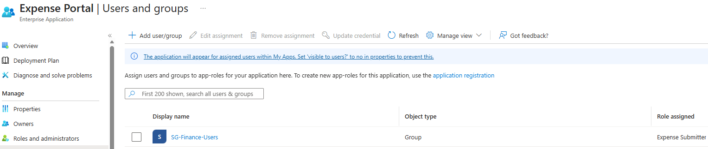

**Shows:** `SG-Finance-Users` assigned to Expense Portal with the Expense Submitter role.

**Why it matters:** Establishes the group-based application entitlement used in the Joiner, Mover and Leaver scenarios.

## 02 — Finance group in the Administrative Unit

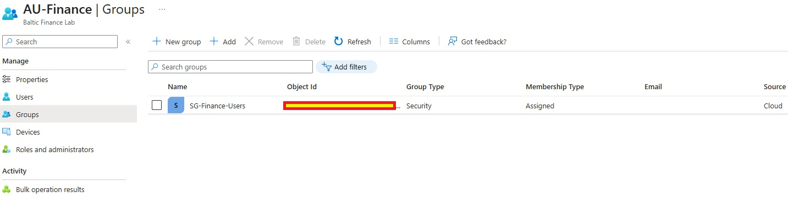

**Shows:** `SG-Finance-Users` as a cloud Security group with Assigned membership in `AU-Finance`.

**Why it matters:** Documents the group's administrative scope. Adding a group to an AU does not add its individual users; direct user membership is not shown here.

## 03 — Joiner group membership

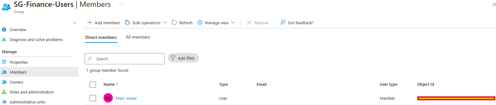

**Shows:** Marc Joiner listed as the one direct member of `SG-Finance-Users`, with user type Member.

**Why it matters:** Connects the new employee to the Finance group that carries the Expense Portal entitlement.

## 04 — Joiner application session

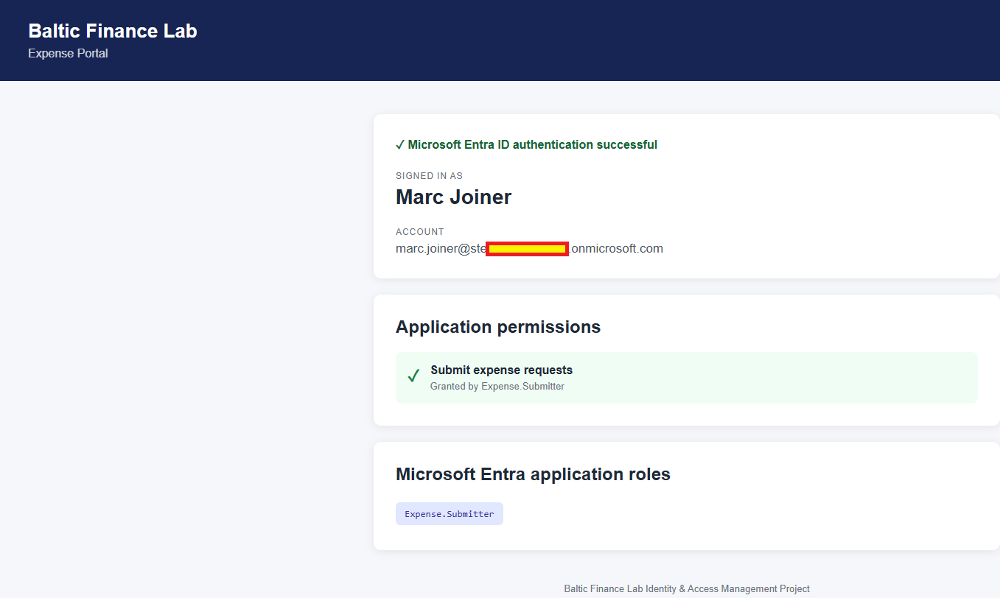

**Shows:** Marc Joiner authenticated to Expense Portal with `Expense.Submitter` displayed.

**Why it matters:** Demonstrates the Joiner's application access and role display. The page does not include a sign-in timestamp to establish session freshness.

## 05 — Mover's IT state

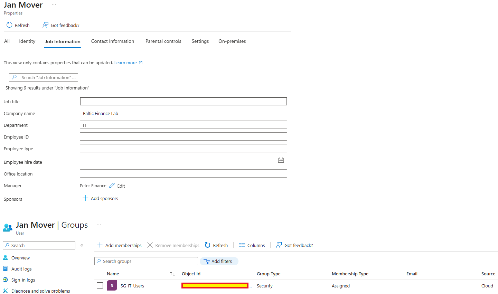

**Shows:** Jan Mover's Department set to IT and `SG-IT-Users` in the visible group-membership panel.

**Why it matters:** Documents the destination state of the department transfer; the following denial demonstrates the resulting application-access boundary.

## 06 — Mover application access denied

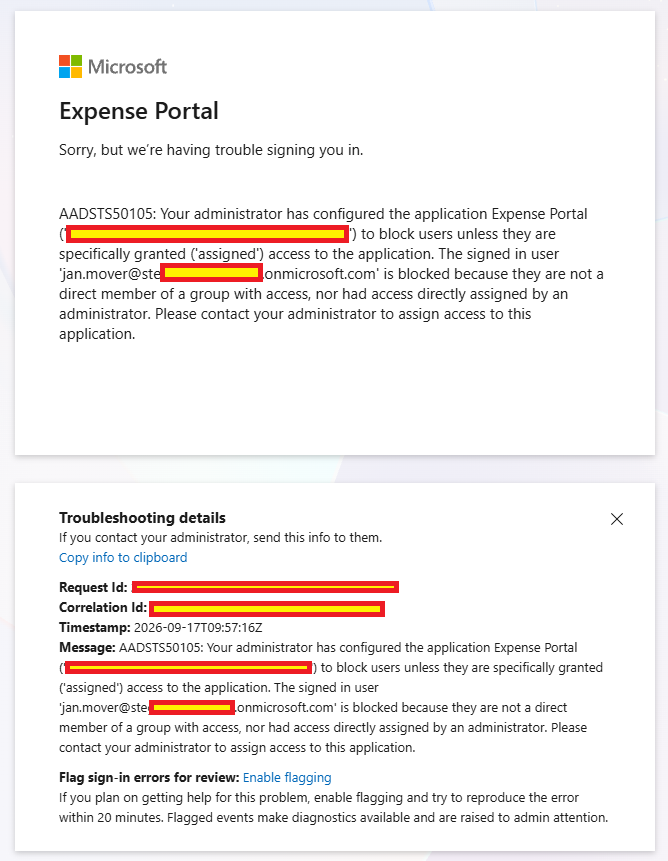

**Shows:** Jan Mover denied Expense Portal access with `AADSTS50105` because no applicable direct or group assignment is present.

**Why it matters:** Demonstrates absence of effective application entitlement for the tested sign-in. It does not show termination of an existing application session.

## 07 — Leaver account and assignment state

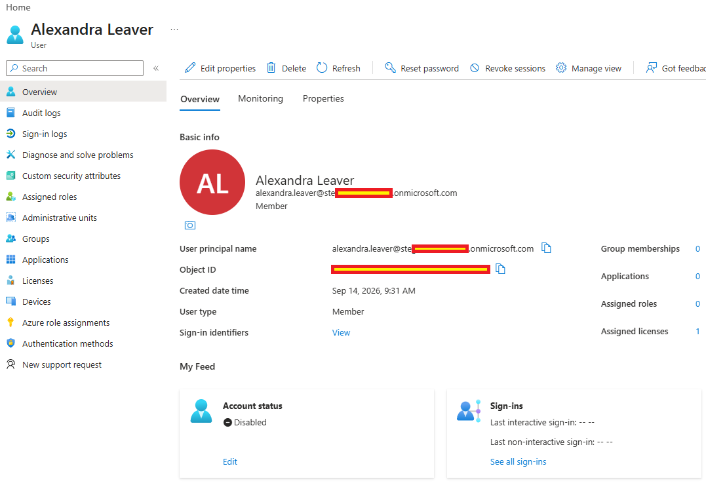

**Shows:** Alexandra Leaver Disabled, with group-membership, application and assigned-role counts at zero; one assigned license remains.

**Why it matters:** Documents the captured offboarding state. Session revocation and full license or data disposition are not demonstrated by this overview.

## 08 — Leaver sign-in blocked

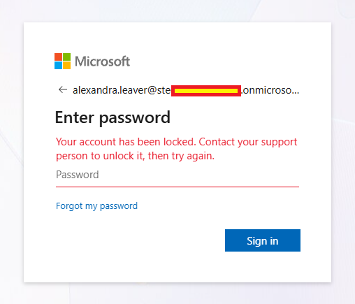

**Shows:** Alexandra's password prompt returning an account-locked message and preventing the captured sign-in.

**Why it matters:** Supports the negative sign-in observation. Without an error code or sign-in log, this image alone does not establish disablement as the exact cause.

## 09 — AU-scoped User Administrator

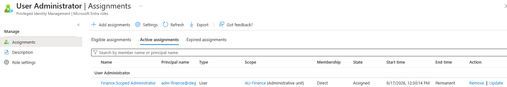

**Shows:** `adm-finance` with a direct, permanent User Administrator assignment scoped to `AU-Finance` in the Active assignments view.

**Why it matters:** Documents the scoped role grant. The capture does not inventory every other role the administrator might hold.

## 10 — Finance user management view

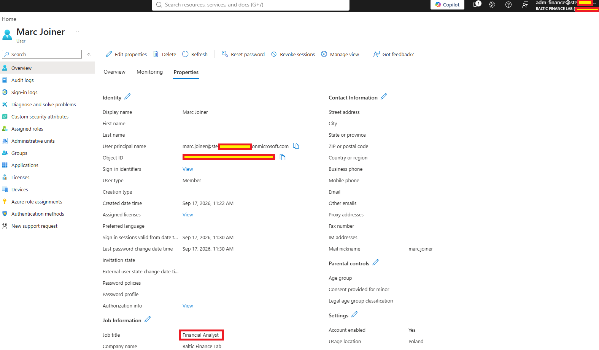

**Shows:** The `adm-finance` session displaying Marc Joiner's Job title as Financial Analyst with editing controls enabled.

**Why it matters:** Supports the positive portal-access scenario. A successful update audit event and Marc's direct AU membership are not visible in this capture.

## 11 — HR user management boundary

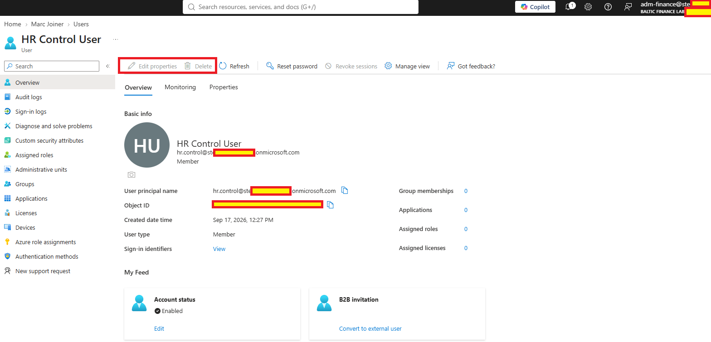

**Shows:** `adm-finance` viewing HR Control User with Edit properties and Delete disabled; Reset password remains visible.

**Why it matters:** Demonstrates the captured Edit/Delete portal boundary. An attempted operation or API denial is not shown, so other management operations remain unverified here.

Sensitive and environment-specific values were redacted from the screenshots before publication.
