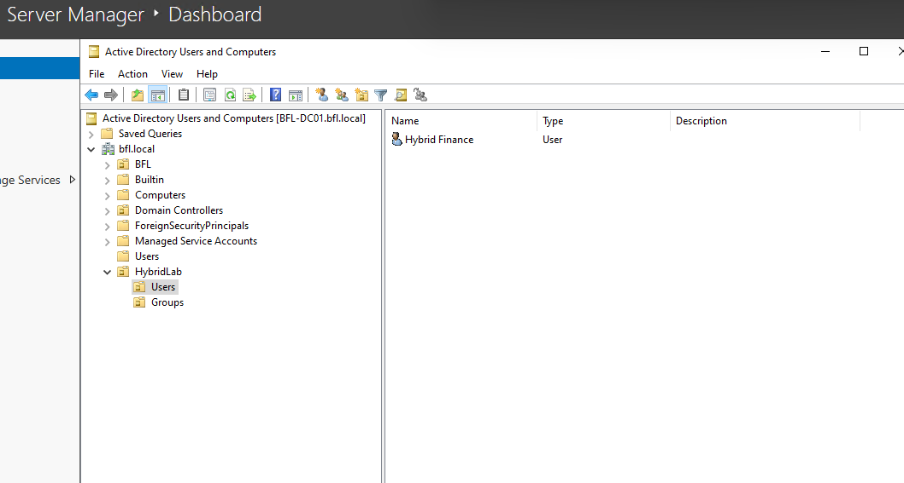
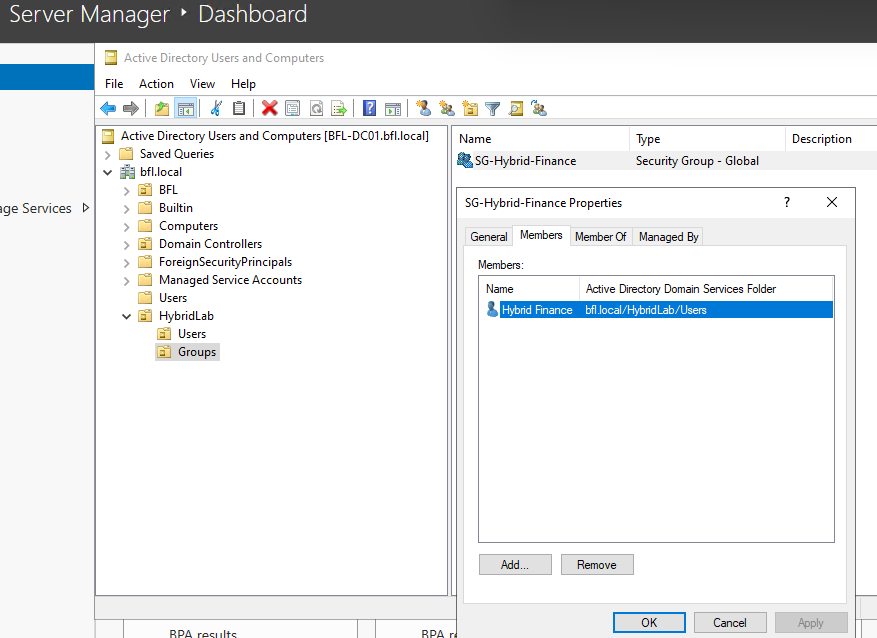
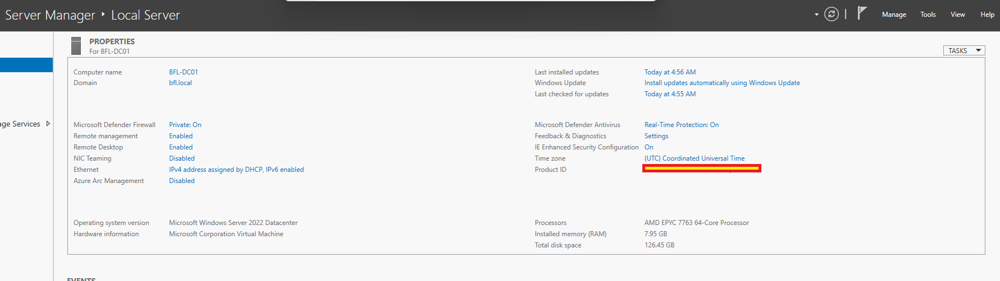
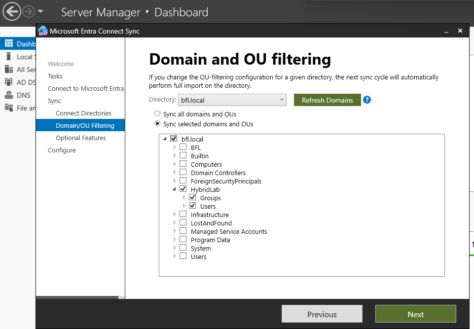
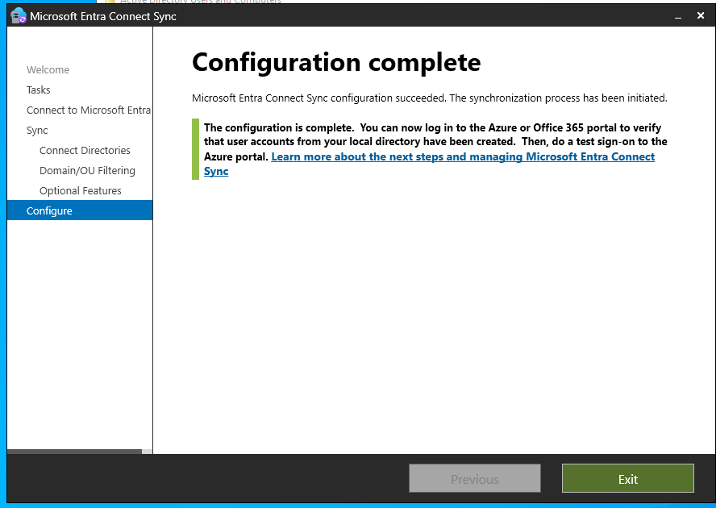
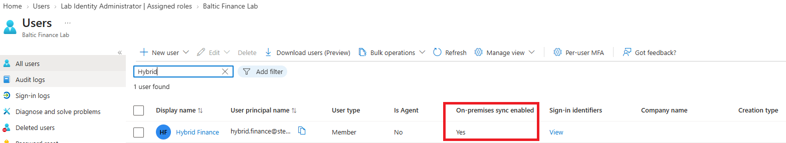
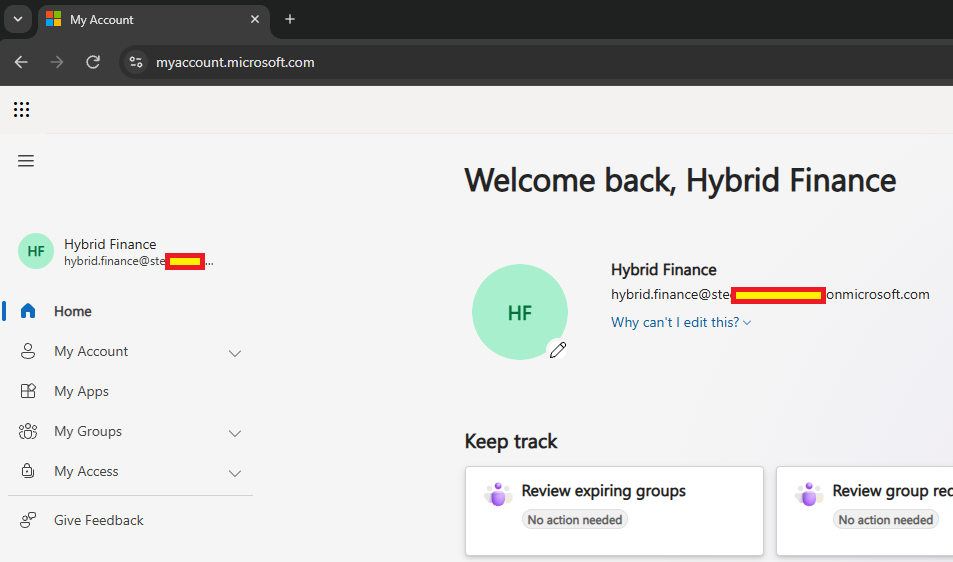
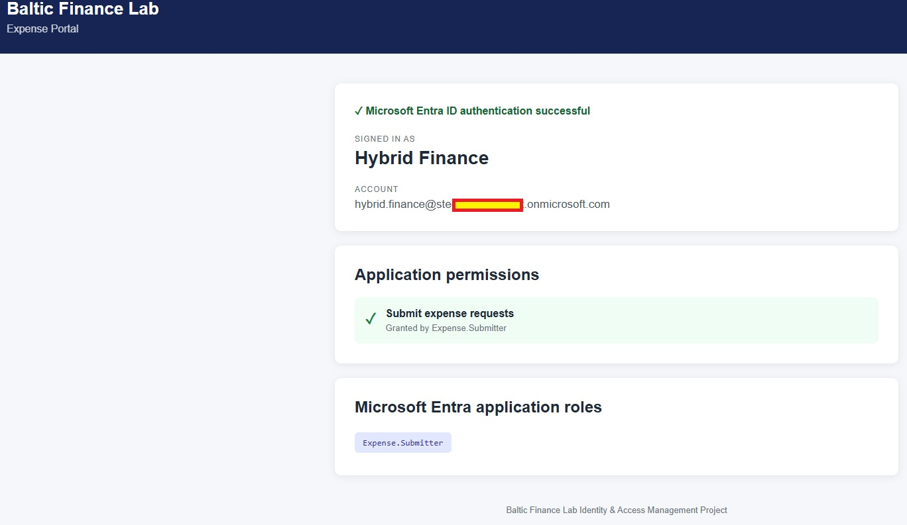
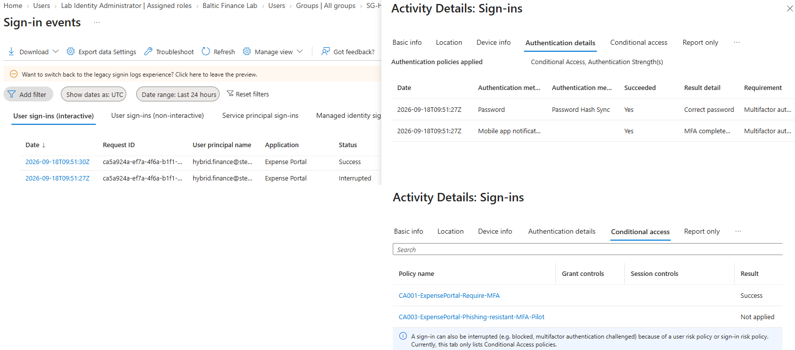
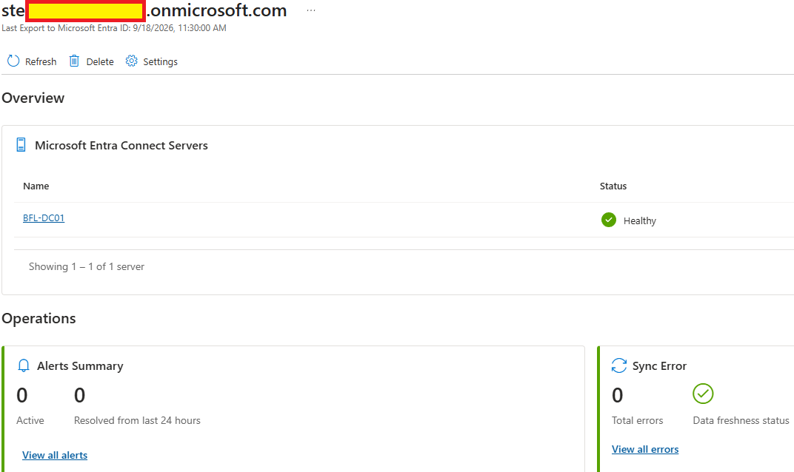

# Day 07 — Evidence

This folder documents hybrid identity integration between Active Directory Domain Services on `BFL-DC01` and Microsoft Entra ID, using Microsoft Entra Connect Sync and Password Hash Synchronization.

## 01 — On-premises hybrid identity

**Shows:** Active Directory Users and Computers on `BFL-DC01` lists `Hybrid Finance` in `HybridLab\Users`.

**Why it matters:** Establishes the on-premises source identity used throughout the hybrid authentication scenario.

## 02 — Hybrid group membership

**Shows:** The Members tab of `SG-Hybrid-Finance` lists `Hybrid Finance`; the AD tree places the group in `HybridLab\Groups`.

**Why it matters:** Connects the user to the intended on-premises security group. The retained filename refers to domain configuration, but this view documents membership.

## 03 — Server and domain configuration

**Shows:** Server Manager identifies `BFL-DC01`, domain `bfl.local` and Windows Server 2022 Datacenter.

**Why it matters:** Identifies the Windows Server environment used for the hybrid lab.

## 04 — Selected synchronization scope

**Shows:** Entra Connect Domain and OU filtering selects the `HybridLab` Users and Groups scope.

**Why it matters:** Documents the limited synchronization boundary; this configuration page does not show completed exports or PHS authentication.

## 05 — Connect configuration completed

**Shows:** Entra Connect reports that configuration succeeded and the synchronization process was initiated.

**Why it matters:** Records successful setup and the start of synchronization. The synchronized-user view below provides separate evidence that the user reached Entra ID.

## 06 — Synchronized user in Entra ID

**Shows:** `Hybrid Finance` appears as a Member with `On-premises sync enabled: Yes`.

**Why it matters:** Connects the AD identity to its synchronized cloud representation.

## 07 — Authenticated hybrid user session

**Shows:** My Account displays the signed-in `Hybrid Finance` identity.

**Why it matters:** Shows cloud access during the password-synchronization scenario. The session alone does not show the password change or authentication method; screenshot 09 supplies the PHS log evidence.

## 08 — Expense Portal access

**Shows:** Expense Portal displays `Hybrid Finance` and the `Expense.Submitter` application role.

**Why it matters:** Shows the synchronized identity reaching the protected application with its expected lab role.

## 09 — PHS, MFA and Conditional Access results

**Shows:** Hybrid Finance sign-in details show Password Hash Sync, successful MFA and `CA001-ExpensePortal-Require-MFA` returning `Success` for Expense Portal.

**Why it matters:** Corroborates the authentication method and Conditional Access evaluation behind the application-access scenario.

## 10 — Connect Health status

**Shows:** `BFL-DC01` reports `Healthy`, with zero active alerts and zero synchronization errors.

**Why it matters:** Records the synchronization service's operational state at capture time.

Sensitive credentials and environment-specific identifiers were redacted before publication.
