# Day 08 — Evidence

This folder contains evidence of Microsoft Entra device identities and device-based Conditional Access for the Expense Portal.

## 01 — Registered device local state

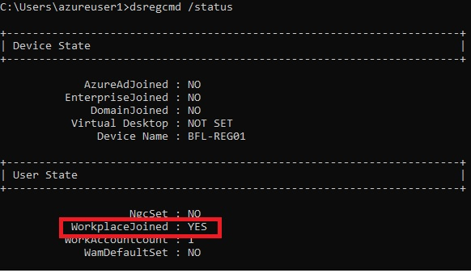

**Shows:** `BFL-REG01` reports `AzureAdJoined: NO`, `DomainJoined: NO` and `WorkplaceJoined: YES`.

**Why it matters:** Distinguishes workplace registration from an Entra or Active Directory device join.

## 02 — Registered device in Entra ID

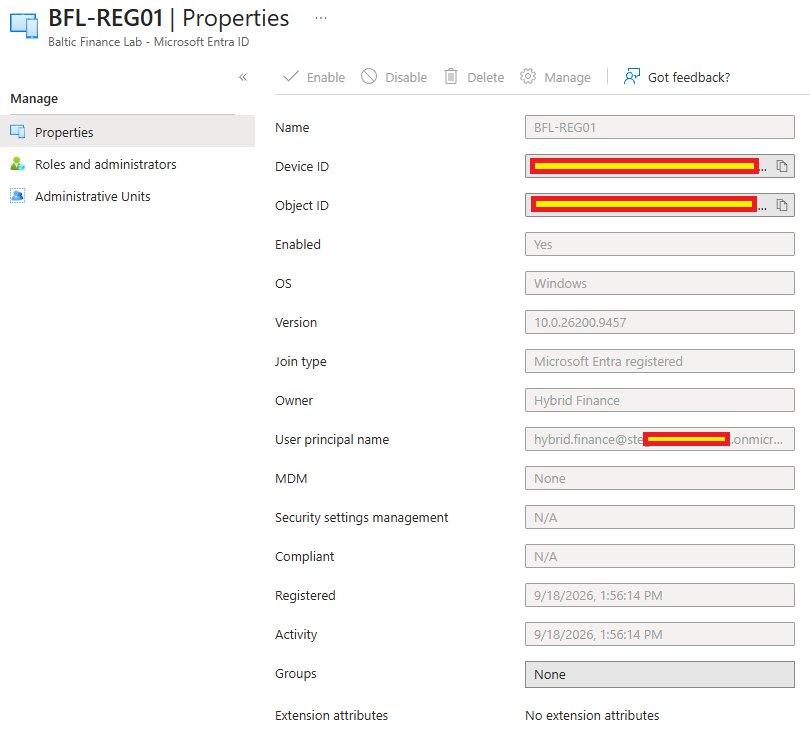

**Shows:** The `BFL-REG01` object has join type `Microsoft Entra registered`, with `Hybrid Finance` as owner.

**Why it matters:** Corroborates the local registration state in the cloud device inventory.

## 03 — CA008 device-filter configuration

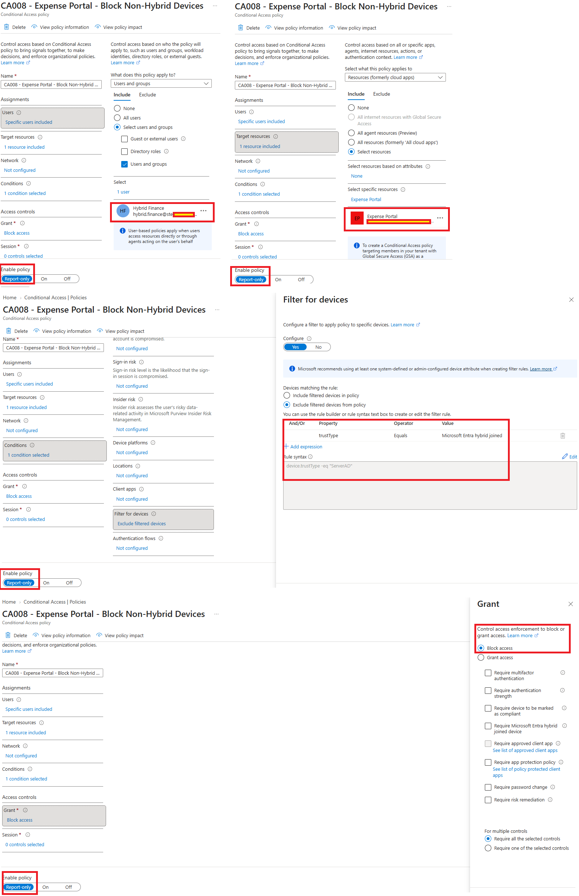

**Shows:** CA008 targets Hybrid Finance and Expense Portal, selects `Block access`, and excludes devices matching `device.trustType -eq "ServerAD"` in Report-only mode.

**Why it matters:** Defines the hybrid-device exclusion before enforcement; the policy settings alone are not a blocked-sign-in result.

## 04 — Registered-device report-only result

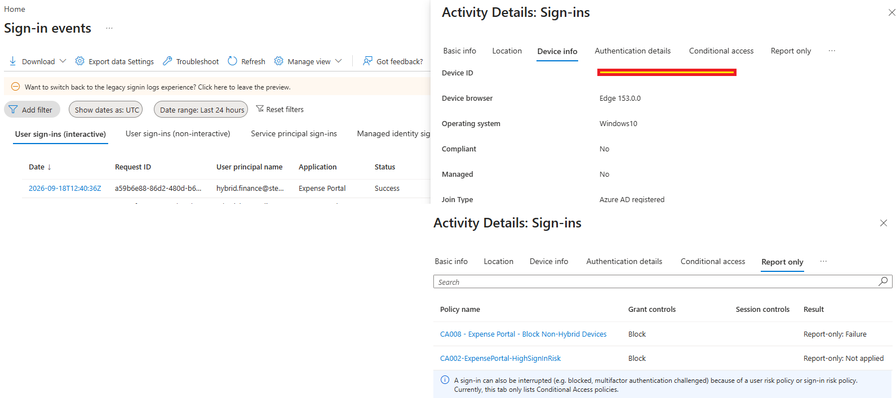

**Shows:** The Expense Portal sign-in succeeds with join type `Azure AD registered`; CA008 returns `Report-only: Failure`.

**Why it matters:** Shows that the policy would block this evaluated request if enforced, while report-only mode leaves the observed sign-in unaffected.

## 05 — Entra joined device local state

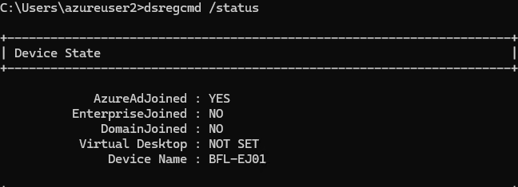

**Shows:** `BFL-EJ01` reports `AzureAdJoined: YES` and `DomainJoined: NO`.

**Why it matters:** Separates a direct Microsoft Entra join from the registered and hybrid joined states.

## 06 — Entra joined device in the directory

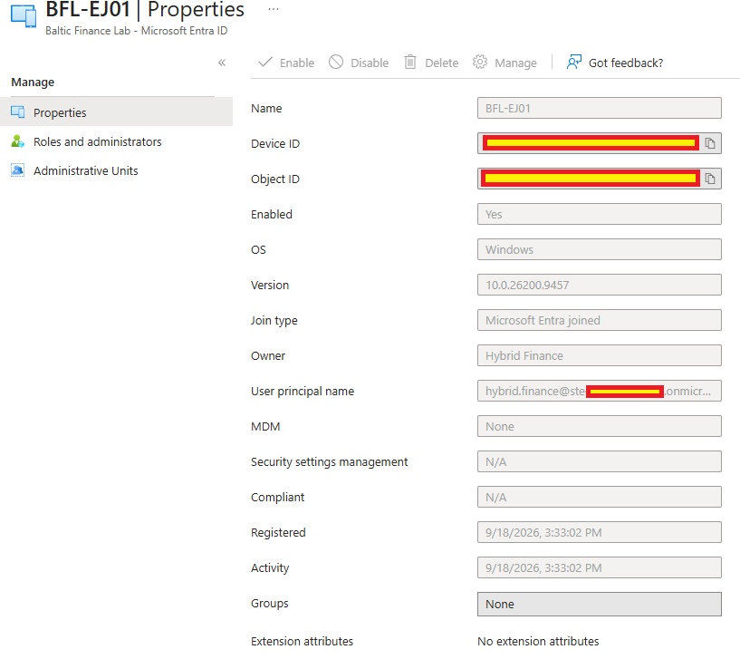

**Shows:** The `BFL-EJ01` object has join type `Microsoft Entra joined`, with `Hybrid Finance` as owner.

**Why it matters:** Corroborates the client join state through its Entra device object.

## 07 — Expense Portal access blocked

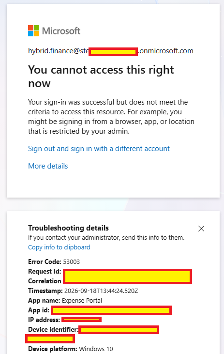

**Shows:** Hybrid Finance receives an Expense Portal denial with Conditional Access error `53003`.

**Why it matters:** Records the user-facing negative result from the Entra joined device scenario; the policy result is shown separately below.

## 08 — CA008 enforced block result

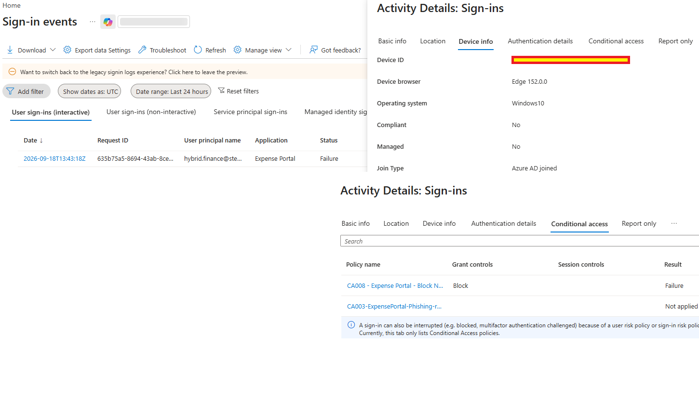

**Shows:** An Expense Portal sign-in for Hybrid Finance shows join type `Azure AD joined`, overall `Failure` and CA008 `Block` / `Failure`.

**Why it matters:** Links the device trust type to CA008 enforcement. Its timestamp differs from screenshot 07, and masked device IDs prevent an independent match to the named VM.

## 09 — Hybrid device in Active Directory

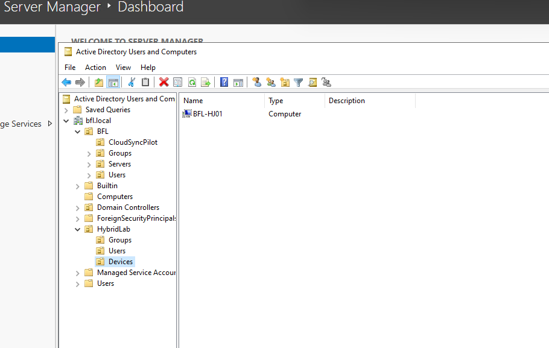

**Shows:** The `BFL-HJ01` computer object appears in `bfl.local` under `HybridLab\Devices`.

**Why it matters:** Identifies the on-premises computer object used in the hybrid join scenario; the Connect OU-selection update is not shown here.

## 10 — Hybrid joined device local state

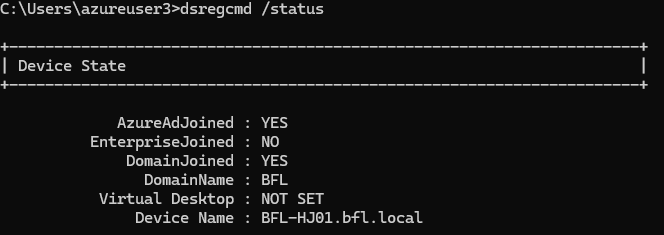

**Shows:** `BFL-HJ01.bfl.local` reports `AzureAdJoined: YES`, `DomainJoined: YES` and `DomainName: BFL`.

**Why it matters:** Shows both directory relationships on the same client.

## 11 — Hybrid user's successful portal session

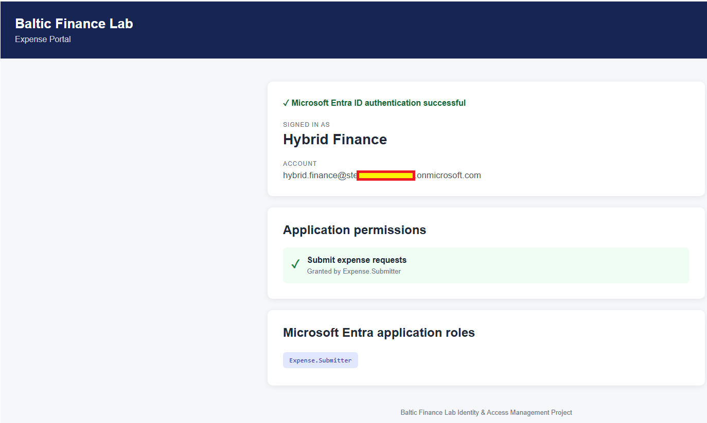

**Shows:** Expense Portal displays Hybrid Finance and `Expense.Submitter`.

**Why it matters:** Records successful application access in the hybrid-device scenario; screenshot 12 separately supplies the sign-in's device join type.

## 12 — Hybrid-device sign-in evaluation

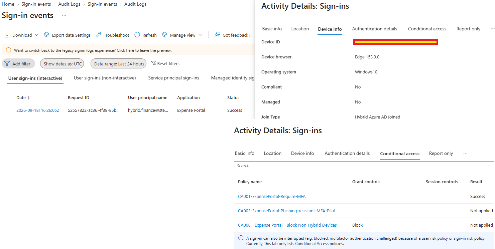

**Shows:** The sign-in succeeds with join type `Hybrid Azure AD joined`; CA001 returns `Success` and CA008 `Not applied`.

**Why it matters:** Supports the behavior expected from the configured hybrid-device exclusion. The log does not expose the masked device ID or detailed exclusion reasoning.

## 13 — Three device identity types

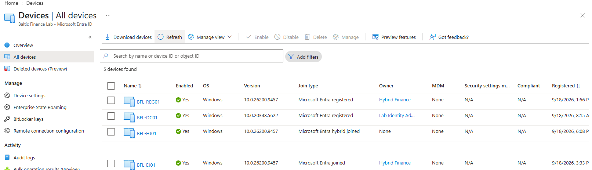

**Shows:** The inventory lists `BFL-REG01` as registered, `BFL-EJ01` as joined and `BFL-HJ01` as hybrid joined.

**Why it matters:** Compares the three lab join states in one directory view; join type does not establish device compliance.

Sensitive credentials, identifiers and tenant-specific values were redacted before publication.
