# Day 09 — Evidence

This folder contains evidence of Just-in-Time privileged access for the Conditional Access Administrator role using Microsoft Entra Privileged Identity Management (PIM).

## 01 — PIM activation requirements

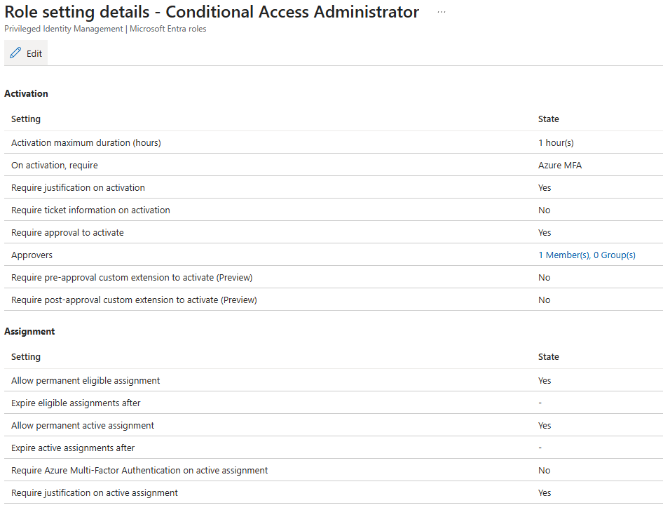

**Shows:** Conditional Access Administrator settings require Azure MFA, justification and approval, with a one-hour maximum and one designated approver.

**Why it matters:** Documents the activation controls. It does not establish that a fresh MFA prompt occurred during this request.

## 02 — Permanent Eligible assignment

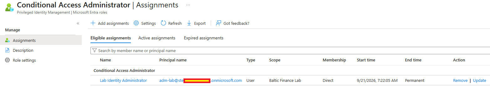

**Shows:** `adm-lab` has a direct Eligible Conditional Access Administrator assignment for Baltic Finance Lab with a permanent end time.

**Why it matters:** Distinguishes continuing eligibility from a permanent Active role assignment.

## 03 — Role available for activation

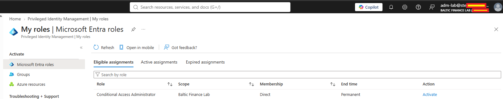

**Shows:** `adm-lab`'s My roles view lists Conditional Access Administrator under Eligible assignments with `Activate` available.

**Why it matters:** Shows the requester's entry point for Just-in-Time elevation.

## 04 — Access denied before activation

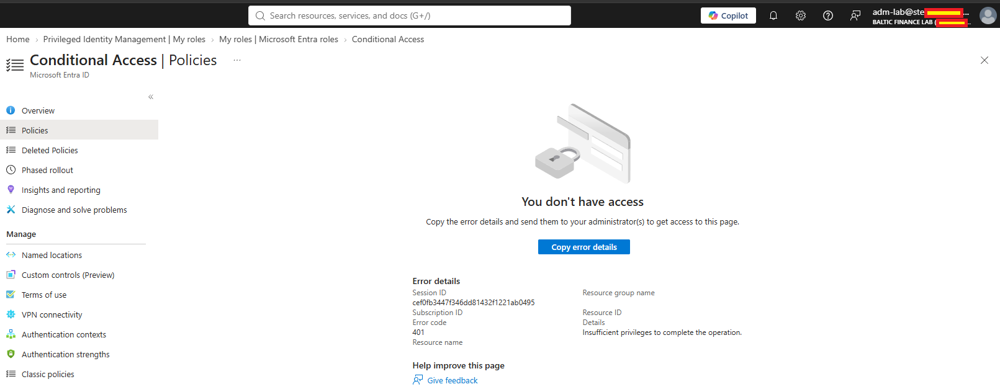

**Shows:** The `adm-lab` session receives `You don't have access`, error `401` and insufficient privileges at Conditional Access Policies.

**Why it matters:** Records the portal access boundary before the documented PIM activation.

## 05 — One-hour activation request

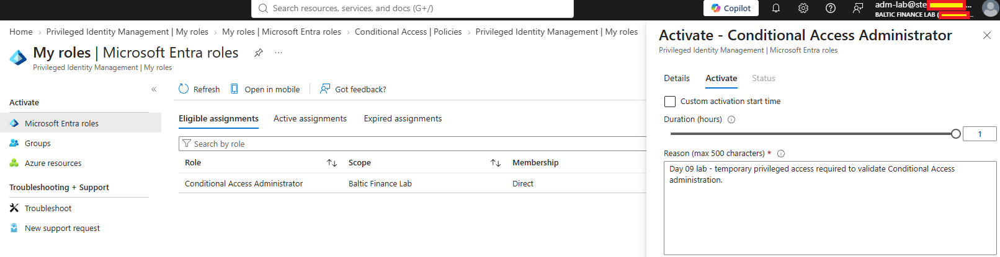

**Shows:** The activation form contains a one-hour duration and a business justification for validating Conditional Access administration.

**Why it matters:** Documents the requested duration and purpose; the next capture shows the submitted request state.

## 06 — Request awaiting approval

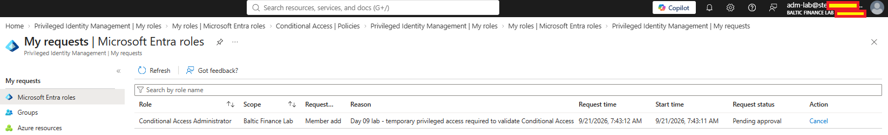

**Shows:** My requests shows the Conditional Access Administrator activation as `Pending approval`.

**Why it matters:** Demonstrates the approval gate before the role becomes Active.

## 07 — Separate approver session

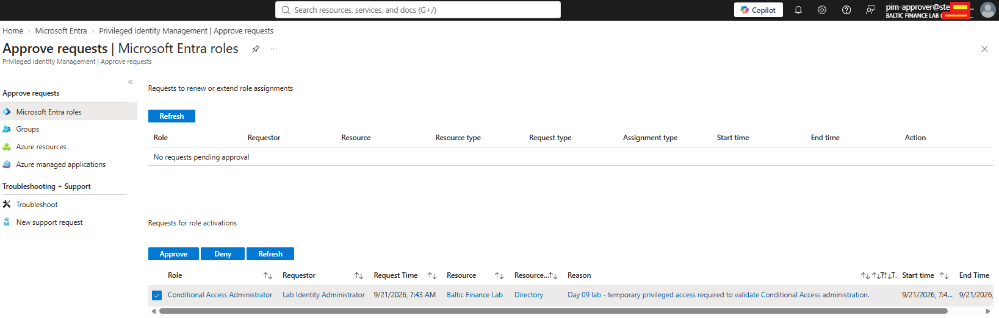

**Shows:** The signed-in `pim-approver` account sees the Lab Identity Administrator request with Approve and Deny controls.

**Why it matters:** Documents separation between requester and approver. The retained filename mentions `bg01`, but the visible approver is `pim-approver`; the later audit records the decision.

## 08 — Temporary Active role

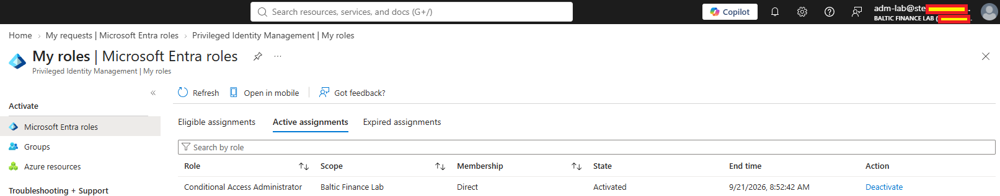

**Shows:** `adm-lab`'s Active assignments show Conditional Access Administrator as `Activated`, with a scheduled end time.

**Why it matters:** Records the temporary privilege window following approval.

## 09 — Disabled validation policy

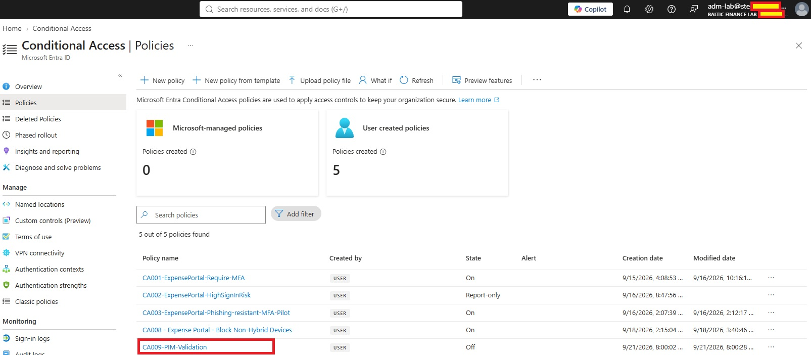

**Shows:** The `adm-lab` session can view `CA009-PIM-Validation` in Conditional Access Policies with state `Off`.

**Why it matters:** Shows administrative access and the resulting validation object after elevation. The list alone does not identify the policy's creator.

## 10 — Activation audit trail

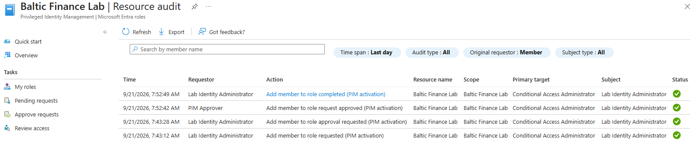

**Shows:** PIM Resource audit records the request, approval request, approval by PIM Approver and completed activation with successful statuses.

**Why it matters:** Corroborates the request-to-activation sequence through service audit events.

## 11 — Eligibility retained after activation

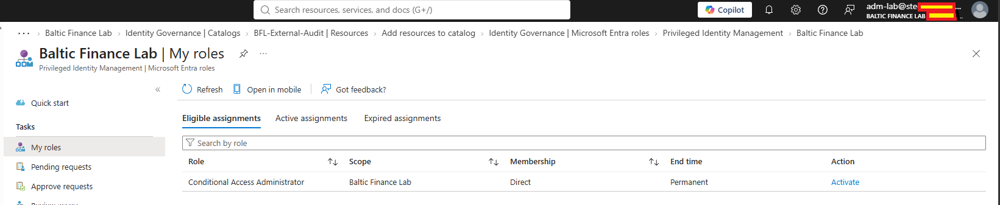

**Shows:** My roles shows Conditional Access Administrator under Eligible assignments with `Activate` available.

**Why it matters:** Shows retained eligibility in the documented post-activation state. Screenshot 12 supplies the explicit evidence of automatic expiration.

## 12 — Automatic expiration audit event

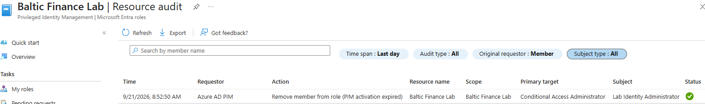

**Shows:** Resource audit records a successful `Remove member from role (PIM activation expired)` event initiated by `Azure AD PIM`.

**Why it matters:** Distinguishes automatic expiry of temporary privilege from a manual deactivation.

Sensitive credentials, identifiers and tenant-specific values were redacted before publication.
