# Day 10 — Evidence

This folder documents Microsoft Entra Entitlement Management for the existing External Auditor from Amber Audit Partners: access request, business approval, automated group and application provisioning, Terms of Use, and access revocation.

## 01 — Empty contractor group baseline

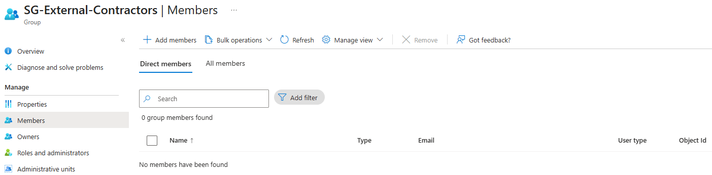

**Shows:** `SG-External-Contractors` has zero direct members before the access-package workflow.

**Why it matters:** Establishes the group-membership baseline without asserting that every other possible application assignment is absent.

## 02 — Connected partner organization

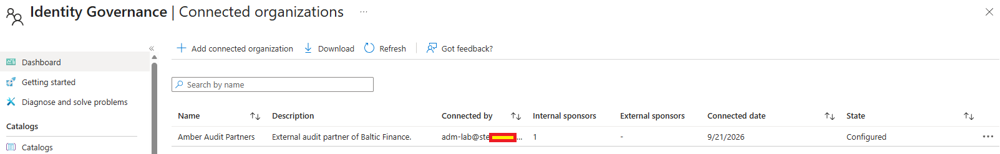

**Shows:** `Amber Audit Partners` appears as a configured connected organization with one internal sponsor.

**Why it matters:** Identifies the partner organization used to scope external package requests; this configuration does not itself grant application access.

## 03 — External-enabled catalog

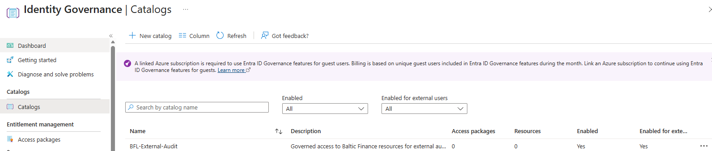

**Shows:** `BFL-External-Audit` is enabled and available to external users; its initial resource and package counts are zero.

**Why it matters:** Records the catalog baseline before resources and access packages are added.

## 04 — Selected catalog resources

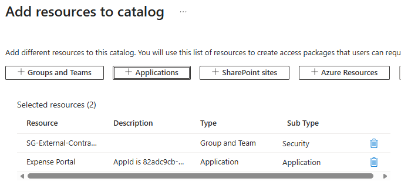

**Shows:** The Add resources view selects a security group and `Expense Portal` for the catalog.

**Why it matters:** Shows the group and application resource types being brought under package management; screenshot 05 displays their full resource-role mapping.

## 05 — Access-package resource roles

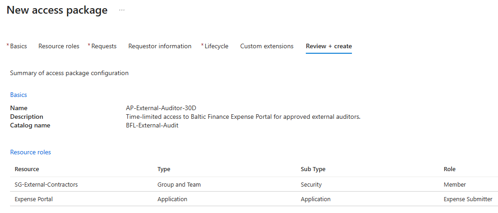

**Shows:** The review page for `AP-External-Auditor-30D` lists `SG-External-Contractors` with role `Member` and Expense Portal with role `Expense Submitter`.

**Why it matters:** Makes the bundled entitlements explicit. The existing Submitter role is a lab demonstration role, not read-only auditor access.

## 06 — Scoped request and approval policy

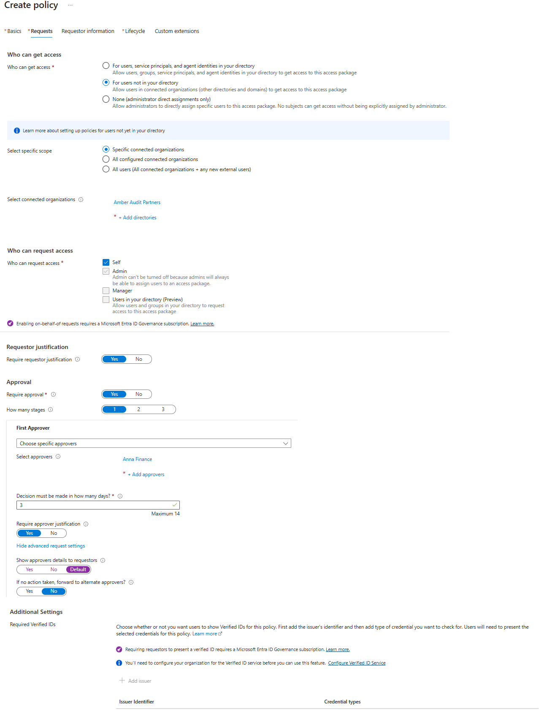

**Shows:** The policy selects Amber Audit Partners, self-service requests, required justification and one approval stage with Anna Finance and a three-day decision window.

**Why it matters:** Documents partner scope and independent business approval before access delivery.

## 07 — Thirty-day lifecycle settings

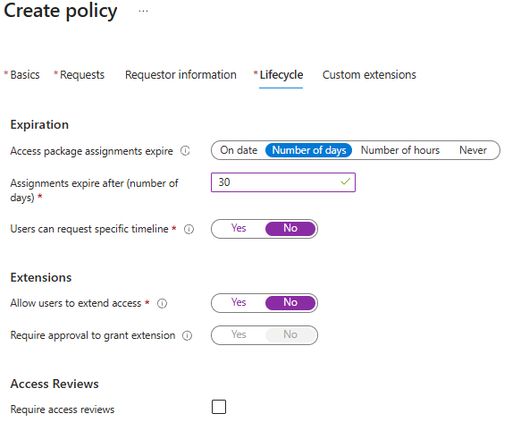

**Shows:** Assignments expire after 30 days; user-selected timelines, extensions and access reviews are disabled.

**Why it matters:** Records the configured lifecycle. It does not show that a 30-day assignment expired naturally.

## 08 — Package available in My Access

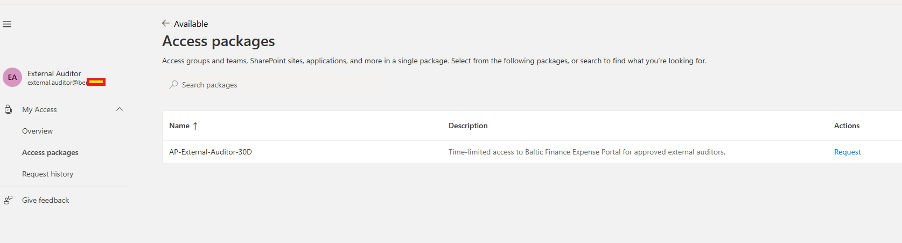

**Shows:** External Auditor sees `AP-External-Auditor-30D` with a `Request` action.

**Why it matters:** Shows package discovery. The portal continued displaying Request after the documented submission; this capture does not show a Pending request.

## 09 — Business approval recorded

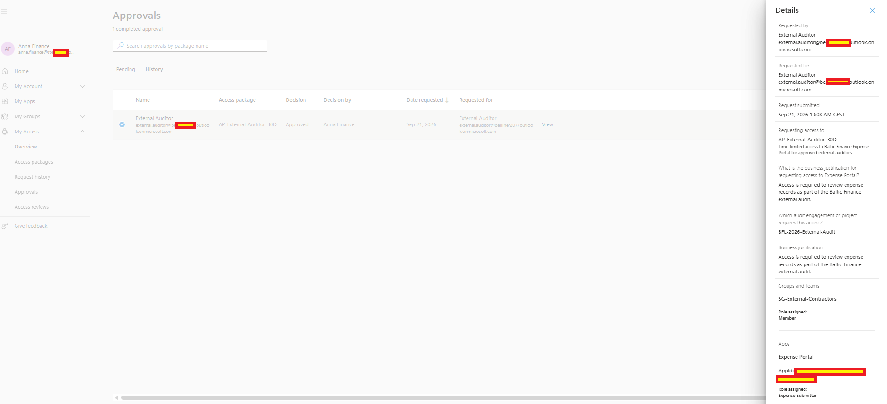

**Shows:** Approval history identifies Anna Finance's `Approved` decision, External Auditor, the requested package, business justification, answers and resource roles.

**Why it matters:** Connects the delivered access to a recorded request and a separate business approver.

## 10 — Delivered package assignment

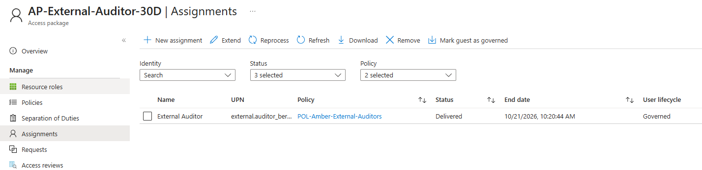

**Shows:** External Auditor's assignment is `Delivered` under `POL-Amber-External-Auditors`, with a future end date and `Governed` lifecycle state.

**Why it matters:** Records successful package delivery and a time-limited assignment; `Governed` is not evidence of guest deletion.

## 11 — Provisioned contractor membership

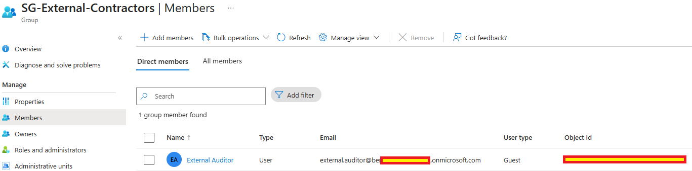

**Shows:** External Auditor appears as a direct Guest member of `SG-External-Contractors`.

**Why it matters:** Shows the group resource role present after the documented package delivery.

## 12 — Provisioned application role

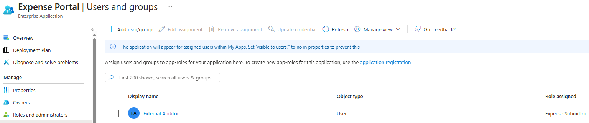

**Shows:** Expense Portal's Users and groups view lists External Auditor with `Expense Submitter`.

**Why it matters:** Shows the application resource role alongside the separate group entitlement.

## 13 — Auditor's successful portal session

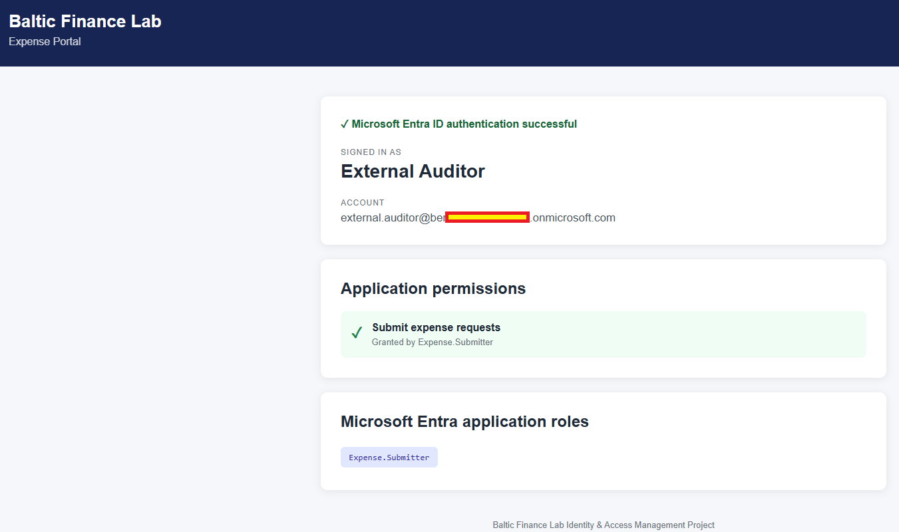

**Shows:** Expense Portal displays External Auditor, successful authentication and `Expense.Submitter`.

**Why it matters:** Demonstrates the application-access outcome after the group and application roles were delivered.

## 14 — Terms of Use policy scope

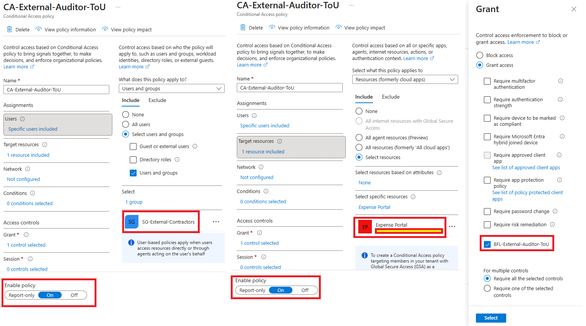

**Shows:** `CA-External-Auditor-ToU` targets `SG-External-Contractors` and Expense Portal, selects `BFL-External-Auditor-ToU` and is set to On.

**Why it matters:** Connects the Terms of Use grant control to the intended group and application.

## 15 — Terms of Use prompt

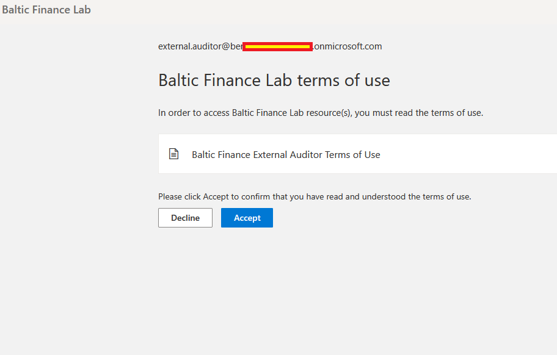

**Shows:** External Auditor receives the Baltic Finance Terms of Use prompt with Accept and Decline controls.

**Why it matters:** Records presentation of the terms; the screenshot precedes acceptance and is not an acceptance-report entry.

## 16 — Terms of Use grant satisfied

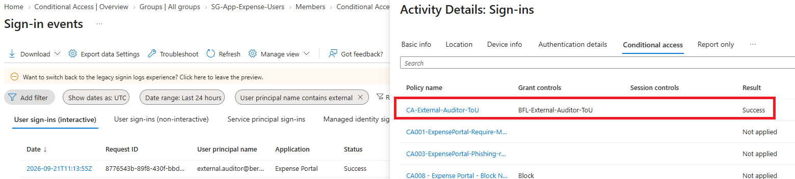

**Shows:** An Expense Portal sign-in succeeds and `CA-External-Auditor-ToU` returns `Success`.

**Why it matters:** Corroborates satisfaction of the grant control during sign-in, without replacing a separate Terms of Use acceptance report.

## 17 — Assignment state after manual removal

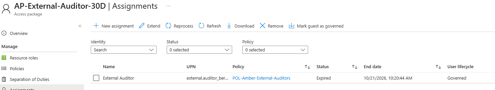

**Shows:** The auditor's assignment displays `Expired`, retaining its original future end date and `Governed` lifecycle state.

**Why it matters:** Records the state following the documented manual-removal test. It does not demonstrate natural expiration after 30 days.

## 18 — Contractor membership removed

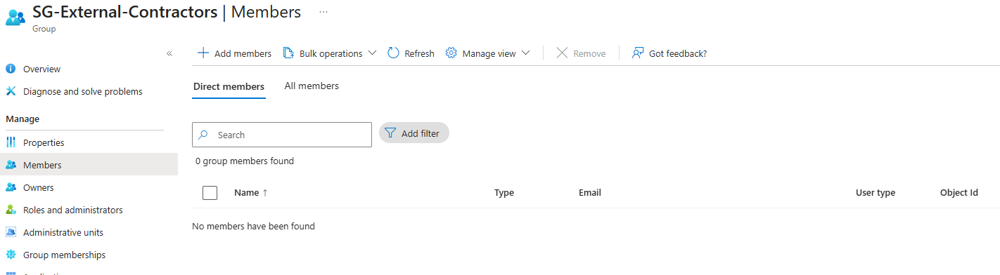

**Shows:** `SG-External-Contractors` returns to zero direct members.

**Why it matters:** Shows the group entitlement withdrawn after the package assignment was removed.

## 19 — Application access denied after revocation

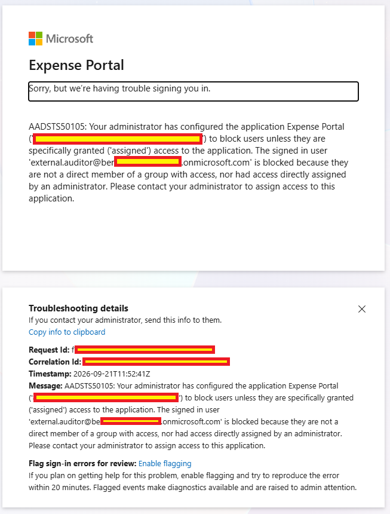

**Shows:** Expense Portal rejects External Auditor with `AADSTS50105`, citing no qualifying direct assignment or group membership.

**Why it matters:** Records an application-assignment denial after entitlement removal; it does not prove the guest account was deleted.

The evidence uses the lab's existing `Expense Submitter` role; this is a demonstration role, **not** read-only auditor access. Sensitive identifiers and tenant-specific details were redacted where appropriate.
