# Day 11 — Evidence

This folder documents a completed Microsoft Entra Access Review of the existing `SG-External-Contractors` group: restored B2B guest access, a separate business review by Anna Finance, a `Deny` decision, manual application of the review results, and verified removal of access to Expense Portal.

## 01 — Empty group before restoration

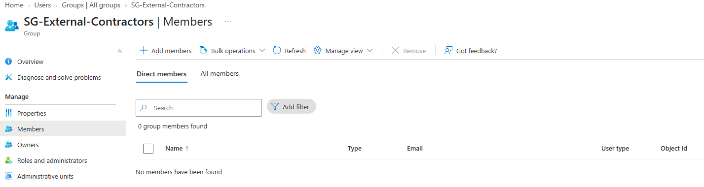

**Shows:** `SG-External-Contractors` has zero direct members.

**Why it matters:** Establishes the Day 11 starting point after the earlier access-package removal.

## 02 — Guest membership restored

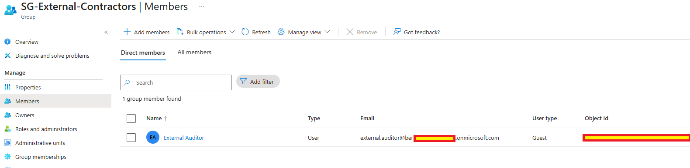

**Shows:** External Auditor appears as a direct Guest member of `SG-External-Contractors`.

**Why it matters:** Provides the membership to recertify in this lab; the expired Day 10 access-package assignment is not being reviewed.

## 03 — Positive application-access baseline

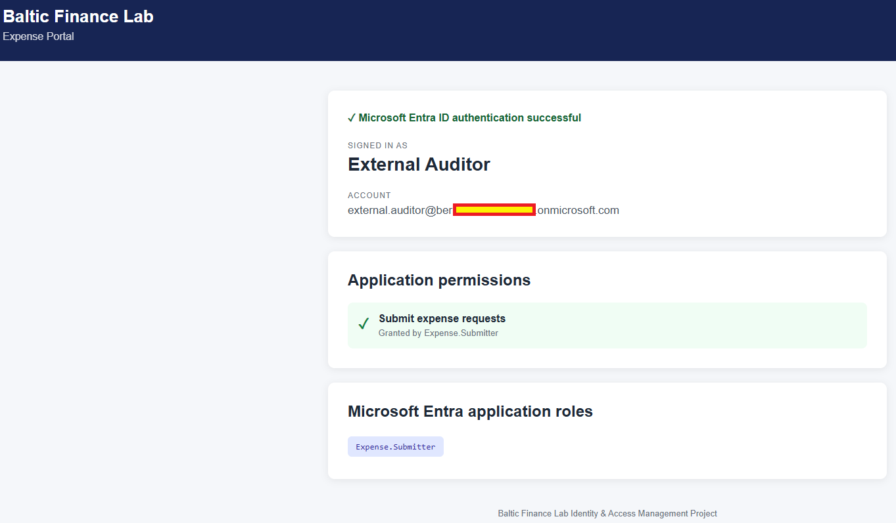

**Shows:** Expense Portal displays External Auditor, successful authentication and `Expense.Submitter`.

**Why it matters:** Records working application access before the documented review sequence.

## 04 — Guest group review scope

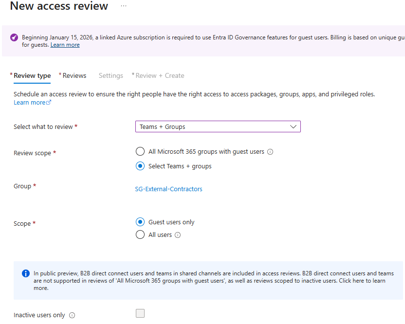

**Shows:** The review selects `SG-External-Contractors`, `Guest users only` and no inactive-users-only filter.

**Why it matters:** Defines which group members are included in the recertification exercise.

## 05 — Reviewer and review schedule

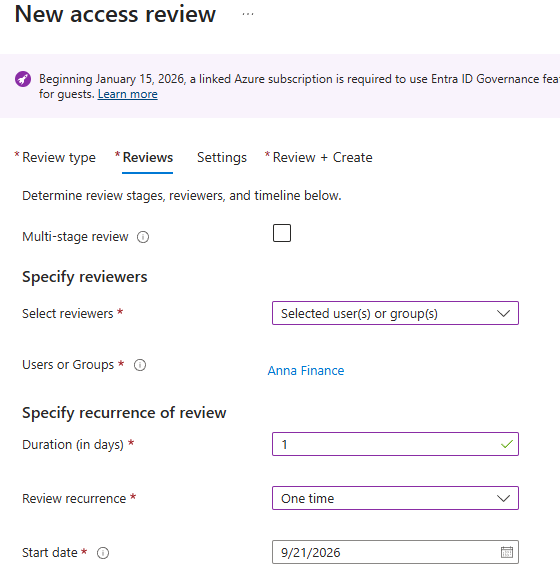

**Shows:** Anna Finance is the selected reviewer for a single-stage, one-time review lasting one day.

**Why it matters:** Documents a separate business reviewer and a bounded review period.

## 06 — Completion and decision settings

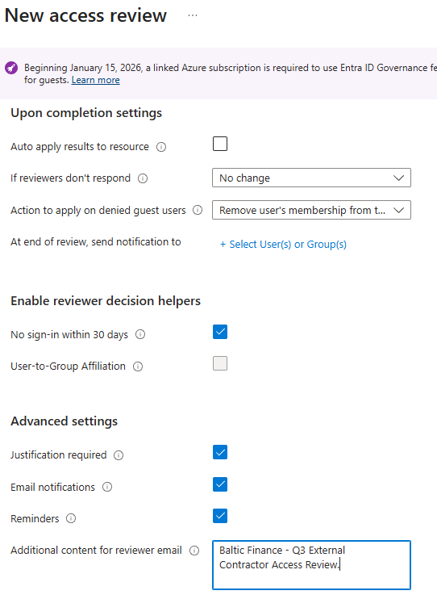

**Shows:** Auto-apply is disabled, non-responses leave access unchanged, and justification, sign-in recommendations, notifications and reminders are enabled. The denied-guest membership-removal label is partly clipped.

**Why it matters:** Explains why recording Deny and applying the results are separate steps. The final group view independently shows membership removal.

## 07 — Review created

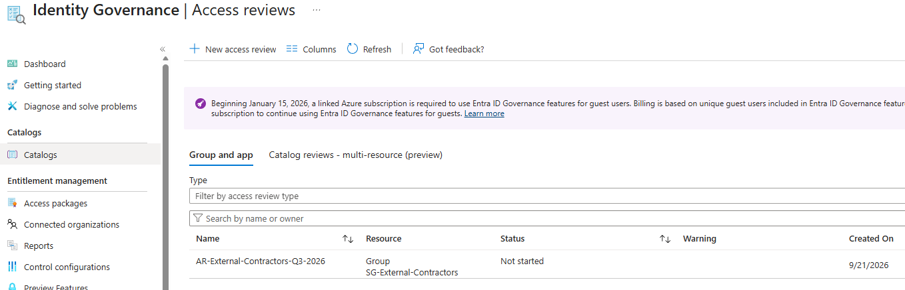

**Shows:** `AR-External-Contractors-Q3-2026` appears for the contractor group with status `Not started`.

**Why it matters:** Records creation of the review; this initial state is not a completed review.

## 08 — Reviewer's pending decision

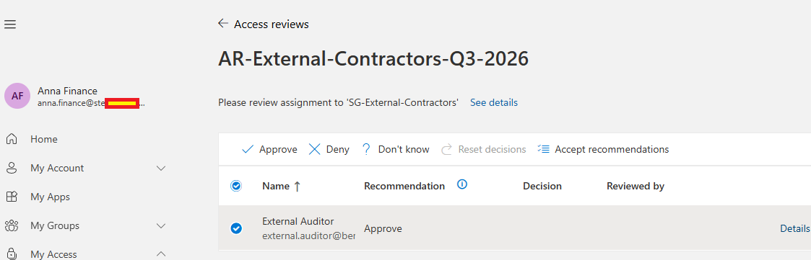

**Shows:** Anna Finance's My Access view lists External Auditor with an `Approve` recommendation and no recorded decision.

**Why it matters:** Shows the reviewer's task before a business decision is submitted.

## 09 — Justified Deny decision

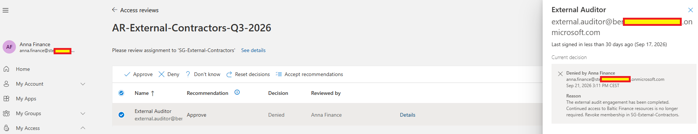

**Shows:** Anna Finance's decision is `Denied`, with justification that the external audit engagement is complete; the recommendation remains `Approve`.

**Why it matters:** Demonstrates a business decision that differs from a usage-based recommendation.

## 10 — Portal session before Apply

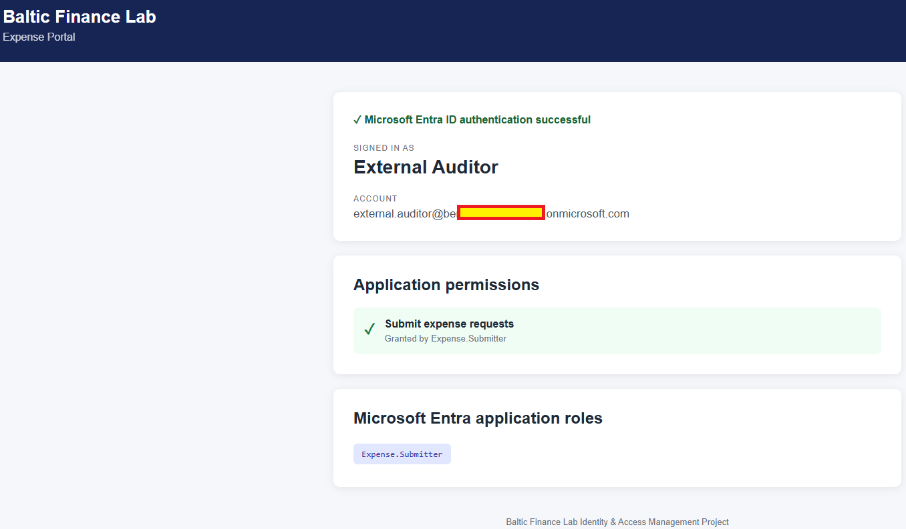

**Shows:** The auditor's Expense Portal session still displays successful authentication and `Expense.Submitter`.

**Why it matters:** Documents the session reported as after Deny and before Apply. No visible timestamp or fresh-sign-in detail independently establishes that sequence.

## 11 — Decision in the administrator's results view

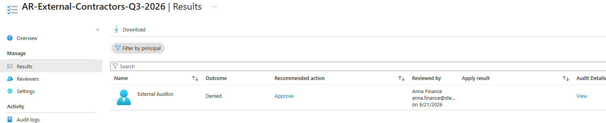

**Shows:** The results view records `Denied` by Anna Finance and a separate recommended action of `Approve`.

**Why it matters:** Corroborates the reviewer decision without conflating it with the system recommendation or an applied result.

## 12 — Review results applied

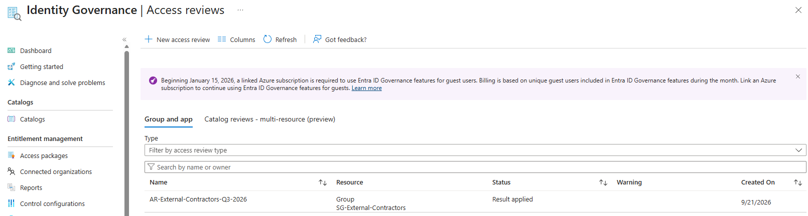

**Shows:** The named contractor-group review has status `Result applied`.

**Why it matters:** Records the transition from a review decision to application of the results.

## 13 — Reviewed membership removed

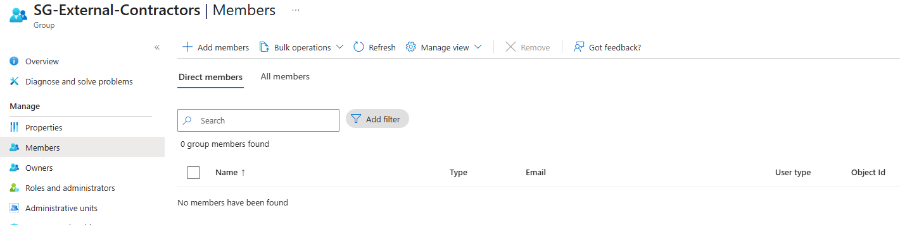

**Shows:** `SG-External-Contractors` has zero direct members after the documented Apply step.

**Why it matters:** Shows the resulting group state, compared with the restored guest membership earlier in the sequence.

## 14 — Auditor's sign-in denied

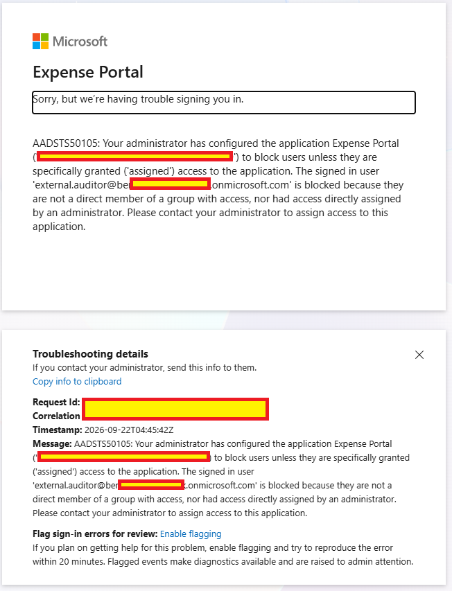

**Shows:** Expense Portal rejects External Auditor with `AADSTS50105`, stating that no qualifying group or direct assignment exists.

**Why it matters:** Records the negative application-access result after membership removal.

## 15 — Denied sign-in in Entra logs

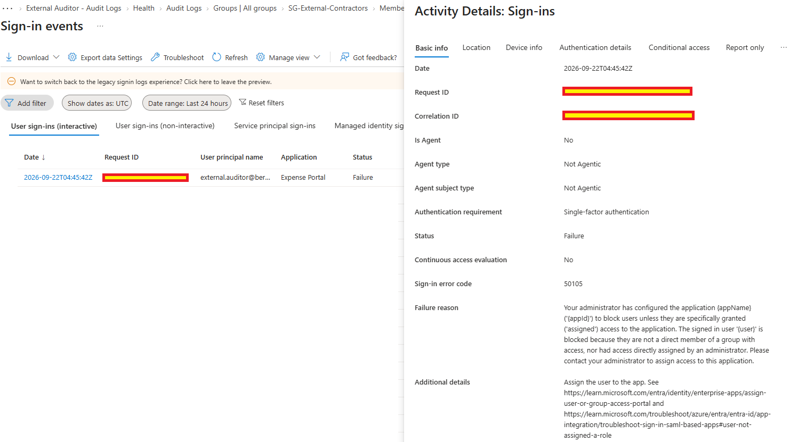

**Shows:** The Expense Portal sign-in for External Auditor is `Failure` with code `50105` and an assignment-related reason.

**Why it matters:** Corroborates the user-facing denial with the same displayed event time and application.

## 16 — Apply review audit event

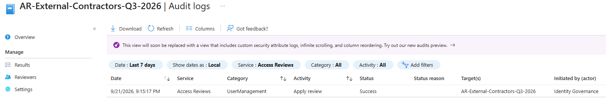

**Shows:** Access Reviews logs show `Apply review` / `Success`, initiated by Identity Governance for `AR-External-Contractors-Q3-2026`.

**Why it matters:** Adds an audit record for applying the review. It does not independently show a `Remove member from group` event.

Sensitive credentials, identifiers and tenant-specific values were redacted before publication.
