# Day 12 — Evidence

This folder documents OAuth 2.0 authorization and Microsoft Graph integration with the existing Expense Portal: delegated `User.Read`, consent, Graph profile retrieval for Anna and Peter, a temporary app-only `User.Read.All` test, and least-privilege cleanup.

Screenshots 01 and 02 are byte-identical copies of one API permissions view. They document the permission type and consent status in the same capture, not two independent events or a before/after sequence.

## 01 — Delegated Graph permission

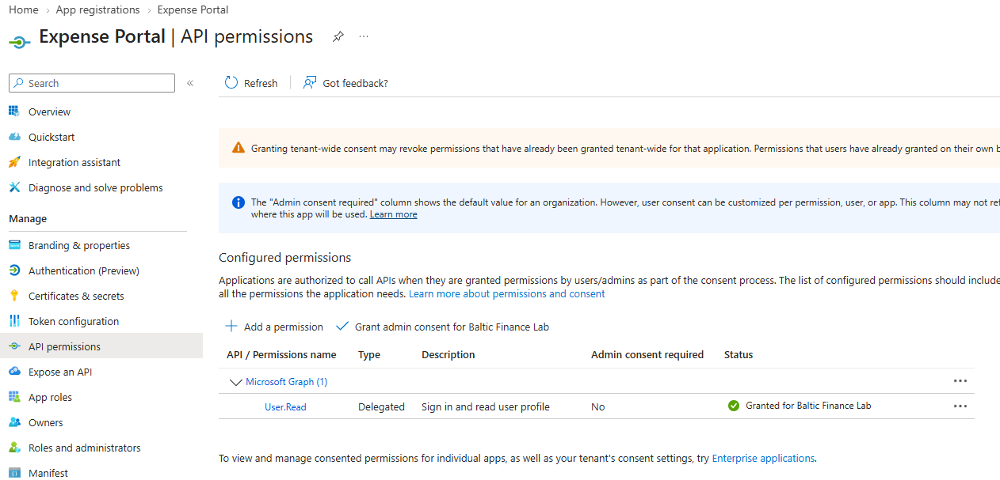

**Shows:** Expense Portal's API permissions list Microsoft Graph `User.Read` as Delegated and Granted for Baltic Finance Lab.

**Why it matters:** Documents the API permission type separately from the application's business App Roles.

## 02 — Delegated admin-consent status

**Shows:** The same API permissions capture shows tenant-wide consent for delegated `User.Read`.

**Why it matters:** Documents the existing grant status. This duplicate of screenshot 01 is not another consent event or a before-and-after comparison.

## 03 — Enterprise Application consent grant

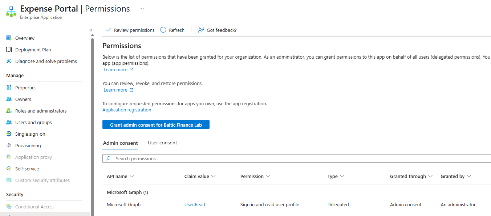

**Shows:** Expense Portal's Enterprise Application Permissions view lists delegated `User.Read`, granted through Admin consent.

**Why it matters:** Corroborates the permission grant on the service principal, alongside the App Registration view.

## 04 — Anna's profile in Graph Explorer

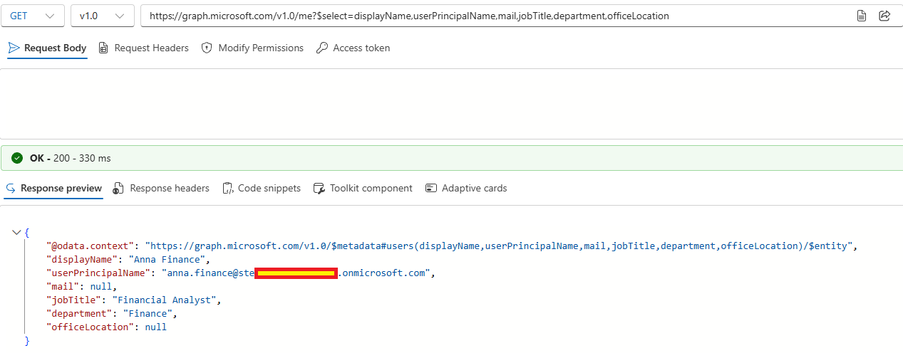

**Shows:** A Graph Explorer `GET /me` request returns Anna Finance's selected profile fields with HTTP 200.

**Why it matters:** Shows a successful delegated profile request using Graph Explorer, which is a separate OAuth client from Expense Portal.

## 05 — App Service authentication and token store

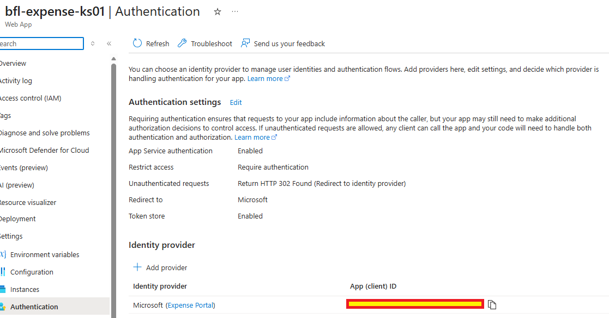

**Shows:** The Expense Portal Web App requires authentication, redirects to Microsoft and has Token store enabled.

**Why it matters:** Documents the Easy Auth configuration used by the portal's Graph integration.

## 06 — Easy Auth Graph scope

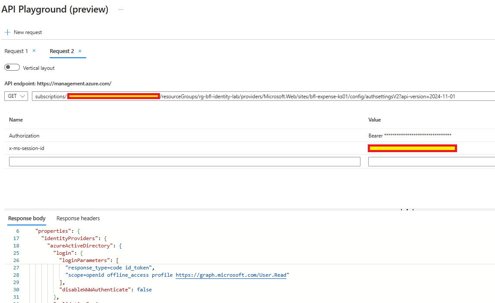

**Shows:** The `authsettingsV2` login parameters include the Microsoft Graph `User.Read` scope and `offline_access`.

**Why it matters:** Shows the configured token request scopes; this configuration capture does not demonstrate token renewal.

## 07 — Anna's profile in Expense Portal

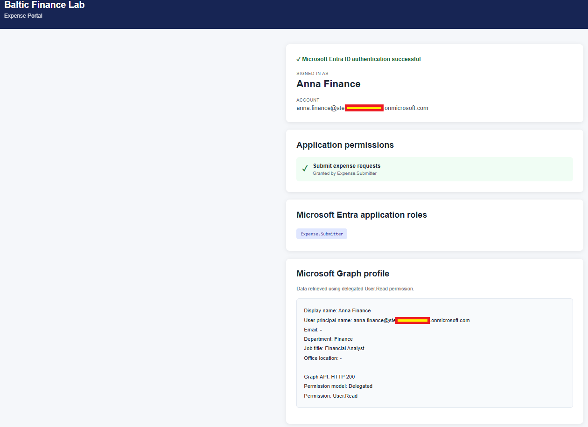

**Shows:** Anna's portal session displays `Expense.Submitter`, her own Graph profile and HTTP 200 with the Delegated `User.Read` labels.

**Why it matters:** Shows user-specific profile output while retaining the application's separate business role.

## 08 — Portal profile endpoint response

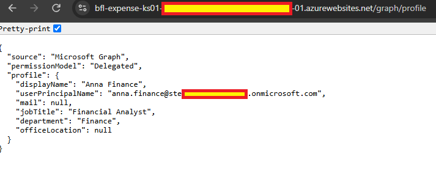

**Shows:** The `/graph/profile` endpoint returns Anna's selected fields with `source: Microsoft Graph` and `permissionModel: Delegated`.

**Why it matters:** Provides the endpoint's JSON output in addition to the portal display; it does not expose the underlying access token.

## 09 — Peter's profile and application roles

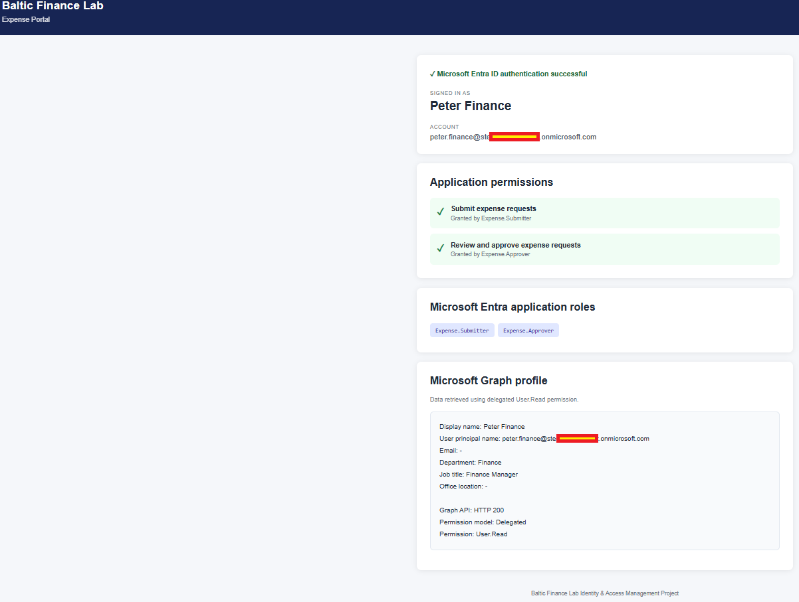

**Shows:** Peter's session displays `Expense.Submitter`, `Expense.Approver`, his own Graph profile and HTTP 200.

**Why it matters:** Compares another user's profile and business roles within the same application.

## 10 — Application permission before consent

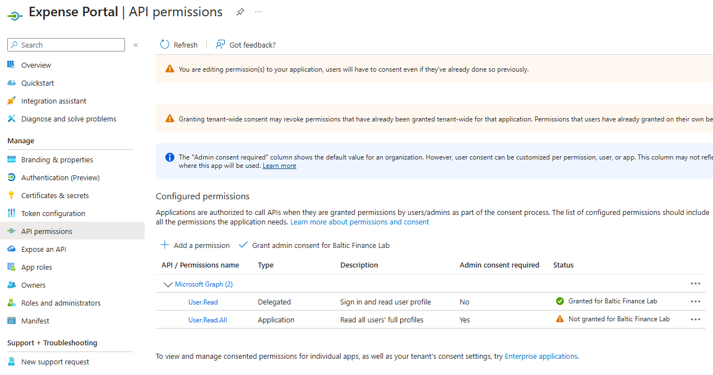

**Shows:** Delegated `User.Read` is Granted, while newly configured Application `User.Read.All` is `Not granted`.

**Why it matters:** Distinguishes a configured application permission from an approved permission grant.

## 11 — Application permission granted

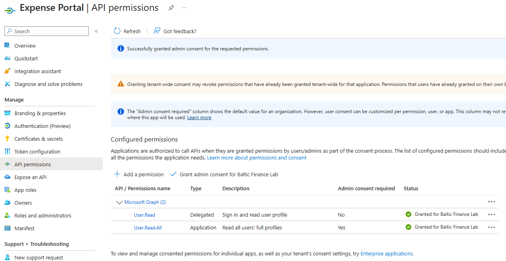

**Shows:** The admin-consent success banner appears and Application `User.Read.All` is marked Granted.

**Why it matters:** Records the granted state used for the temporary app-only experiment.

## 12 — Graph users request in PowerShell

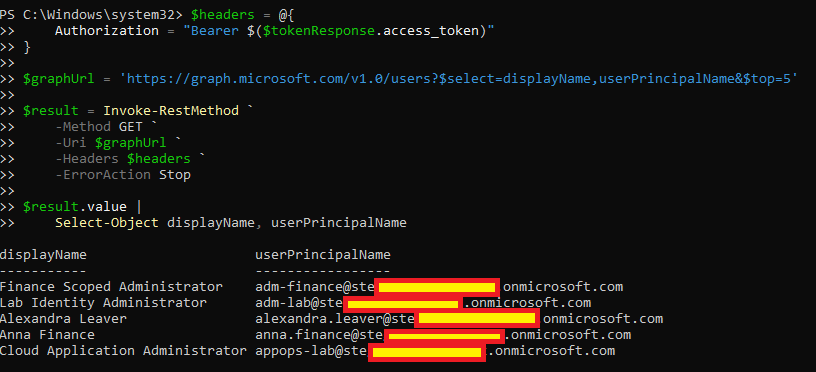

**Shows:** A bearer-token `GET /users` request returns multiple user profiles in PowerShell.

**Why it matters:** Shows the request outcome in the documented app-only scenario. Token acquisition is outside this capture; screenshot 14 separately displays selected claims.

## 13 — Negative Graph me request

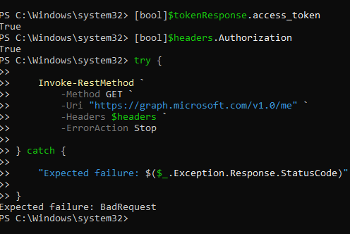

**Shows:** The PowerShell `GET /me` request displays `Expected failure: BadRequest`.

**Why it matters:** Records the negative result in the app-only scenario, where `/me` requires user context. The capture does not include the Graph error body.

## 14 — Selected app-only token claims

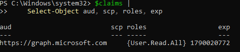

**Shows:** The displayed claims include Microsoft Graph as audience, `User.Read.All` in `roles` and a blank `scp` value.

**Why it matters:** Supports the app-only permission comparison. Displaying selected claims is not cryptographic token validation.

## 15 — Final configured permission list

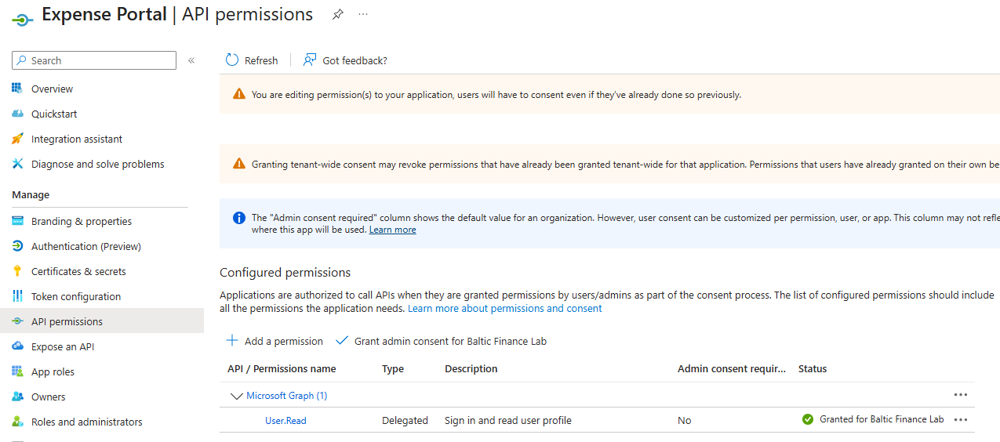

**Shows:** Expense Portal's API permissions list retains delegated `User.Read` and no longer lists Application `User.Read.All`.

**Why it matters:** Records the minimal configured permission state after the experiment; separate secret deletion and consent revocation are not shown in this view.

## 16 — Final delegated portal session

**Shows:** Anna's Expense Portal session displays `Expense.Submitter`, her Graph profile and HTTP 200.

**Why it matters:** Records the captured regression result after the documented cleanup. The screenshot alone does not establish fresh token acquisition or renewal.

Sensitive identifiers, user-specific details and credentials were redacted where appropriate. No access tokens or client secrets are published.
