# Day 13 — Evidence

This folder documents workload authentication with Microsoft Entra Managed Identities in Baltic Finance: Azure Automation accessing a private Azure Blob through Microsoft Entra ID, an initial access denial, least-privilege Azure RBAC, successful read access, a reported write denial, and a separate user-assigned identity test.

## 01 — Storage Account deployment

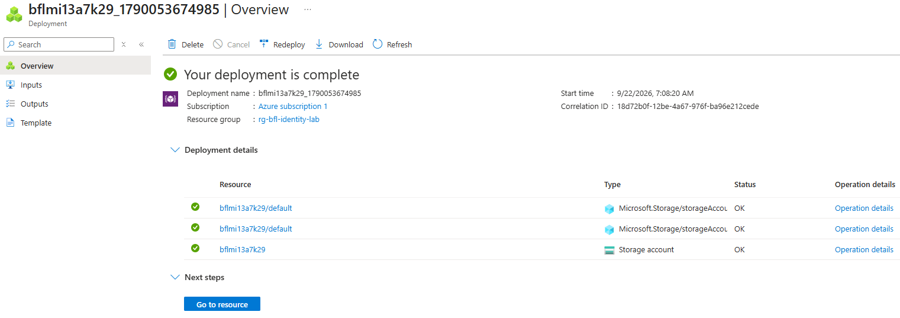

**Shows:** The deployment of `bflmi13a7k29` in `rg-bfl-identity-lab` completed successfully.

**Why it matters:** Establishes the Storage resource used by the workload access tests.

## 02 — Proof Blob in the lab container

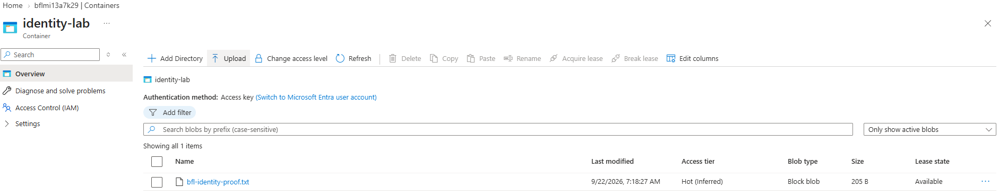

**Shows:** The `identity-lab` container contains `bfl-identity-proof.txt`; the portal session uses an access key.

**Why it matters:** Identifies the test object. This view does not demonstrate Managed Identity authentication or expose the container's anonymous-access setting.

## 03 — Automation Account deployment

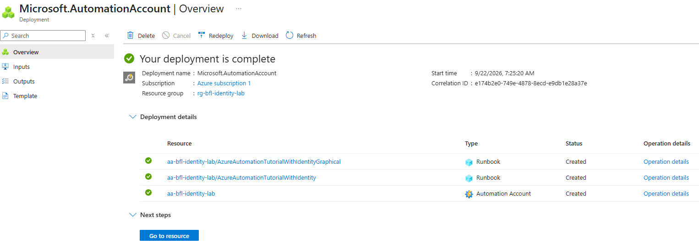

**Shows:** The deployment of `aa-bfl-identity-lab` completed successfully.

**Why it matters:** Establishes the Azure Automation host for the Managed Identity Runbooks.

## 04 — System-assigned identity enabled

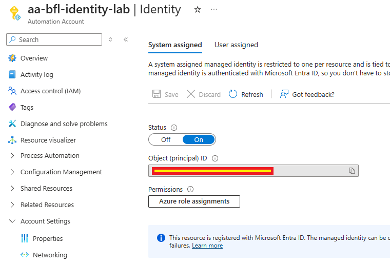

**Shows:** The System-assigned identity for `aa-bfl-identity-lab` is On; its principal ID is masked.

**Why it matters:** Records the workload identity configuration before the authentication and authorization tests.

## 05 — Managed Identity service principal

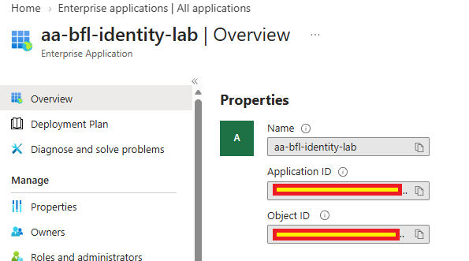

**Shows:** Microsoft Entra Enterprise Applications lists `aa-bfl-identity-lab`.

**Why it matters:** Shows the Automation identity's Entra representation; masked IDs prevent independent object-ID correlation.

## 06 — Blob read denied before data RBAC

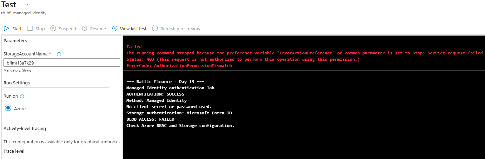

**Shows:** The Runbook test reports successful Managed Identity authentication followed by HTTP `403` / `AuthorizationPermissionMismatch` on Blob access.

**Why it matters:** Distinguishes authentication from data authorization in the documented pre-assignment test. The screenshot does not show the earlier RBAC inventory.

## 07 — Storage Blob Data Reader assignment

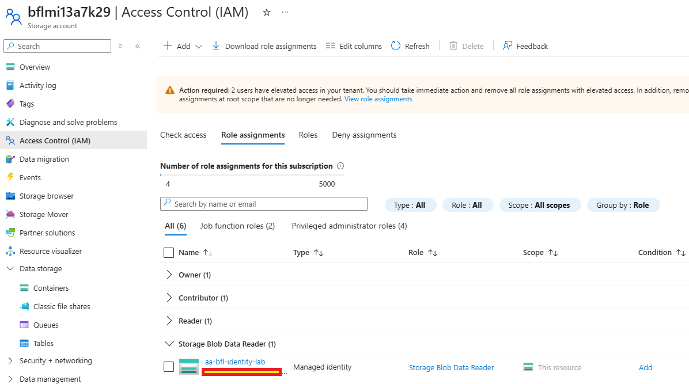

**Shows:** Storage IAM lists `aa-bfl-identity-lab` with `Storage Blob Data Reader` at `This resource` on the test Storage Account.

**Why it matters:** Records the scoped data-plane role used for the subsequent read test.

## 08 — Successful System-assigned Blob read

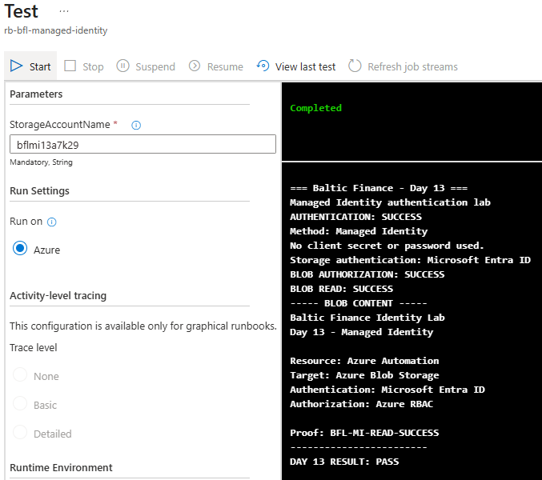

**Shows:** The completed Runbook test reports successful authentication and Blob read, returning `BFL-MI-READ-SUCCESS`.

**Why it matters:** Provides runtime output after the reader assignment; the full executed Runbook source is not shown.

## 09 — Published PowerShell Runbook

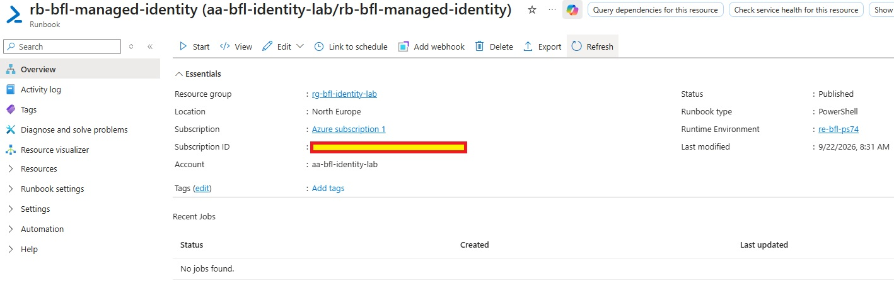

**Shows:** `rb-bfl-managed-identity` has Published status and the `re-bfl-ps74` runtime environment.

**Why it matters:** Shows that the Runbook was published; publication alone does not prove a successful job.

## 10 — Completed published Runbook job

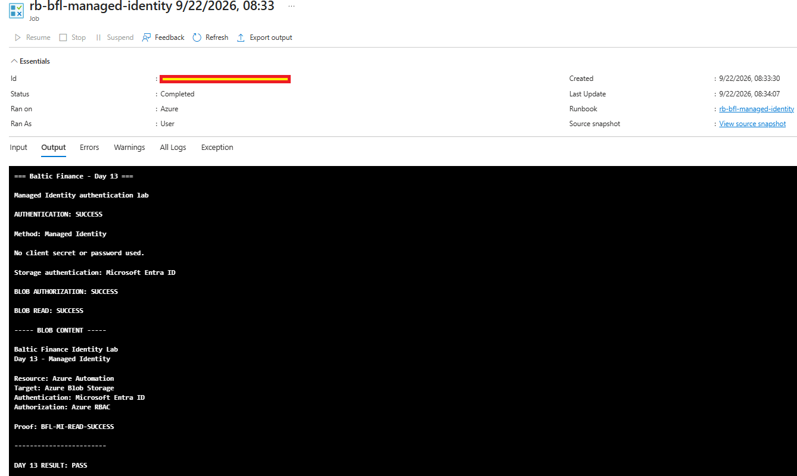

**Shows:** A separate job is Completed and its output reports a successful Blob read with `BFL-MI-READ-SUCCESS`.

**Why it matters:** Extends the read evidence beyond the Test pane to a published Runbook job.

## 11 — Role assignment in Azure Activity Log

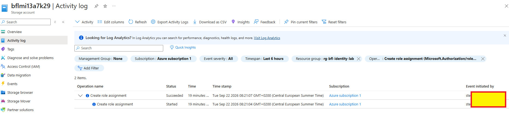

**Shows:** Azure Activity Log records `Create role assignment` with status Succeeded.

**Why it matters:** Records the permission change before the published job. The unopened event details do not identify the exact role or principal, and this is not a Blob-read log.

## 12 — User-assigned identity resource

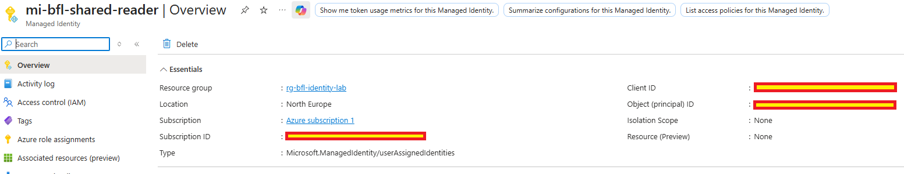

**Shows:** The standalone `mi-bfl-shared-reader` Managed Identity exists in the lab resource group.

**Why it matters:** Introduces the second workload identity, whose lifecycle is separate from the Automation Account.

## 13 — User-assigned identity attached to Automation

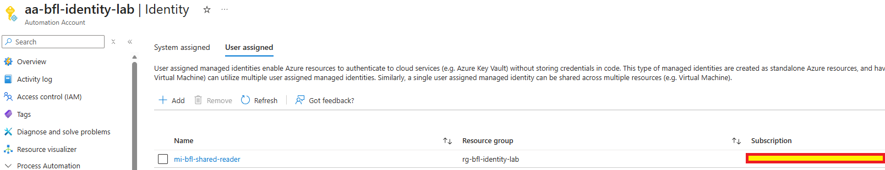

**Shows:** The Automation Account's User-assigned identity list contains `mi-bfl-shared-reader`.

**Why it matters:** Shows the identity is attached to the workload host; runtime selection is demonstrated separately.

## 14 — Successful User-assigned Blob read

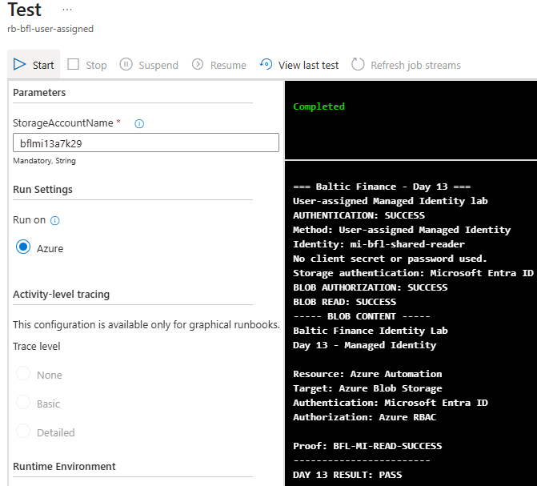

**Shows:** The completed test names `mi-bfl-shared-reader` and reports successful authentication and Blob read with the proof marker.

**Why it matters:** Supports the recorded second-identity read scenario; the identity name is Runbook output rather than an exposed token claim.

## 15 — Reported write denial under the reader role

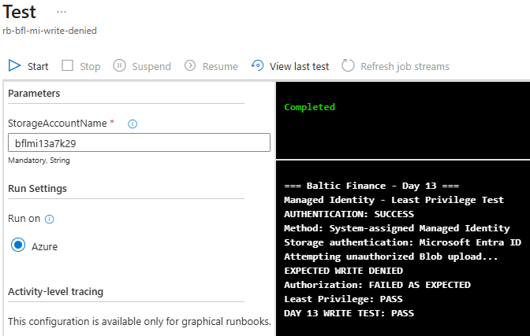

**Shows:** The test output records an attempted upload, `EXPECTED WRITE DENIED` and `Least Privilege: PASS`.

**Why it matters:** Documents the handled negative-test result. Without the raw Storage error or exception-handling source, the screenshot does not independently establish the cause of the denial.

## 16 — Managed Identity sign-in records

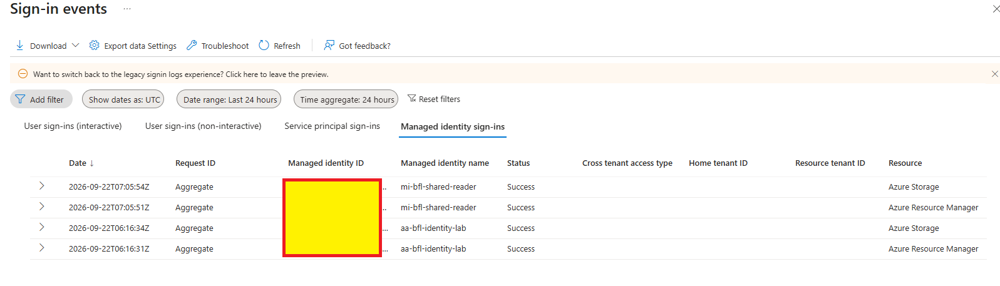

**Shows:** Both `aa-bfl-identity-lab` and `mi-bfl-shared-reader` have successful sign-ins to Azure Storage and Azure Resource Manager.

**Why it matters:** Corroborates workload authentication and token issuance; sign-in success does not authorize every Blob operation.

## 17 — Explicit User-assigned identity selection

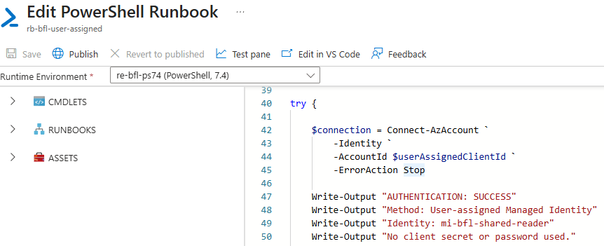

**Shows:** The PowerShell 7.4 Runbook fragment uses `Connect-AzAccount -Identity -AccountId $userAssignedClientId -ErrorAction Stop`.

**Why it matters:** Shows explicit selection of a User-assigned identity. The masked client ID and missing remainder of the Runbook limit source-level verification.

The Runbook outputs and visible identity-selection code document Microsoft Entra authentication to Storage. The complete Runbook source is not included, so all credential and error-handling paths cannot be independently reviewed. Sensitive identifiers were redacted where appropriate; no access tokens or credentials are published.
