# Day 14 — Evidence

This folder documents SSO and application integration in Baltic Finance: OIDC authentication with the existing Expense Portal, SAML federation, linked sign-on, a single-server Microsoft Entra Application Proxy deployment, Conditional Access, SCIM-based provisioning and deprovisioning, and a subsequently completed Password-based SSO test.

## 01 — Expense Portal OIDC configuration

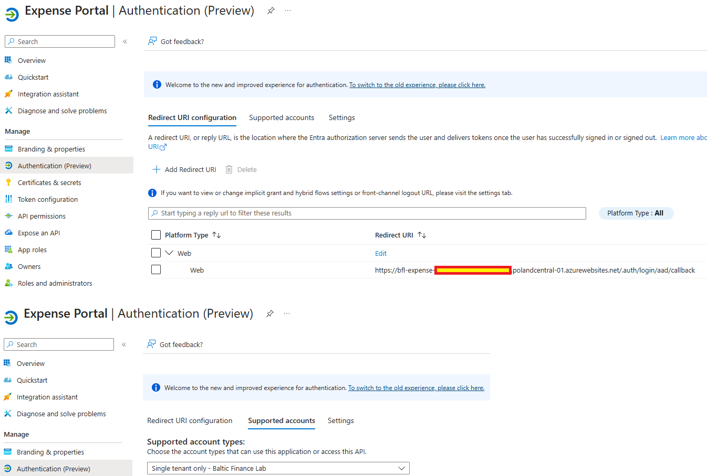

**Shows:** The Expense Portal App Registration shows its web callback ending in `/.auth/login/aad/callback` and single-tenant account configuration.

**Why it matters:** Documents the application sign-in setup; successful authentication is evidenced separately.

## 02 — Anna's authenticated Expense Portal session

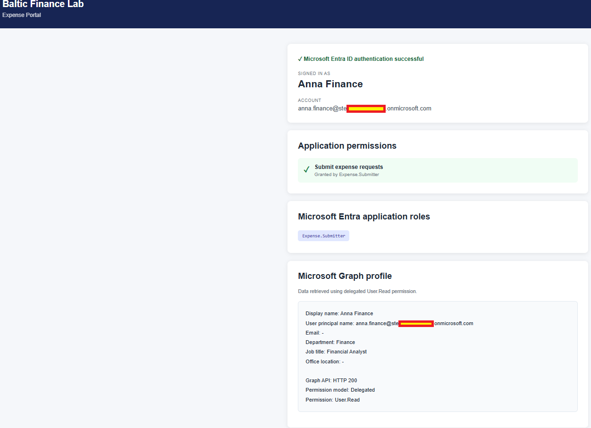

**Shows:** Expense Portal displays Anna Finance, `Expense.Submitter` and a Graph profile returned with HTTP 200 using delegated `User.Read`.

**Why it matters:** Demonstrates the captured application session and profile access without claiming a raw OIDC protocol trace.

## 03 — Expense Portal sign-in and policy results

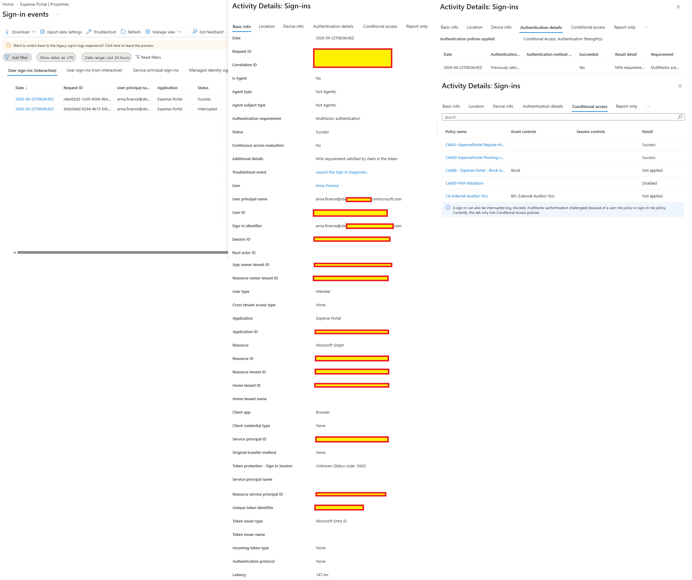

**Shows:** Anna's Expense Portal sign-in succeeds with Microsoft Graph as the resource; MFA is satisfied by a token claim and `CA001` / `CA003` show Success.

**Why it matters:** Corroborates the app's authentication and policy evaluation. It does not show a new MFA prompt or an Application Proxy sign-in.

## 04 — SAML federation configuration

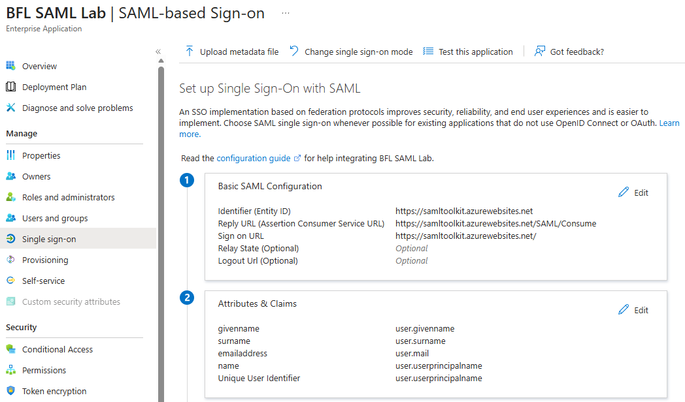

**Shows:** `BFL SAML Lab` shows the Toolkit Entity ID, ACS/Reply URL, Sign-on URL and `user.userprincipalname` NameID mapping.

**Why it matters:** Documents the SAML service-provider integration separately from Expense Portal's OIDC configuration.

## 05 — SAML Toolkit session and Entra sign-in

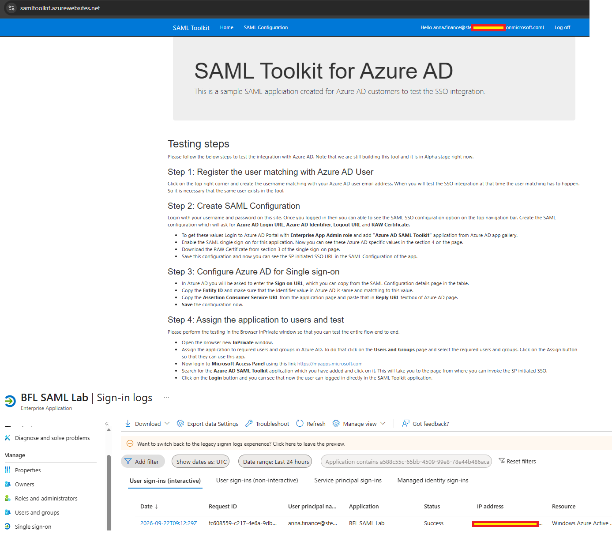

**Shows:** SAML Toolkit greets Anna alongside a successful `BFL SAML Lab` sign-in record.

**Why it matters:** Supports functional SAML sign-in; no raw assertion or session-to-event correlation ID is exposed.

## 06 — Linked SSO destination

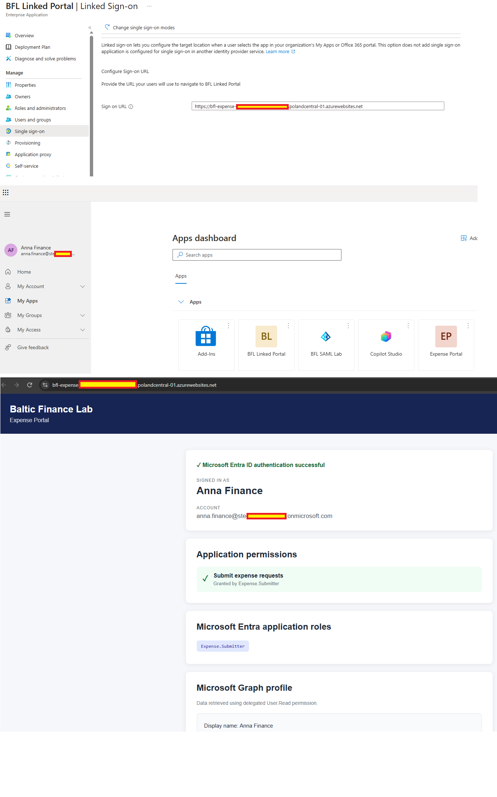

**Shows:** `BFL Linked Portal` shows the Expense Portal destination URL, Anna's My Apps tile and the resulting portal page.

**Why it matters:** Shows the configured navigation path. Linked SSO supplies a link; Expense Portal performs its own authentication.

## 07 — Internal IIS application on BFL-APP01

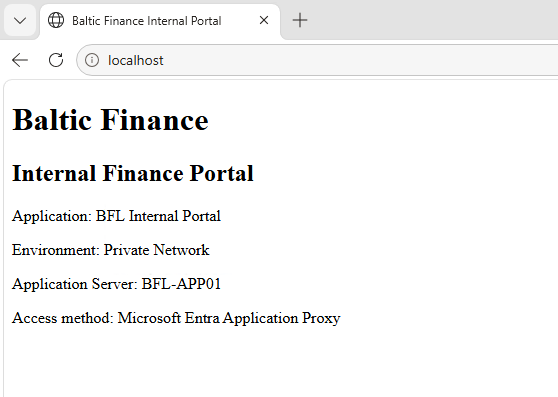

**Shows:** The browser at `http://localhost/` displays the static `BFL Internal Portal` page identifying `BFL-APP01`.

**Why it matters:** Establishes local application reachability in the single-server lab; page text does not prove backend user SSO.

## 08 — Registered Private Network Connector

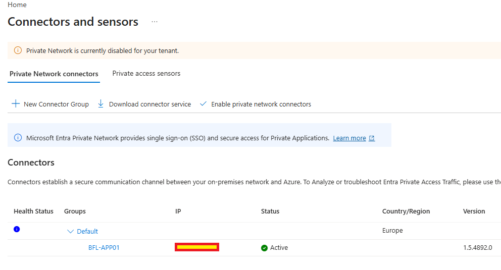

**Shows:** `BFL-APP01` appears Active in the Default connector group; the page also displays a Private Network disabled banner.

**Why it matters:** Confirms connector registration, while the banner prevents treating this as the final enabled-service state.

## 09 — Dedicated connector group

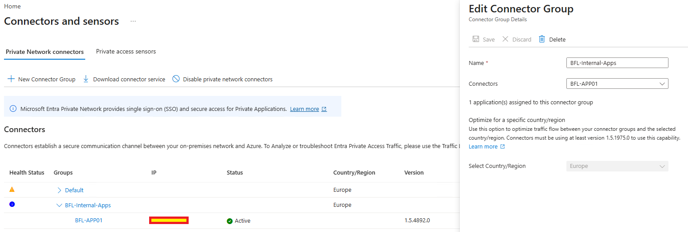

**Shows:** `BFL-Internal-Apps` contains the Active `BFL-APP01` connector and one assigned application.

**Why it matters:** Documents the group used to route the published application to the co-located connector and IIS host.

## 10 — Application Proxy publication settings

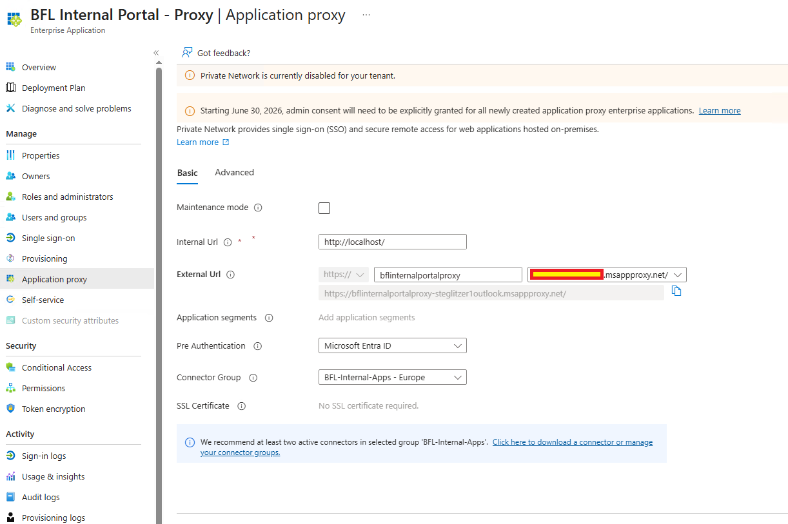

**Shows:** `BFL Internal Portal - Proxy` uses `http://localhost/`, an external HTTPS URL, Entra pre-authentication and `BFL-Internal-Apps`; a Private Network disabled banner is also visible.

**Why it matters:** Records the intended route and authentication settings. Capture timestamps do not establish the service-state transition; runtime access appears in screenshots 13–15.

## 11 — Proxy application group assignment

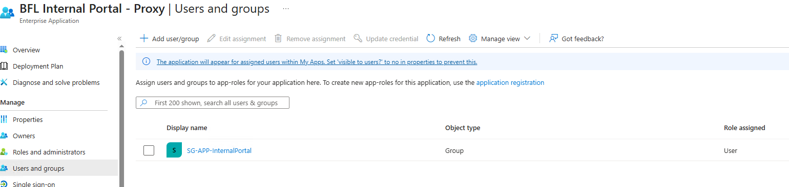

**Shows:** `SG-APP-InternalPortal` is assigned to the proxy Enterprise Application with the User role.

**Why it matters:** Documents the application access scope used by the positive and negative assignment tests.

## 12 — Proxy MFA policy configuration

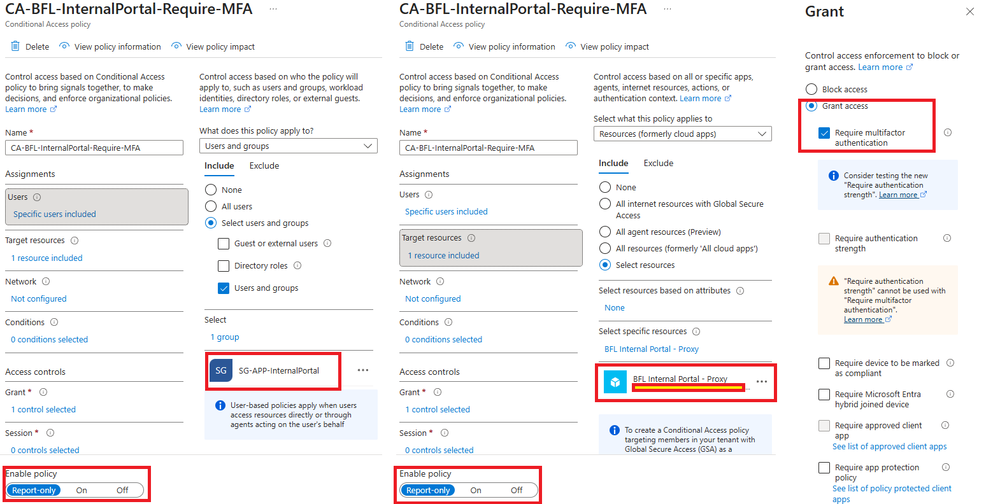

**Shows:** `CA-BFL-InternalPortal-Require-MFA` targets the pilot group and proxy application, requires MFA and is captured in Report-only mode.

**Why it matters:** Records policy scope without claiming enforcement from configuration alone; screenshot 15 separately records a successful policy evaluation.

## 13 — External access to the internal portal

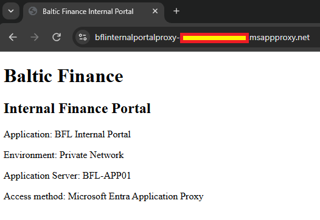

**Shows:** The static IIS portal opens at the external Application Proxy HTTPS URL.

**Why it matters:** Demonstrates external resource reachability. The page does not display the acting identity or prove backend SSO; Anna's sign-in is recorded separately in screenshot 15.

## 14 — Unassigned Peter denied proxy access

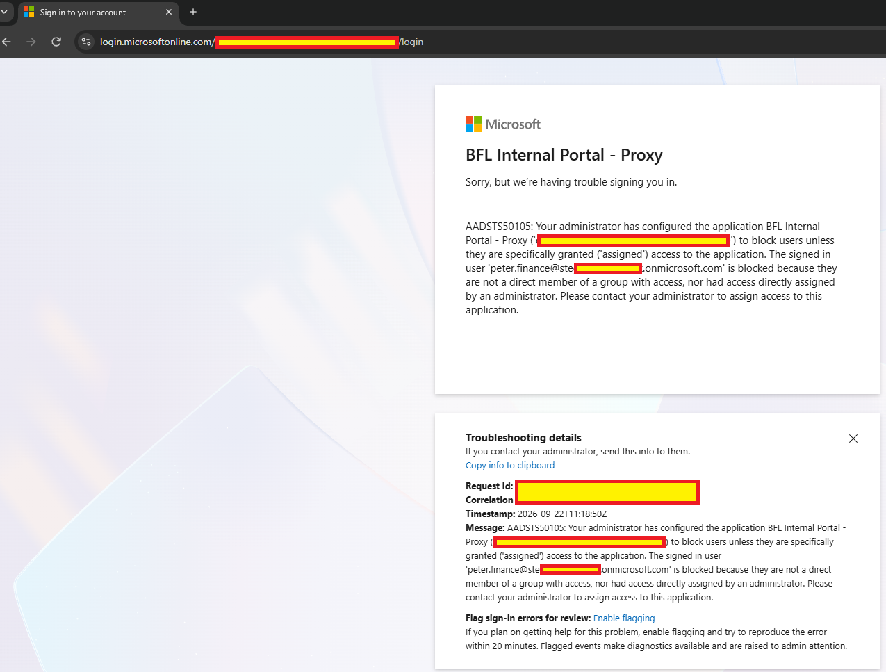

**Shows:** Peter receives `AADSTS50105` for `BFL Internal Portal - Proxy` because he lacks an application assignment.

**Why it matters:** Demonstrates the negative application-authorization case rather than a disabled user account or invalid password.

## 15 — Proxy sign-ins and MFA policy evaluation

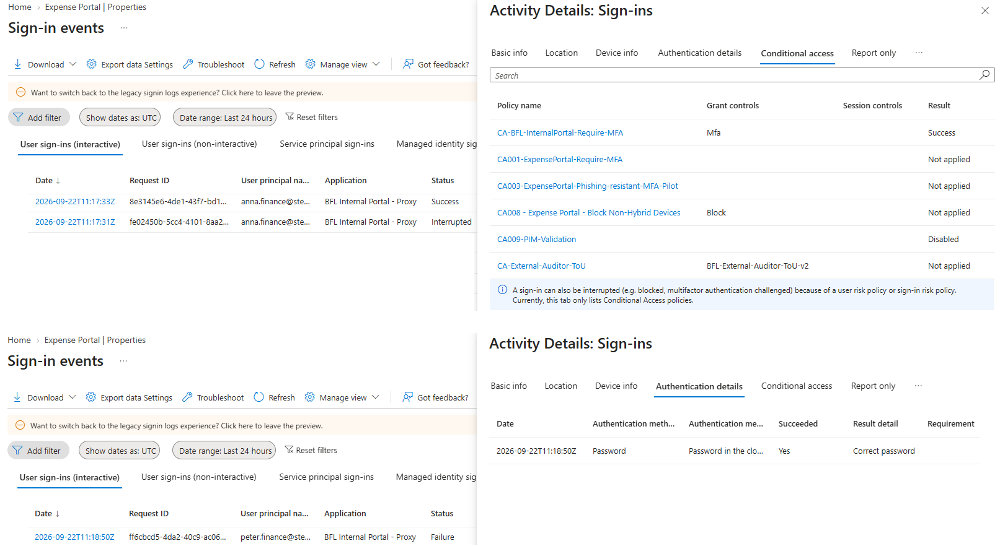

**Shows:** The logs show Anna's successful proxy sign-in, Peter's failed sign-in and Success for `CA-BFL-InternalPortal-Require-MFA` on Anna's event.

**Why it matters:** Corroborates the access outcomes and actual policy evaluation; the exact transition from the Report-only configuration is not captured.

## 16 — SCIM provisioning scope and mappings

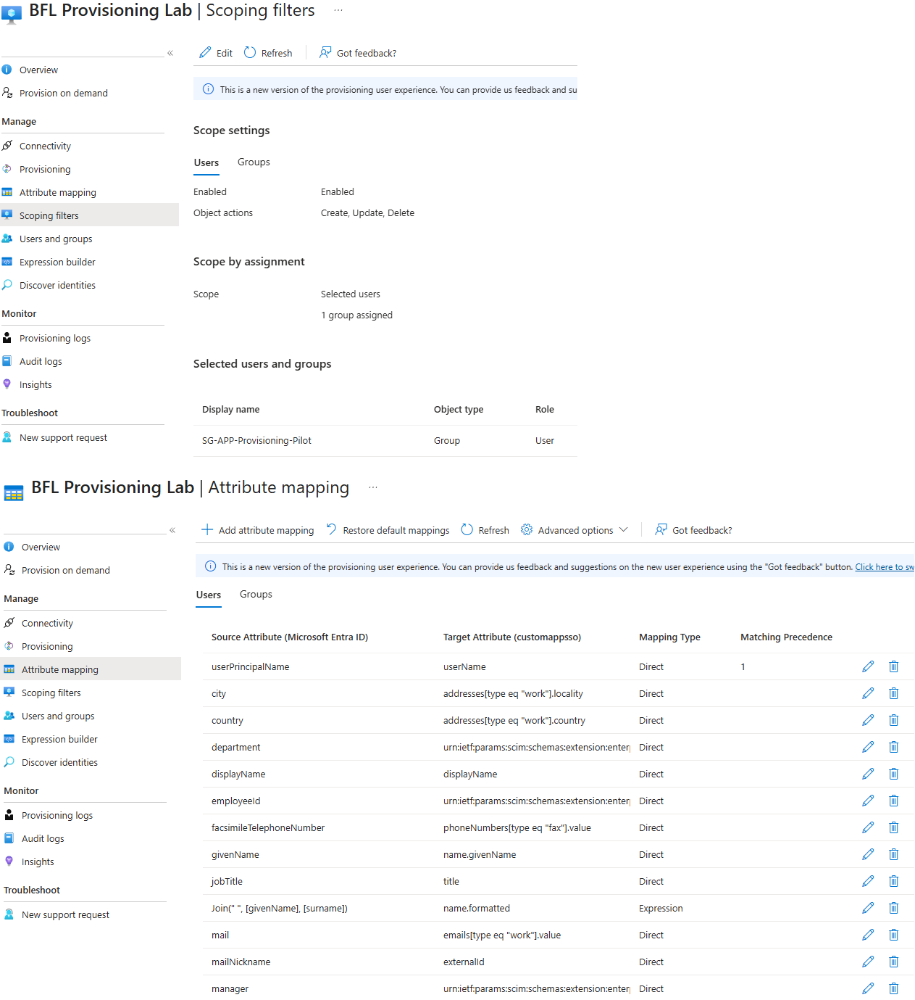

**Shows:** `SG-APP-Provisioning-Pilot` defines the assignment scope; mappings include `userPrincipalName → userName` and `jobTitle → title` for `customappsso`.

**Why it matters:** Documents the selected-user provisioning boundary and source-to-target attribute mapping.

## 17 — On-demand SCIM user update

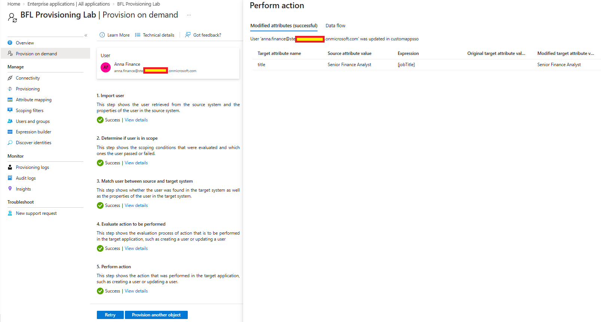

**Shows:** Anna's import, scoping, matching, evaluation and update stages succeed; `title` is updated to `Senior Finance Analyst` in `customappsso`.

**Why it matters:** Demonstrates an update to a matched target record, not the initial account creation.

## 18 — Target disable and redundant soft-delete

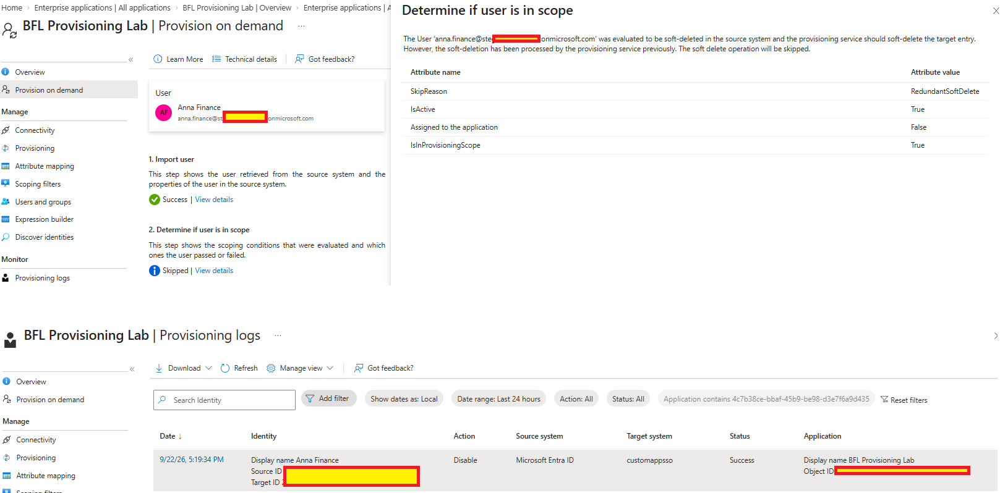

**Shows:** Anna is no longer assigned but remains active in Entra. An on-demand attempt is skipped as `RedundantSoftDelete`, while a separate log records `Disable → Success` in `customappsso`.

**Why it matters:** Distinguishes successful target deprovisioning from a later redundant-operation skip; the final target account screen is not included.

## 19 — Password-based SSO form configuration

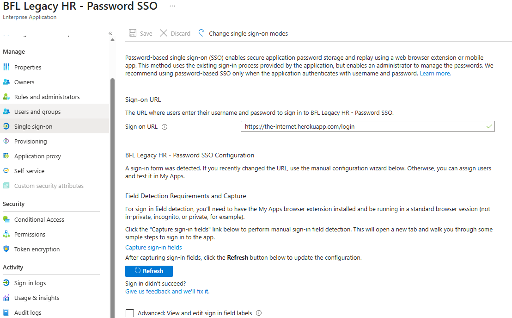

**Shows:** `BFL Legacy HR - Password SSO` shows the test login URL and `A sign-in form was detected`.

**Why it matters:** Documents the form-based SSO setup separately from SAML or OIDC federation.

## 20 — Password SSO tile in Anna's My Apps

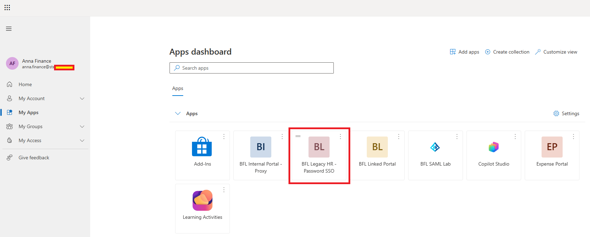

**Shows:** Anna's My Apps dashboard contains the assigned `BFL Legacy HR - Password SSO` tile.

**Why it matters:** Confirms the application launch entry is available to the test user; the tile alone does not prove credential replay.

## 21 — Successful session at the password test site

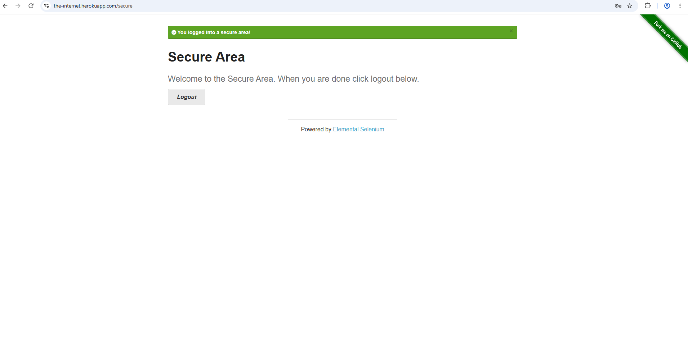

**Shows:** The target site's `/secure` page displays `You logged into a secure area!`.

**Why it matters:** Confirms the destination session. Automatic replay without manual entry is the reported test observation; this image does not expose the replay step or independently distinguish it from manual sign-in.

Sensitive identifiers and user-specific details were redacted where appropriate; no credentials or tokens are published.
