# Day 15 — Evidence

This folder documents the Baltic Finance Global Secure Access and Microsoft Defender for Cloud Apps lab: a scoped pilot group, enabled traffic forwarding profiles, a connected client, observed Microsoft 365/Entra traffic, per-app Private Access to an internal finance site, Internet Access web filtering, Cloud App Catalog and OAuth permission review, and a tested Conditional Access App Control download block.

The images are arranged by **implementation and verification flow**, not by exact capture time. Screenshot 02 is the final profile state.

## 01 — Global Secure Access pilot membership

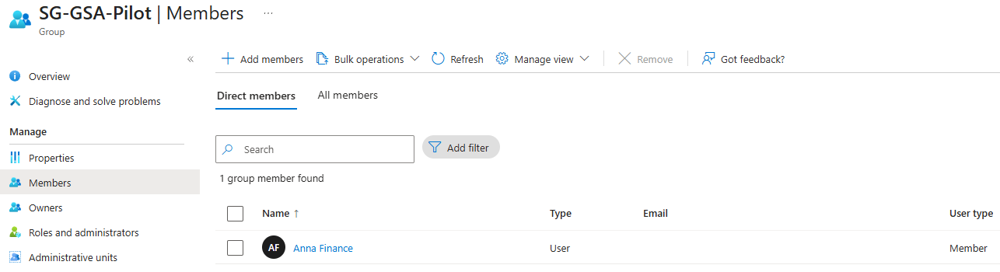

**Shows:** `SG-GSA-Pilot` contains Anna Finance as its only direct member.

**Why it matters:** Documents the narrow user scope for the network-access and session-control tests.

## 02 — Final traffic forwarding profile state

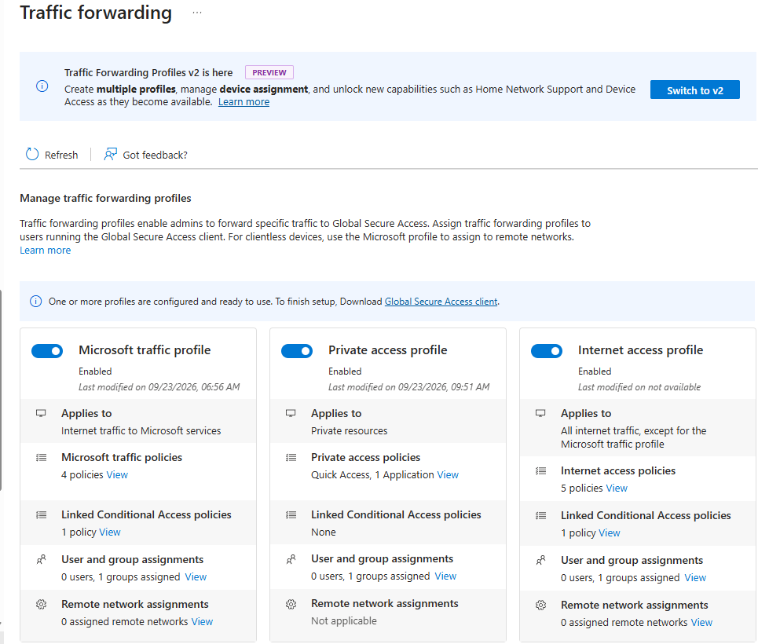

**Shows:** Microsoft traffic, Private Access and Internet Access profiles are enabled, with group assignments and related policy/application counts.

**Why it matters:** Records the final configuration; its position in the evidence list does not imply it preceded every traffic capture.

## 03 — Pilot traffic forwarding assignment

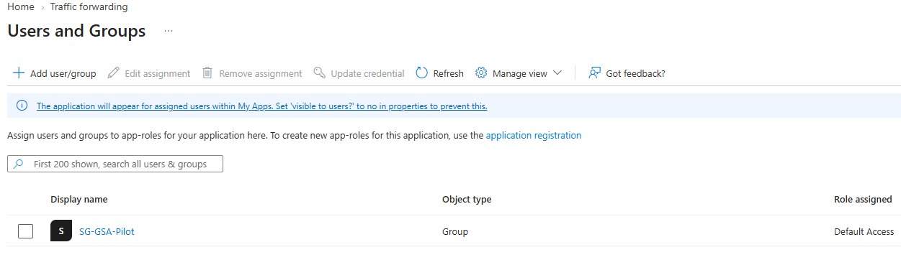

**Shows:** The traffic-forwarding-related Enterprise Application view lists `SG-GSA-Pilot` with Default Access.

**Why it matters:** Shows the pilot assignment. The application/profile name is not visible in this crop, and assignment alone does not prove traffic forwarding.

## 04 — Connected Global Secure Access Client

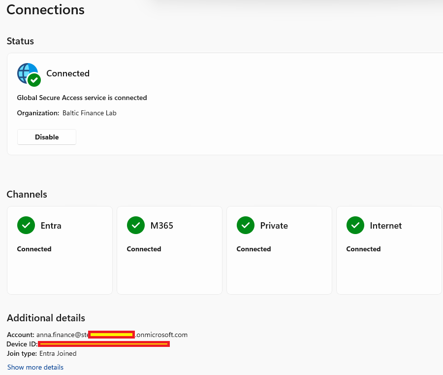

**Shows:** Anna's client is connected to Baltic Finance Lab on an Entra Joined device; Entra, M365, Private and Internet channels are Connected.

**Why it matters:** Confirms client connectivity before examining the actual traffic records.

## 05 — Observed Microsoft and Entra traffic

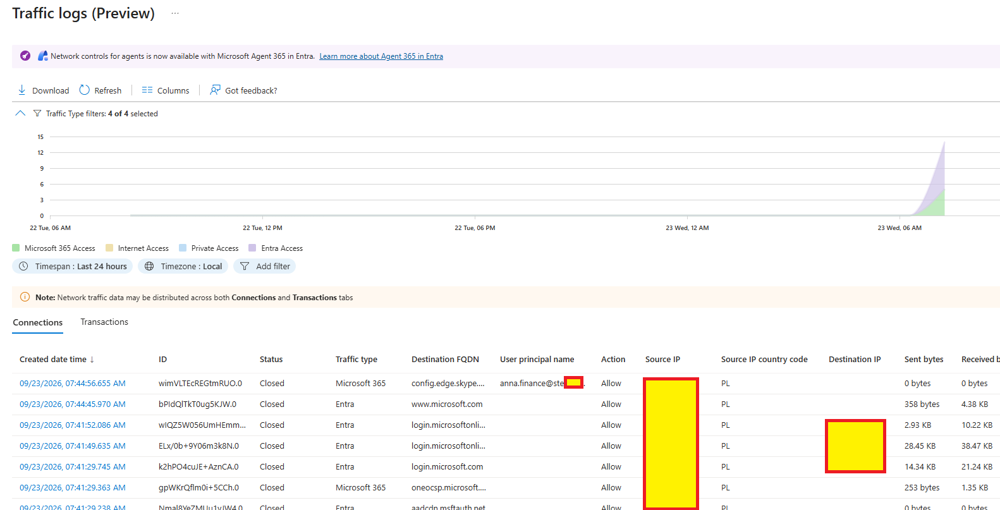

**Shows:** Central GSA Traffic logs show Anna's Microsoft 365 and Entra connections with action Allow.

**Why it matters:** Provides traffic evidence beyond group assignment and client connection status.

## 06 — Private Access application segment

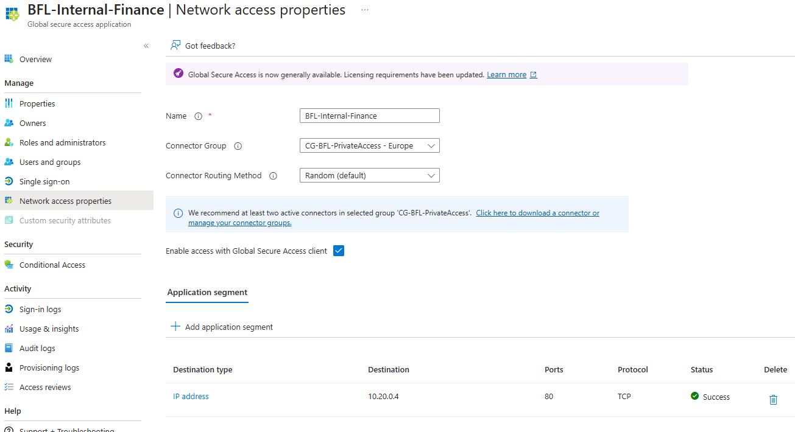

**Shows:** `BFL-Internal-Finance` uses `CG-BFL-PrivateAccess - Europe`, has GSA client access enabled and lists a successful TCP segment for `10.20.0.4:80`.

**Why it matters:** Documents the specific internal destination exposed through Private Access.

## 07 — Internal finance page reached by IP

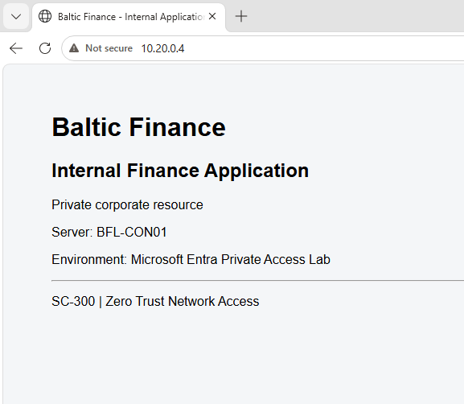

**Shows:** The browser at `http://10.20.0.4/` displays the Internal Finance Application page identifying `BFL-CON01`.

**Why it matters:** Shows resource reachability; the page alone does not establish the network path or acting identity.

## 08 — Private Access tunnel in client diagnostics

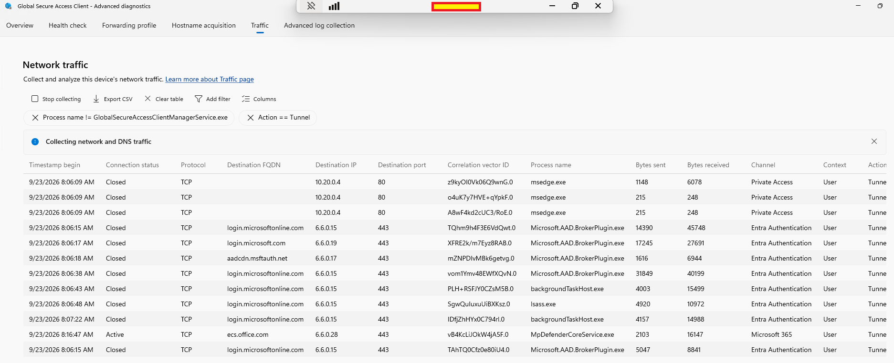

**Shows:** GSA advanced diagnostics show Edge TCP traffic to `10.20.0.4:80` with channel Private Access and action Tunnel.

**Why it matters:** Demonstrates the client-side route to the destination shown in screenshots 06–07.

## 09 — Central Private Access transactions

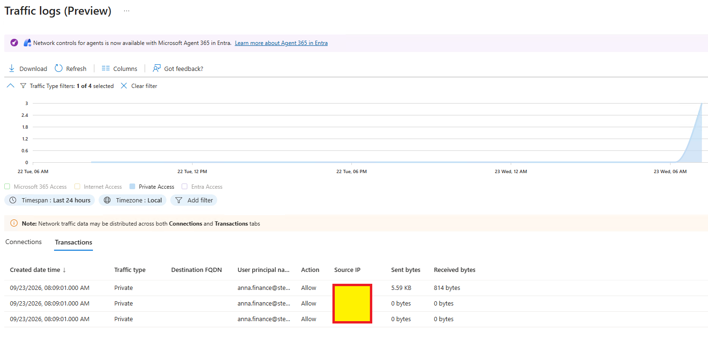

**Shows:** Central GSA logs show Anna's Private traffic with action Allow.

**Why it matters:** Corroborates permitted Private Access traffic; the crop omits destination and correlation fields needed to match an exact client transaction.

## 10 — Internet domain-block configuration

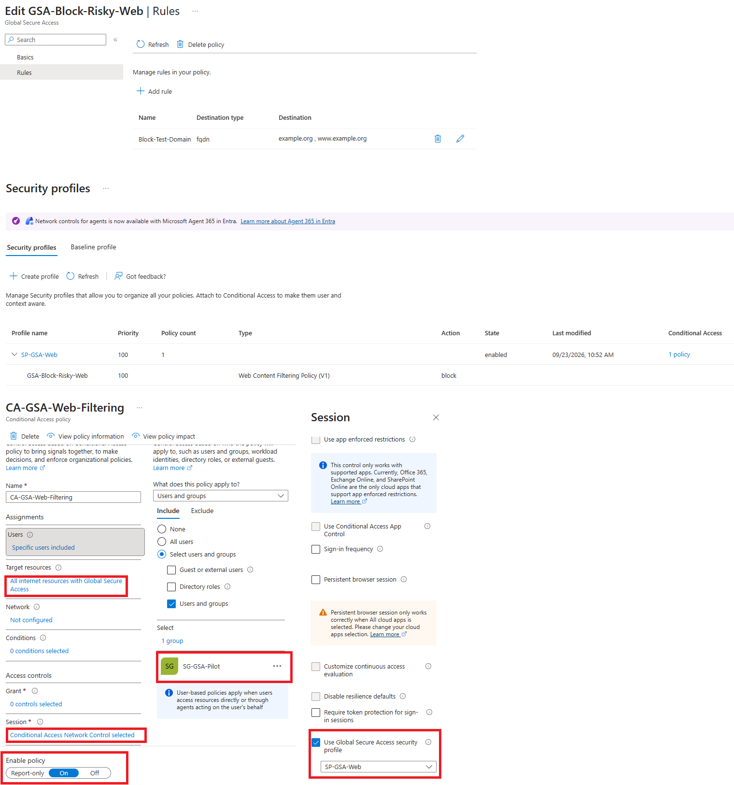

**Shows:** `GSA-Block-Risky-Web` matches `example.org` and `www.example.org`; enabled `SP-GSA-Web` uses Block, and `CA-GSA-Web-Filtering` targets the pilot and GSA Internet resources.

**Why it matters:** Documents the domain rule, security profile and Conditional Access scope that define the web-filtering test.

## 11 — Blocked and allowed Internet traffic

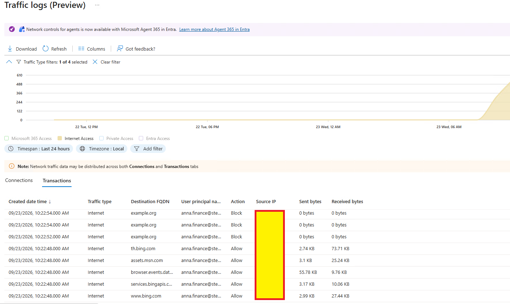

**Shows:** Anna's Internet Access transactions show `example.org` blocked while other destinations are allowed.

**Why it matters:** Demonstrates a selective block. These events predate the profile's last-modified time in screenshot 10 and do not re-test its later configuration.

## 12 — Cloud App Catalog risk review

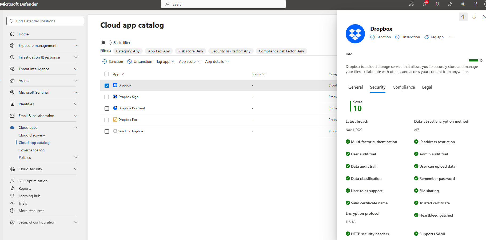

**Shows:** Defender for Cloud Apps displays Dropbox security factors and its catalog score.

**Why it matters:** Supports catalog analysis; it does not show discovered tenant usage or a Sanctioned/Unsanctioned decision.

## 13 — Expense Portal OAuth permission review

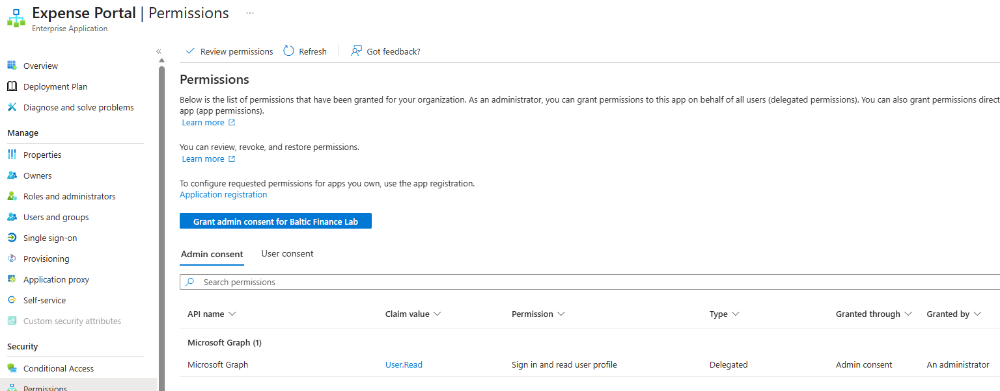

**Shows:** The Enterprise Application's Permissions view shows Microsoft Graph `User.Read`, Delegated, through Admin consent.

**Why it matters:** Documents the existing OAuth grant; this Entra review is not a Defender OAuth App Policy or App governance result.

## 14 — Conditional Access App Control scope

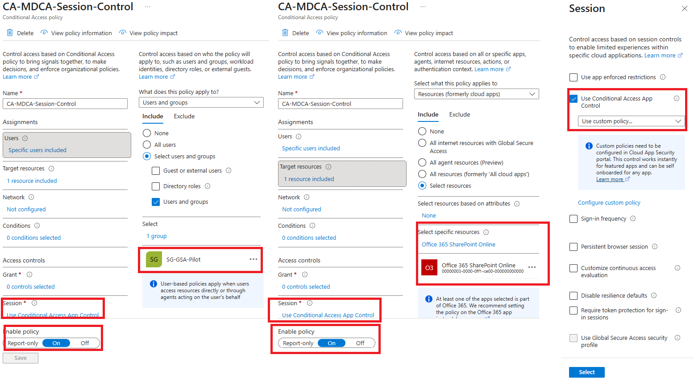

**Shows:** `CA-MDCA-Session-Control` is On for `SG-GSA-Pilot` and Office 365 SharePoint Online, using Conditional Access App Control with a custom policy.

**Why it matters:** Records the sign-in/session scope for the separate Defender download policy.

## 15 — Defender download-block policy

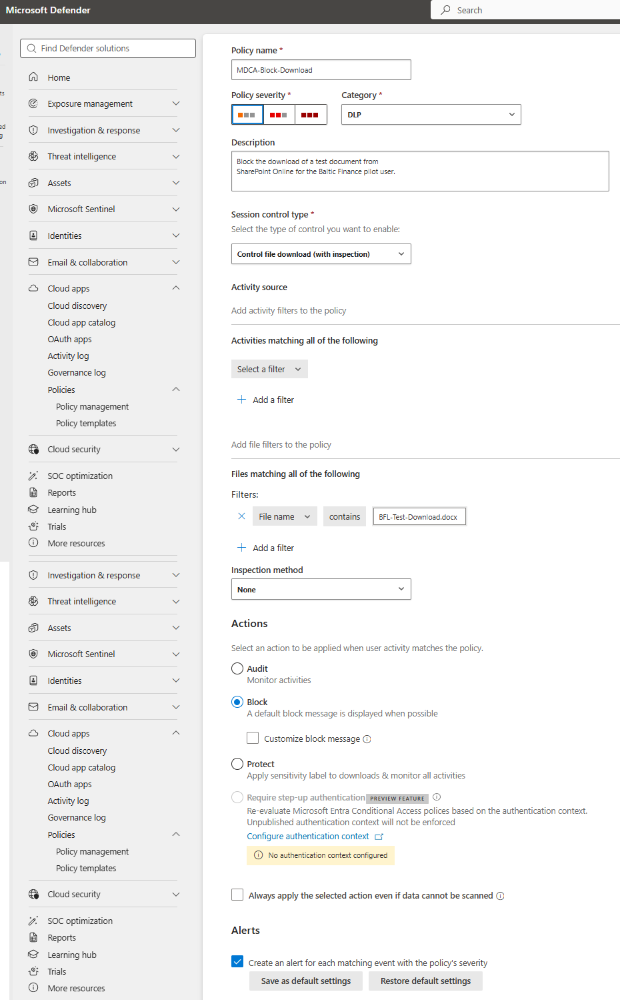

**Shows:** `MDCA-Block-Download` controls file downloads, matches the filename `BFL-Test-Download.docx`, uses Inspection method None and action Block.

**Why it matters:** Documents a filename-based restriction; it does not demonstrate content-based DLP inspection.

## 16 — SharePoint download blocked

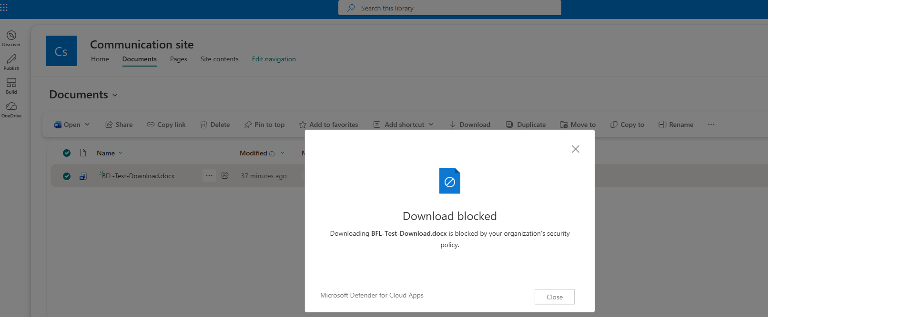

**Shows:** SharePoint displays Microsoft Defender for Cloud Apps' `Download blocked` message for `BFL-Test-Download.docx`.

**Why it matters:** Confirms the matching file's download was denied. The screenshot does not identify the acting user or matched policy ID, and does not show all-file blocking.

Sensitive account and device identifiers, network addresses where appropriate, and user-specific details were redacted. No credentials or tokens are published.
