# Day 16 — Evidence

This folder documents Baltic Finance identity monitoring: investigations in Microsoft Entra sign-in and audit logs, export to Log Analytics, KQL analysis of newly collected events, Conditional Access and custom Workbooks, and an Identity Secure Score review.

Screenshots 01–05 examine available Entra history; screenshots 06–17 document the monitoring setup and subsequent tests. Diagnostic Settings do not backfill earlier events into the new workspace.

## 01 — Application assignment denial investigation

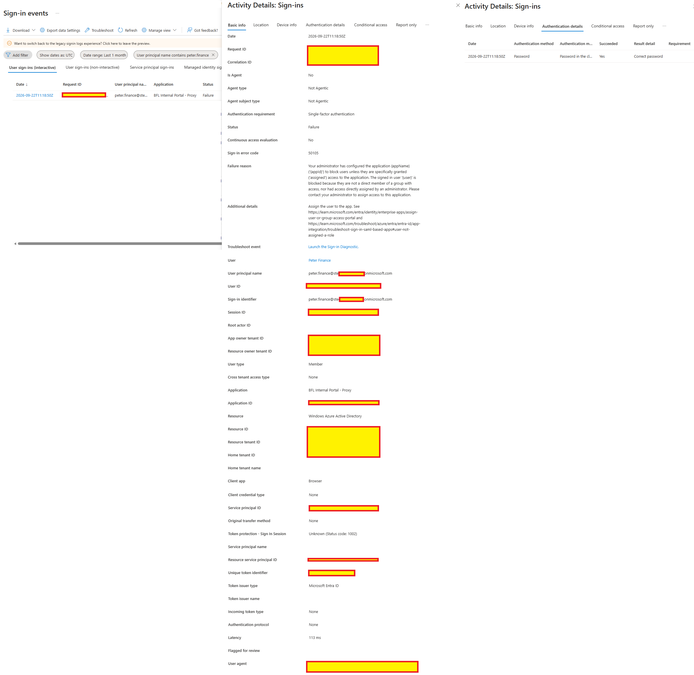

**Shows:** Peter's `BFL Internal Portal - Proxy` sign-in failed with `50105` even though the password step succeeded.

**Why it matters:** Identifies missing application assignment as the denial reason, separating authorization from incorrect credentials.

## 02 — Successful Conditional Access evaluation

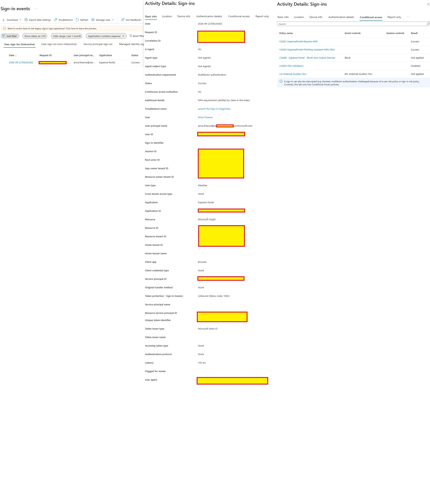

**Shows:** Anna's Expense Portal sign-in succeeds; MFA is satisfied by a token claim and `CA001` / `CA003` show Success.

**Why it matters:** Demonstrates policy-outcome analysis for a successful sign-in, not a Conditional Access failure or a new MFA prompt.

## 03 — PIM activation approval-request audit

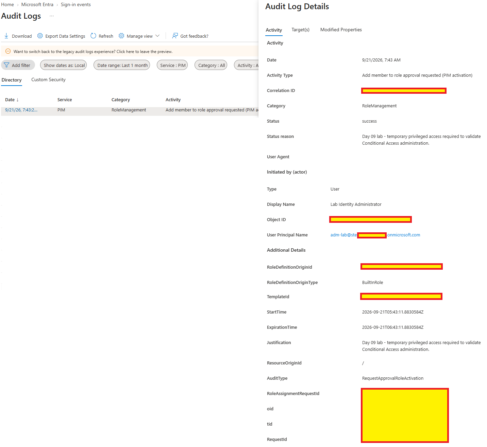

**Shows:** An `adm-lab` audit event records a Day 09 PIM activation approval request with justification and a one-hour requested interval.

**Why it matters:** Shows an audited privileged-access workflow step; it does not establish approval or completed activation.

## 04 — B2B guest assignment denial

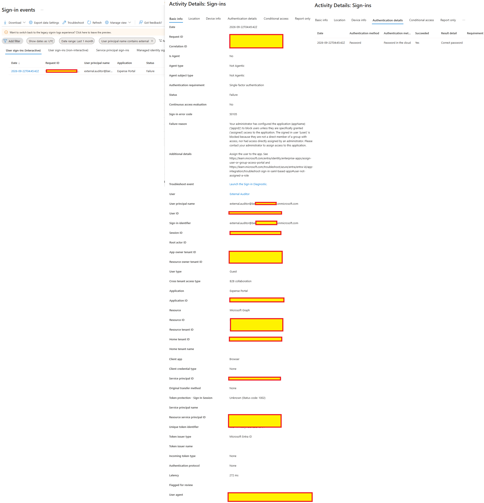

**Shows:** External Auditor's B2B guest sign-in to Expense Portal fails with `50105` despite a successful password step.

**Why it matters:** Identifies an application-assignment denial for the guest rather than a wrong password or disabled account.

## 05 — Expense Portal sign-in history

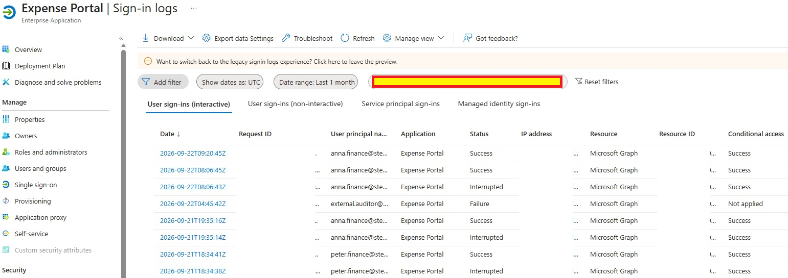

**Shows:** Interactive sign-in records for internal users and the external auditor include Success, Interrupted and Failure results.

**Why it matters:** Provides application-level monitoring context across distinct historical events.

## 06 — Log Analytics workspace

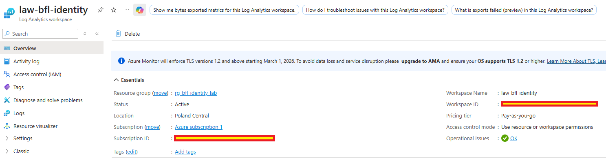

**Shows:** `law-bfl-identity` is Active in `rg-bfl-identity-lab`, in Poland Central.

**Why it matters:** Establishes the workspace used for the later exported-log queries and Workbooks.

## 07 — Entra diagnostic export configuration

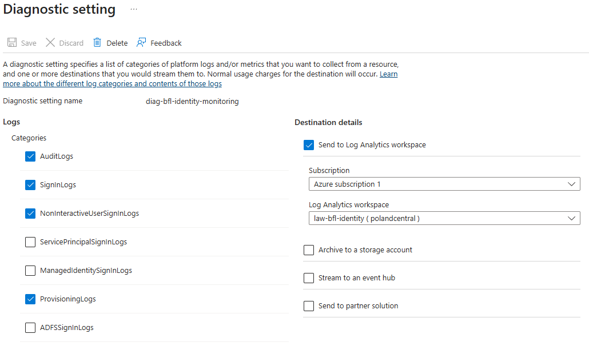

**Shows:** `diag-bfl-identity-monitoring` selects Audit, interactive/non-interactive user Sign-in and Provisioning logs for `law-bfl-identity`; workload sign-in categories are unselected.

**Why it matters:** Documents export scope. Selecting a category alone does not prove event ingestion or backfill earlier history.

## 08 — Successful Expense Portal test session

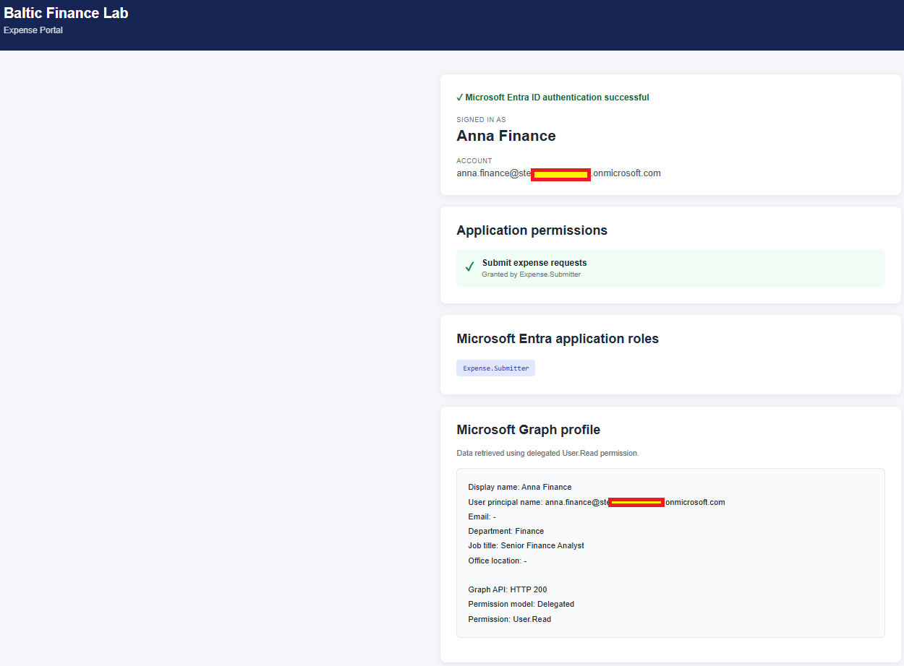

**Shows:** Anna is authenticated with `Expense.Submitter` and the portal displays her Graph profile with HTTP 200 using delegated `User.Read`.

**Why it matters:** Records a positive application observation alongside the later negative authentication examples.

## 09 — Rejected Authenticator request

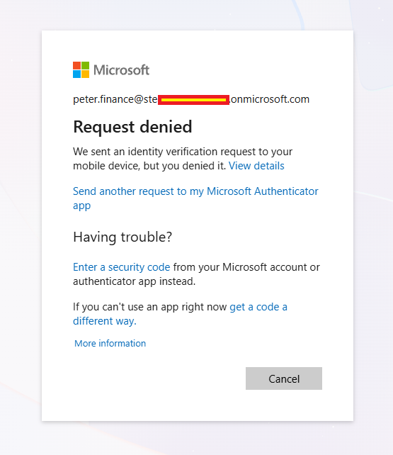

**Shows:** Peter's sign-in interaction displays `Request denied` after an Authenticator verification request is declined.

**Why it matters:** Documents an MFA rejection; it is distinct from the invalid-credentials event returned by the later KQL queries.

## 10 — KQL failed-sign-in investigation

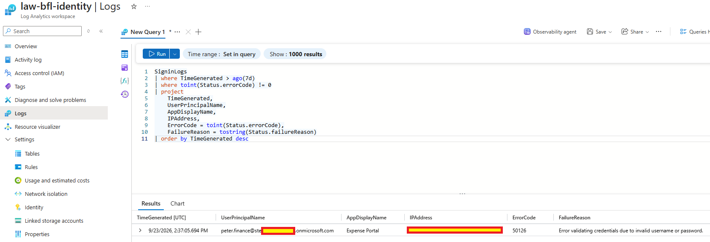

**Shows:** A `SigninLogs` query returns Peter's failed Expense Portal sign-in with error `50126` and an invalid username/password reason.

**Why it matters:** Shows an ingested authentication failure and its cause; it is not the `50105` assignment denial or the rejected MFA interaction.

## 11 — KQL outcomes grouped by user

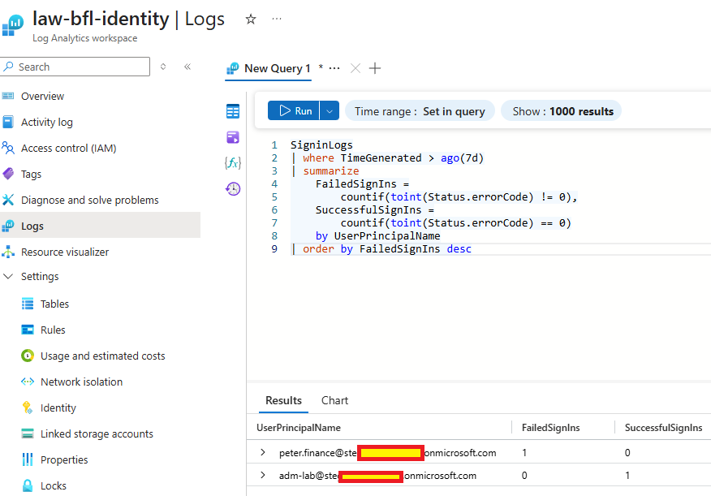

**Shows:** `summarize` and `countif()` return one failed sign-in for Peter and one successful sign-in for `adm-lab`.

**Why it matters:** Demonstrates per-user aggregation within the available exported records and query interval.

## 12 — KQL Conditional Access status summary

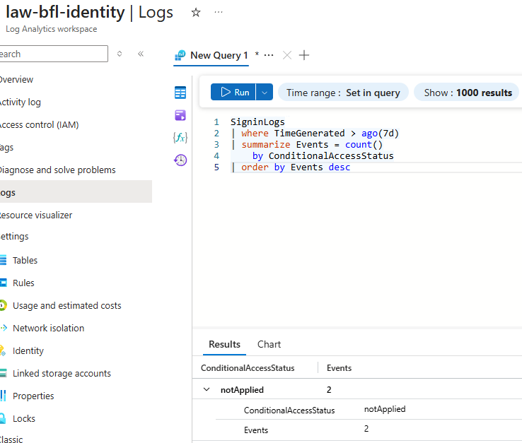

**Shows:** The query aggregates `ConditionalAccessStatus`; the captured results contain two `notApplied` records.

**Why it matters:** Describes the sampled workspace events, without implying Conditional Access never applied elsewhere in the tenant.

## 13 — KQL audit activity by operation

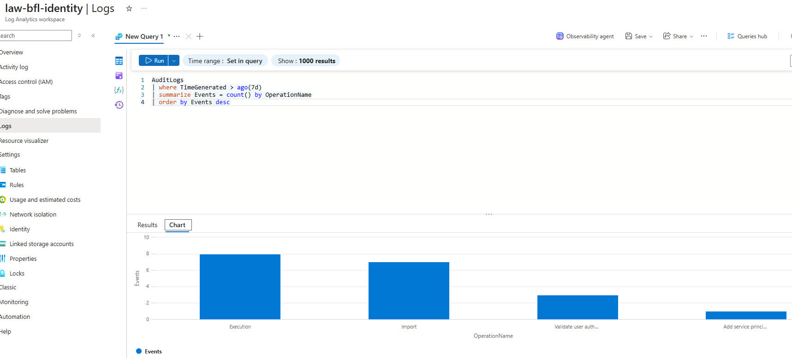

**Shows:** Exported `AuditLogs` are grouped by `OperationName` and displayed as event counts.

**Why it matters:** Demonstrates an audit activity summary, not proof of a role change or PIM activation in Log Analytics.

## 14 — KQL Expense Portal sign-ins

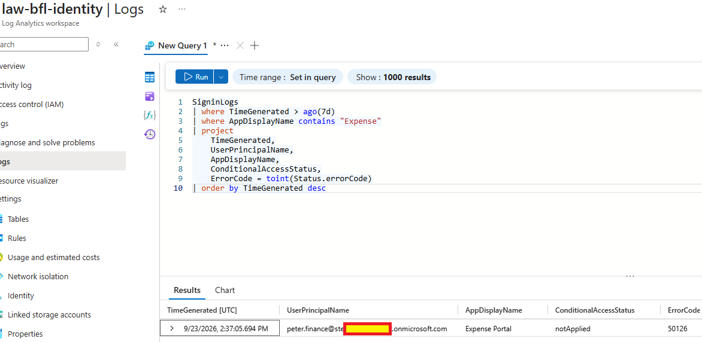

**Shows:** The query filters application names containing `Expense` and returns Peter's `50126` event with CA status `notApplied`.

**Why it matters:** Shows application-specific investigation of the same invalid-credentials event visible in screenshot 10.

## 15 — Microsoft Conditional Access Workbook

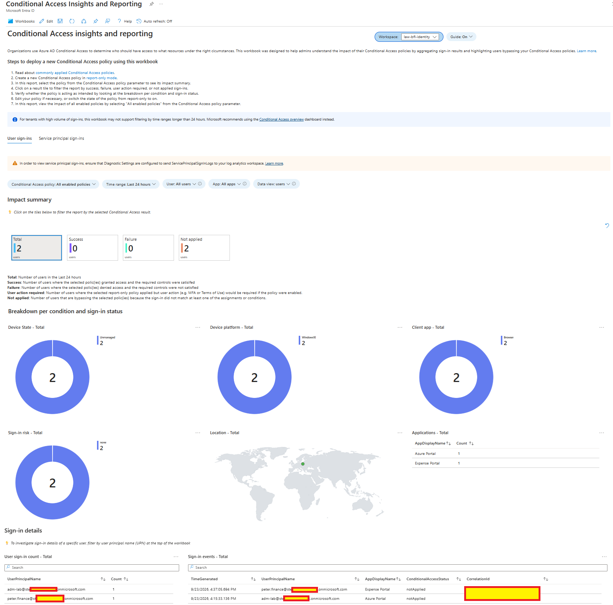

**Shows:** Conditional Access Insights and Reporting uses `law-bfl-identity` and shows two users with Not applied outcomes in the selected interval.

**Why it matters:** Demonstrates workspace-backed reporting; the visible warning also records the missing Service Principal sign-in export.

## 16 — Custom identity monitoring Workbook

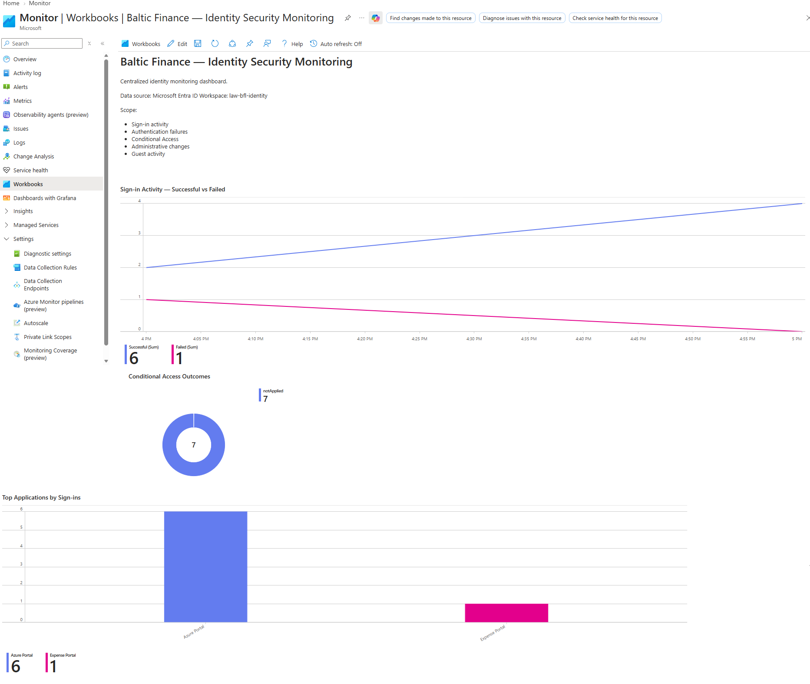

**Shows:** The saved `Baltic Finance — Identity Security Monitoring` Workbook displays six successful and one failed sign-in, CA outcomes and top applications.

**Why it matters:** Demonstrates the captured dashboard output. The values are time-range snapshots, and the underlying Workbook source is not included.

## 17 — Identity Secure Score baseline

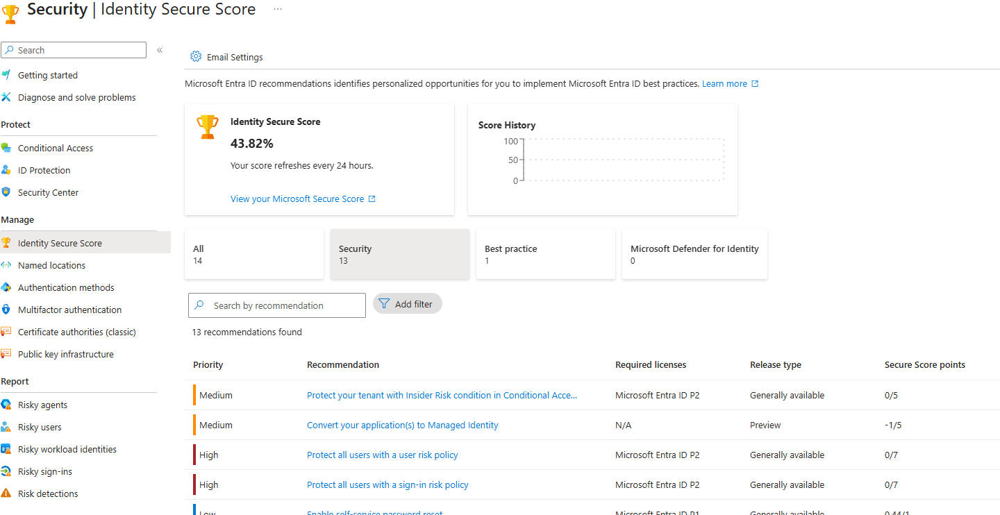

**Shows:** Identity Secure Score is `43.82%`, with 14 total recommendations and 13 in Security; risk-policy and Managed Identity recommendations are visible.

**Why it matters:** Establishes the Day 16 baseline for later comparison, without claiming remediation from this screenshot.

Identifiers and user-specific details were redacted where appropriate; no credentials or access tokens are published.
