# Day 17 — Microsoft Graph PowerShell Automation — Evidence

**Follow-up:** Day 18 adds the [successful CA CSV export](../day-18/02-graph-inventory.png) and [test-role removal audit](../day-18/05-privilege-remediation.png). The screenshots below remain the original Day 17 record.

The screenshots document delegated Microsoft Graph PowerShell administration in Baltic Finance Lab: read operations, lab-user and security-group provisioning, membership idempotency, a real Entra role-authorization boundary, selected tenant inventory and an Entra audit event.

## 01 — PowerShell and Microsoft Graph SDK

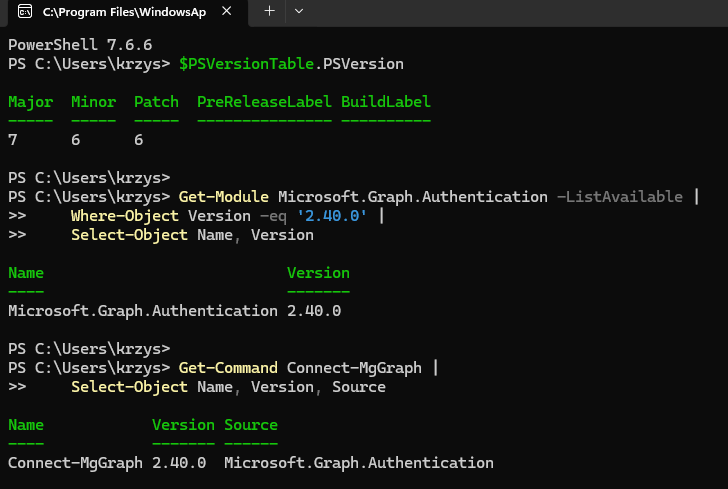

**Shows:** PowerShell `7.6.6`, Microsoft.Graph.Authentication `2.40.0` and the `Connect-MgGraph` cmdlet are available.

**Why it matters:** Records the local tooling used for the captured Graph administration exercises.

## 02 — Delegated Microsoft Graph connection

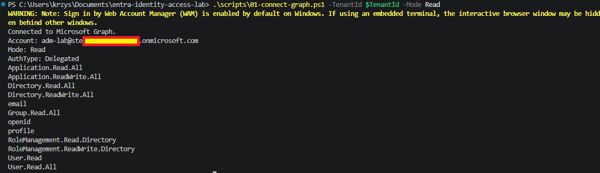

**Shows:** `adm-lab` connects using delegated authentication with Read mode displayed; the actual context includes additional write scopes.

**Why it matters:** Establishes the acting account and authentication model. The mode label does not prove a read-only token.

## 03 — Reading existing tenant objects

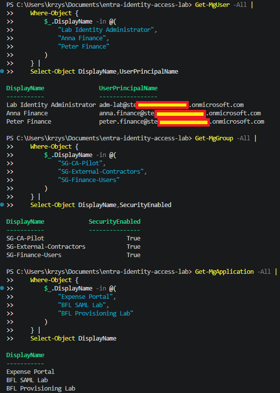

**Shows:** Filtered `Get-MgUser`, `Get-MgGroup` and `Get-MgApplication` queries return Baltic Finance users, groups and earlier lab applications.

**Why it matters:** Demonstrates read access to selected tenant objects without claiming any write operation.

## 04 — Existing lab-user properties

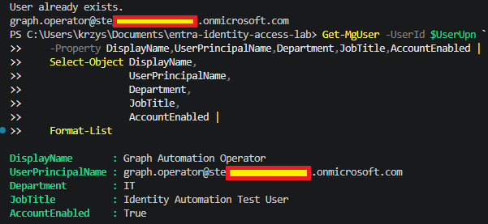

**Shows:** `Graph Automation Operator` has IT department, the test job title and an enabled account; the script reports `User already exists`.

**Why it matters:** Verifies the target user's properties. This capture is not the original successful `New-MgUser` response; screenshot 17 supplies the creation audit.

## 05 — Lab-user rerun behavior

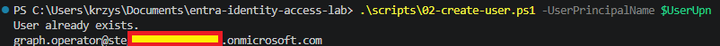

**Shows:** A repeated provisioning run finds the existing `graph.operator` user and reports `User already exists`.

**Why it matters:** Demonstrates duplicate avoidance in the captured rerun, without treating later source edits as tenant-tested behavior.

## 06 — Security-group creation and properties

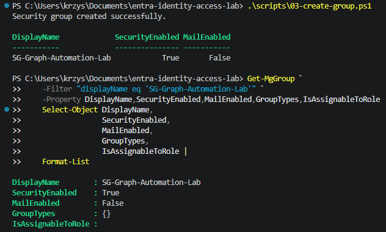

**Shows:** PowerShell reports creation of `SG-Graph-Automation-Lab`; a subsequent Graph query shows `SecurityEnabled: True` and `MailEnabled: False`.

**Why it matters:** Records creation of the dedicated test Security group separately from its later membership changes.

## 07 — Initial Security-group state

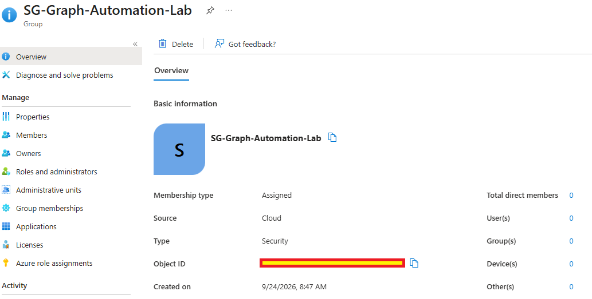

**Shows:** The Entra portal shows a cloud Security group with Assigned membership and zero direct members.

**Why it matters:** Provides the before-state for the subsequent membership test.

## 08 — Add, verify and recheck group membership

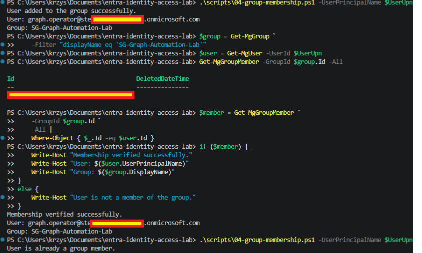

**Shows:** The script adds `graph.operator`, a Graph lookup verifies membership, and a repeated run reports the user is already a member.

**Why it matters:** Demonstrates the captured add-and-verify operation and duplicate prevention on rerun.

## 09 — Group membership in the Entra portal

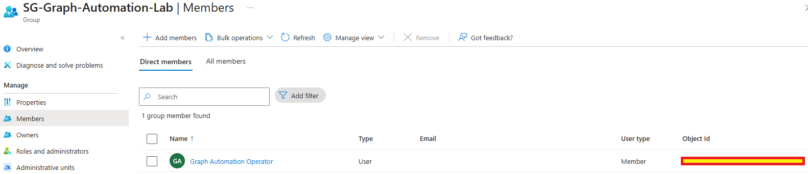

**Shows:** `Graph Automation Operator` appears as the group's direct member.

**Why it matters:** Independently corroborates the membership result shown in PowerShell.

## 10 — Conditional Access Administrator role definition

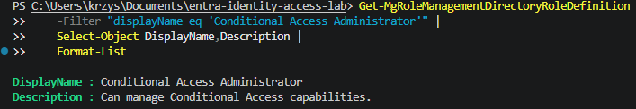

**Shows:** Graph returns the `Conditional Access Administrator` definition and description.

**Why it matters:** Demonstrates role discovery; permission to read a role definition does not authorize assigning it.

## 11 — Role-assignment dry run

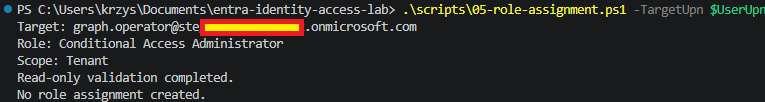

**Shows:** The script prints the target user, role and tenant scope and reports read-only validation without creating an assignment.

**Why it matters:** Documents the captured dry-run behavior; this output is not a separate before/after audit of directory writes.

## 12 — Role assignment denied to adm-lab

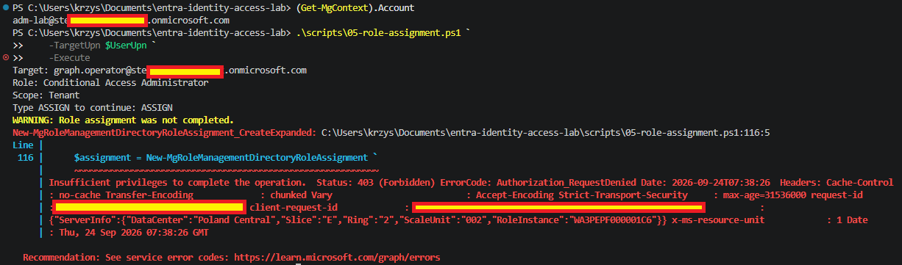

**Shows:** After an explicit assignment request, Graph returns `403 Forbidden / Authorization_RequestDenied` in the `adm-lab` context.

**Why it matters:** Demonstrates the real authorization boundary for the privileged operation.

## 13 — Authorized direct role assignment

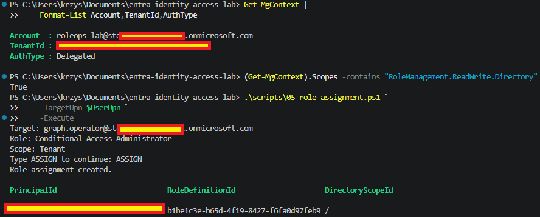

**Shows:** A delegated `roleops-lab` context includes `RoleManagement.ReadWrite.Directory`; the operation reports `Role assignment created` at tenant scope.

**Why it matters:** Records the successful direct assignment. It is not PIM Eligible access or a time-limited activation; Day 18 separately evidences removal.

## 14 — Partial local tenant inventory export

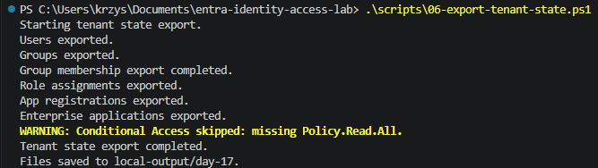

**Shows:** The script reports CSV exports for users, groups, memberships, roles, App Registrations and Enterprise Applications; Conditional Access is skipped because `Policy.Read.All` is absent.

**Why it matters:** Preserves the six-category result of this run. The raw CSV contents are unpublished, and a separate successful query does not prove CA CSV creation.

## 15 — App Registration and Service Principal queries

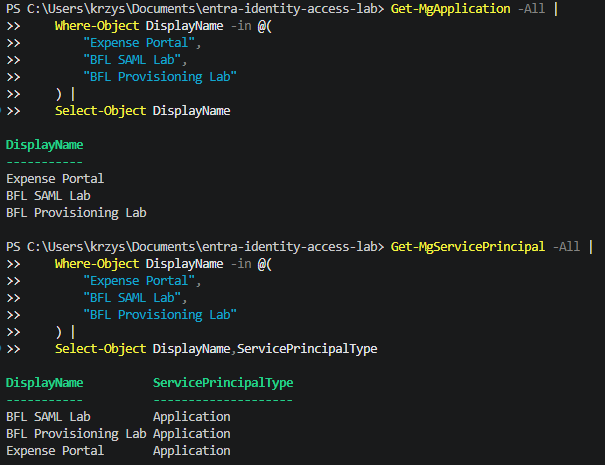

**Shows:** Separate `Get-MgApplication` and `Get-MgServicePrincipal` queries return Expense Portal, BFL SAML Lab and BFL Provisioning Lab.

**Why it matters:** Demonstrates the distinction between application definitions and their tenant Service Principals.

## 16 — Conditional Access policy query

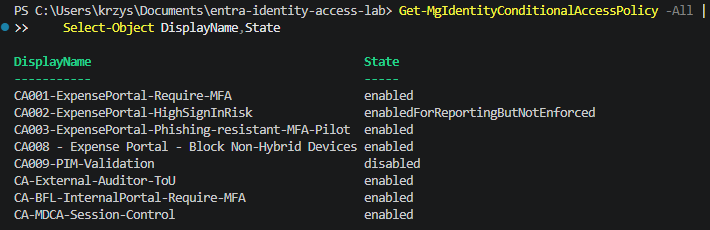

**Shows:** A separate Graph query returns eight Conditional Access policies and their states, including Report-only `CA002` and disabled `CA009`.

**Why it matters:** Confirms policy-query access at capture time; it does not change the skipped CSV-export result in screenshot 14 or prove enforcement.

## 17 — Audited Graph user creation

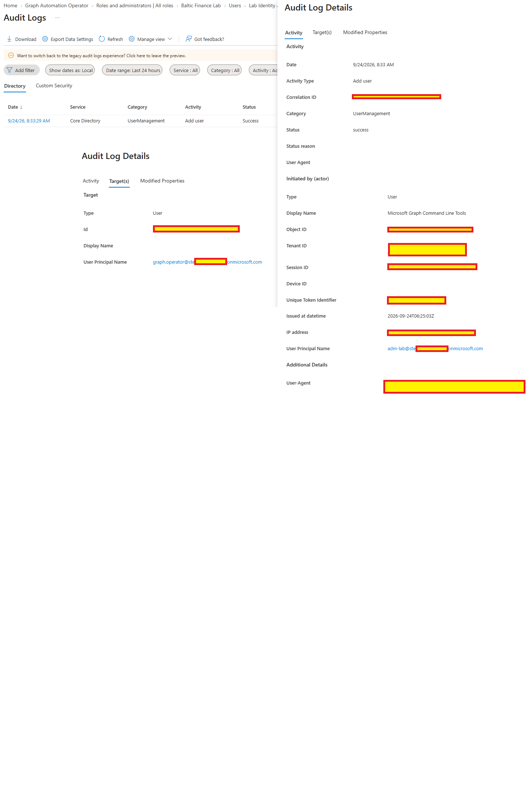

**Shows:** Entra Audit Logs record successful `Add user` for `graph.operator`, initiated by `adm-lab` through Microsoft Graph Command Line Tools.

**Why it matters:** Corroborates the original provisioning action alongside the existing-user captures in screenshots 04–05.

