# Day 18 — Security Assessment and Final Validation — Evidence

This folder documents the final security assessment of the Baltic Finance Lab. The review validates privileged access, emergency access, PIM, authentication, Conditional Access, external governance, application permissions, workload identities and centralized monitoring. It also closes selected evidence gaps from earlier lab days and records remediation only where it was actually verified.

## 01 — Assessment tenant baseline

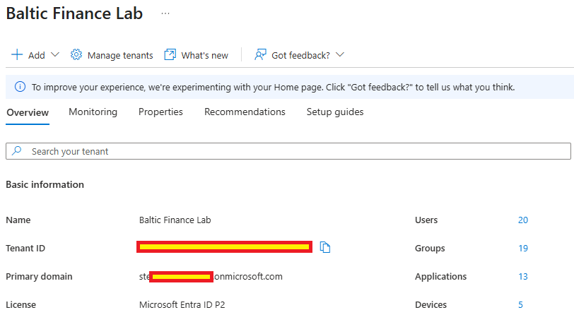

**Shows:** The Baltic Finance Lab overview displays Entra ID P2 and counts of 20 users, 19 groups, 13 applications and five devices.

**Why it matters:** Records the assessment snapshot; the tenant license label alone does not verify feature licensing for every user.

## 02 — Microsoft Graph inventory rerun

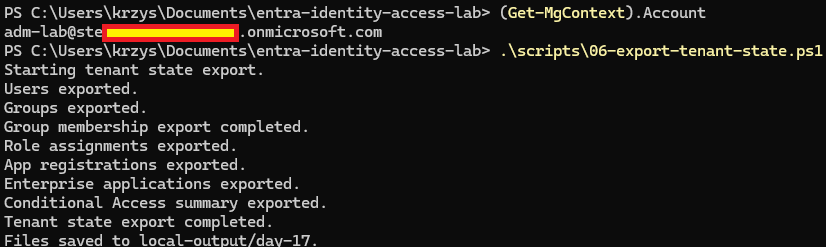

**Shows:** The export output reports success for users, groups, memberships, roles, App Registrations, Enterprise Applications and the Conditional Access summary.

**Why it matters:** Supplies the CA-export output missing on Day 17. Unpublished CSV contents cannot be independently checked for completeness.

## 03 — Eligible Conditional Access Administrator assignment

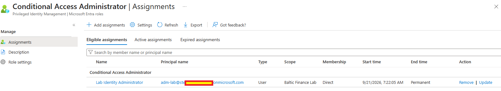

**Shows:** `adm-lab` has a Direct, Permanent Eligible assignment for `Conditional Access Administrator`.

**Why it matters:** Distinguishes eligibility for activation from standing Active administrative privilege.

## 04 — No Active assignment for the reviewed role

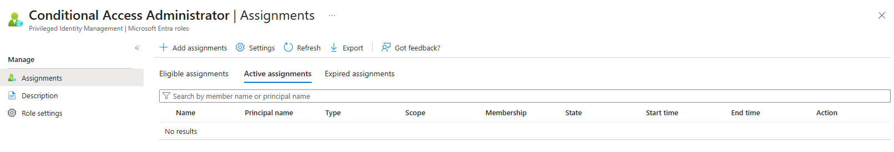

**Shows:** The `Conditional Access Administrator` Active assignments view returns `No results`.

**Why it matters:** Confirms the role-specific state at capture time; it is not an inventory of every privileged role in the tenant.

## 05 — Audited removal of the Day 17 test role

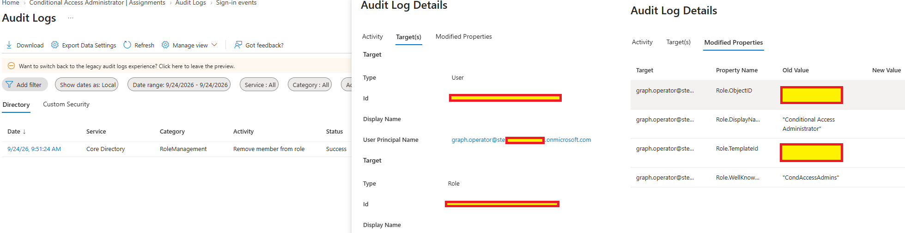

**Shows:** Audit Logs record `Remove member from role → Success` for `graph.operator`; modified properties identify `Conditional Access Administrator`.

**Why it matters:** Provides independent cleanup evidence for the direct test assignment created on Day 17.

## 06 — Emergency roles and reported CA exclusions

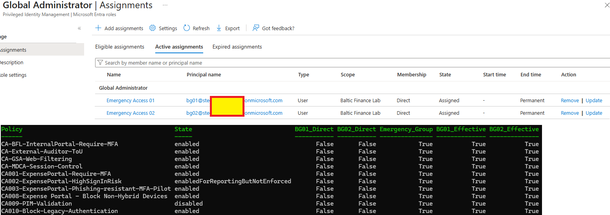

**Shows:** `Emergency Access 01` and `Emergency Access 02` hold permanent Active Global Administrator assignments. Console output reports group-based effective exclusions across ten CA policies.

**Why it matters:** Confirms the emergency role assignments. The exclusion review's source and group-membership inputs are absent, so its reported effective exclusions cannot be independently recalculated.

## 07 — Current PIM Eligible assignment

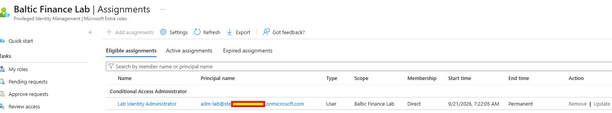

**Shows:** The tenant PIM Eligible assignments view lists `adm-lab` as permanently Eligible for `Conditional Access Administrator`.

**Why it matters:** Corroborates retention of the Just-in-Time administration model documented on Day 09.

## 08 — PIM activation security settings

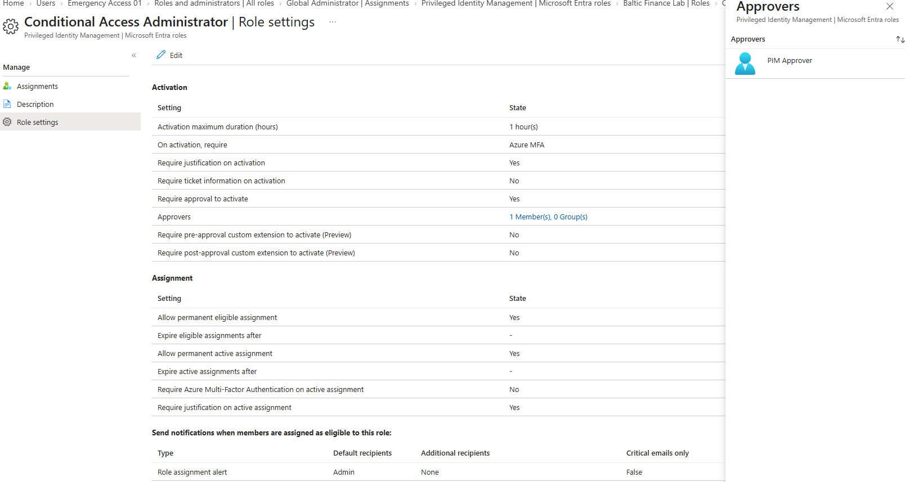

**Shows:** Activation is limited to one hour and requires Azure MFA, justification and approval by `PIM Approver`; the role policy also permits permanent Active assignments.

**Why it matters:** Documents activation controls and the remaining policy allowance. It is configuration evidence, not a new activation test.

## 09 — Authentication method availability and scope

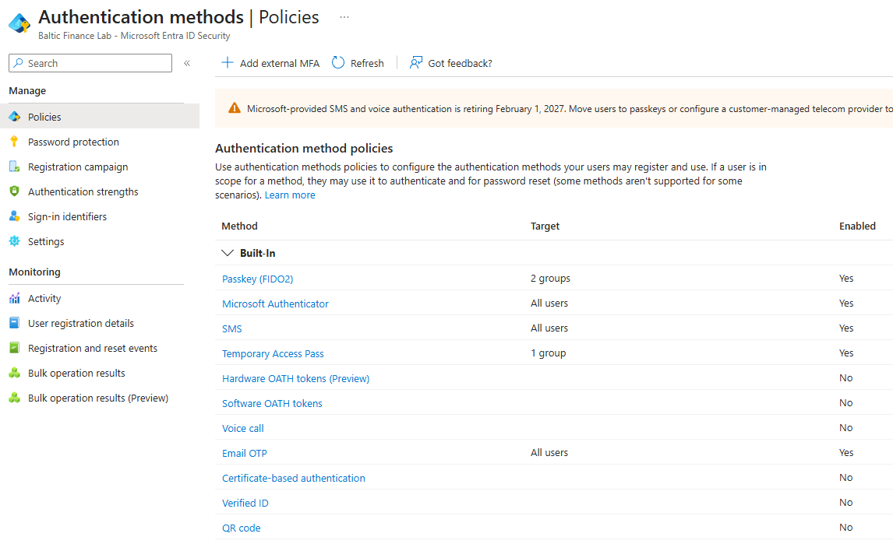

**Shows:** Passkey (FIDO2), Microsoft Authenticator, SMS, Temporary Access Pass and Email OTP are enabled for their displayed scopes.

**Why it matters:** Records available methods and targeting; broad SMS availability does not mean it satisfies phishing-resistant Authentication Strength requirements.

## 10 — Phishing-resistant MFA pilot policy

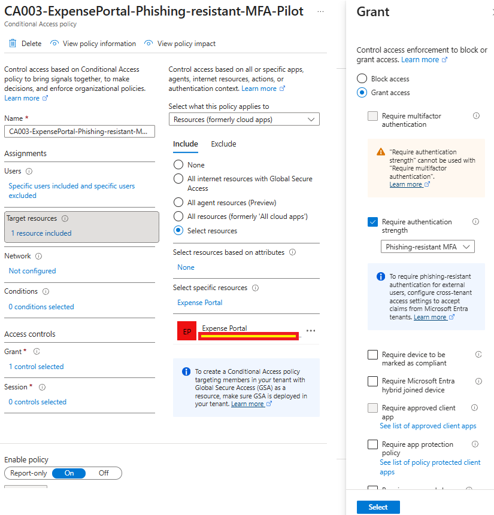

**Shows:** `CA003-ExpensePortal-Phishing-resistant-MFA-Pilot` is On, targets Expense Portal and requires `Phishing-resistant MFA` for its selected users.

**Why it matters:** Documents the scoped stronger-access requirement; it does not establish coverage of every Expense Portal user.

## 11 — Conditional Access policy inventory

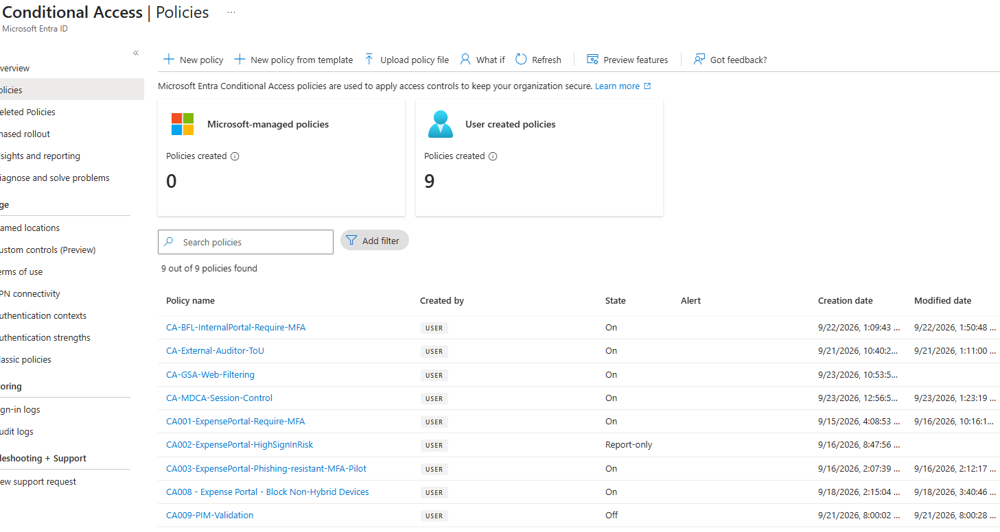

**Shows:** The portal lists nine policies and their states, including `CA002-ExpensePortal-HighSignInRisk` in Report-only and `CA009-PIM-Validation` Off.

**Why it matters:** Records a point-in-time inventory. `CA010-Block-Legacy-Authentication` appears in the later ten-policy output in screenshot 06.

## 12 — Conditional Access What If prediction

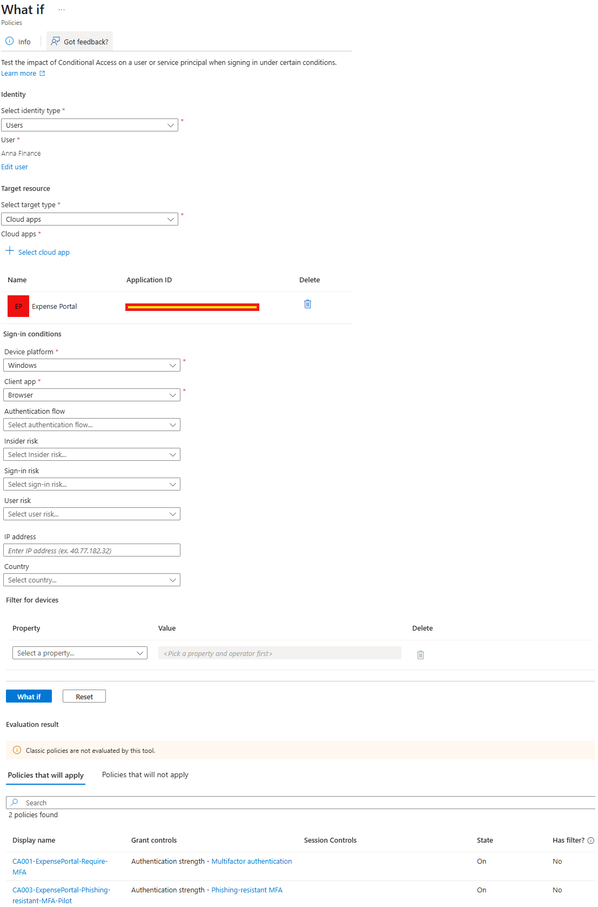

**Shows:** What If evaluates Anna Finance accessing Expense Portal from Windows with a browser and predicts that `CA001` and `CA003` apply.

**Why it matters:** Provides a policy simulation to compare with actual sign-in evidence; the simulation itself does not execute a sign-in.

## 13 — Actual Expense Portal policy evaluation

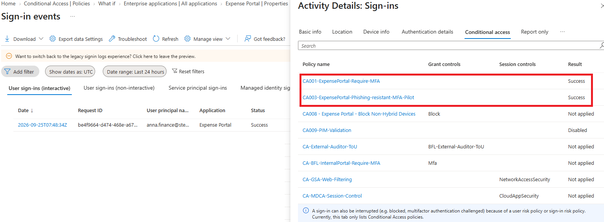

**Shows:** Anna's successful Expense Portal sign-in at `07:48:34Z` shows `CA001` and `CA003` with Success, alongside other Not applied or Disabled outcomes.

**Why it matters:** Confirms the predicted policies evaluated successfully on a real event. Authentication-method details are not shown in this view.

## 14 — External contractor group final state

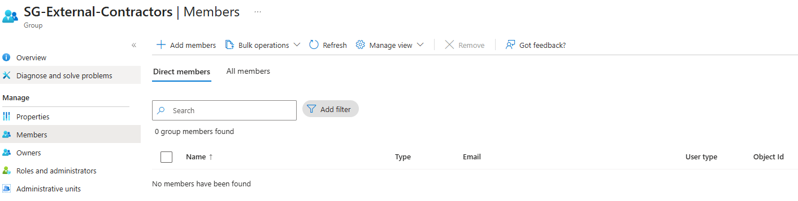

**Shows:** `SG-External-Contractors` contains zero direct members.

**Why it matters:** Records the final membership state of the governed access group; this is not the Access Review decision screen.

## 15 — External Access Package lifecycle policy

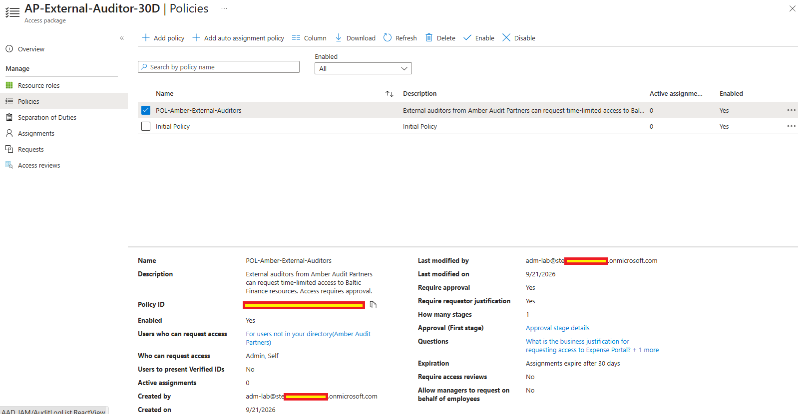

**Shows:** `POL-Amber-External-Auditors` is enabled, requires justification and one-stage approval, expires assignments after 30 days and has zero active assignments.

**Why it matters:** Documents the selected policy's governance controls; the separately visible `Initial Policy` is not assessed here.

## 16 — External Auditor assignment history

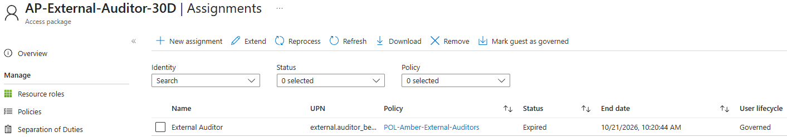

**Shows:** External Auditor's Access Package assignment is `Expired` and `Governed`, with a future configured end date still displayed.

**Why it matters:** Records the final assignment status. It does not prove natural 30-day expiration and is consistent with the earlier manual revocation workflow.

## 17 — External Auditor denied Expense Portal access

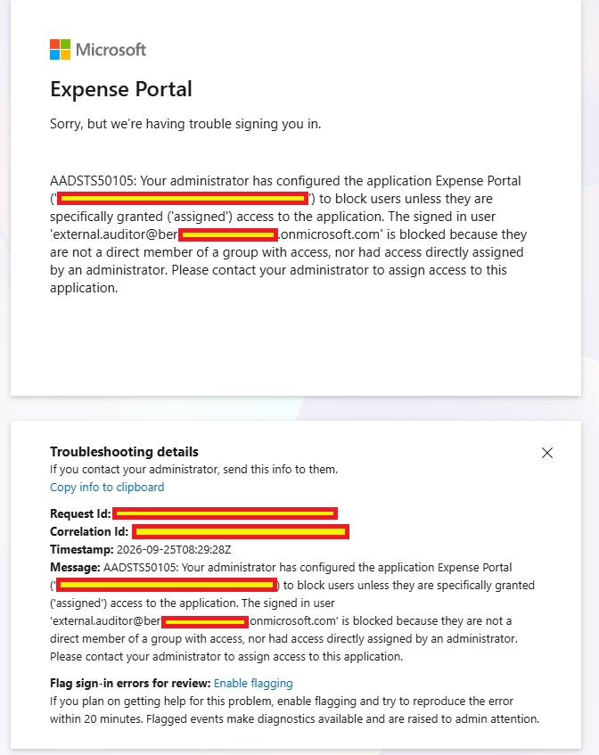

**Shows:** The guest's Expense Portal attempt fails with `AADSTS50105` because no direct or qualifying group application assignment is present.

**Why it matters:** Demonstrates a fresh negative access result for this application, without claiming all possible guest access paths were reviewed.

## 18 — Configured App Registration permissions

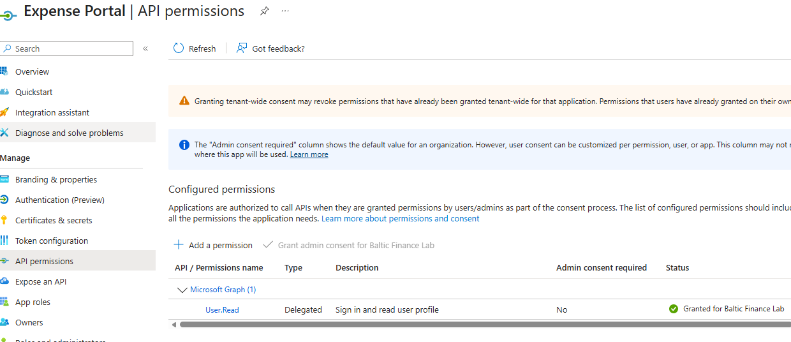

**Shows:** Expense Portal's configured API permissions contain only Microsoft Graph `User.Read`, Delegated, with tenant consent granted.

**Why it matters:** Shows the temporary `User.Read.All` Application permission is no longer configured; the actual consent grant is reviewed separately.

## 19 — Enterprise Application consent grant

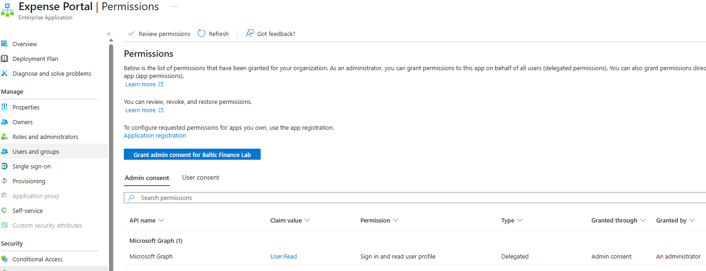

**Shows:** Expense Portal's Enterprise Application Admin consent view lists Microsoft Graph `User.Read` as Delegated.

**Why it matters:** Corroborates the granted permission behind the configured scope; the separate User consent tab is not displayed.

## 20 — Easy Auth credential reference

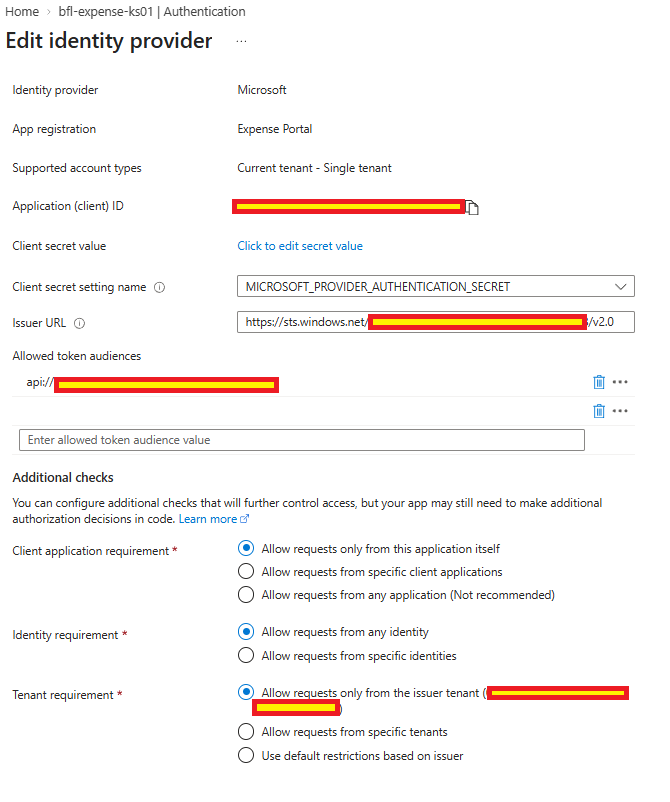

**Shows:** App Service Authentication uses the Microsoft provider linked to Expense Portal, with single-tenant accounts and client secret setting `MICROSOFT_PROVIDER_AUTHENTICATION_SECRET`.

**Why it matters:** Documents the provider's credential reference without exposing its value. The screen does not establish secret validity, expiry, rotation or token refresh.

## 21 — Expense Portal regression session

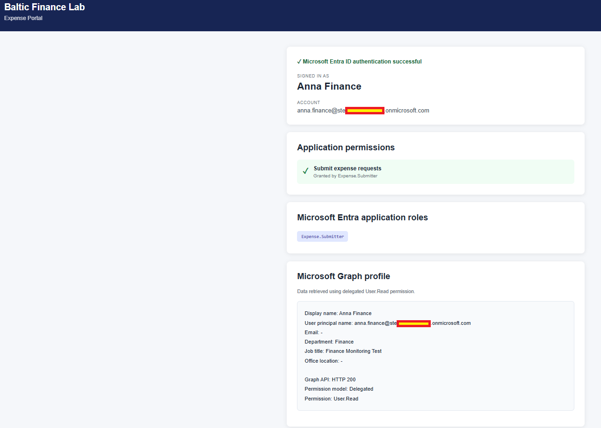

**Shows:** Anna's captured session displays `Expense.Submitter` and a Graph profile with HTTP 200 using delegated `User.Read`.

**Why it matters:** Confirms the displayed session and Graph response. Fresh authorization-code redemption, token refresh and the exact configuration-to-session chronology are not independently shown.

## 22 — Storage reader assignments for both identities

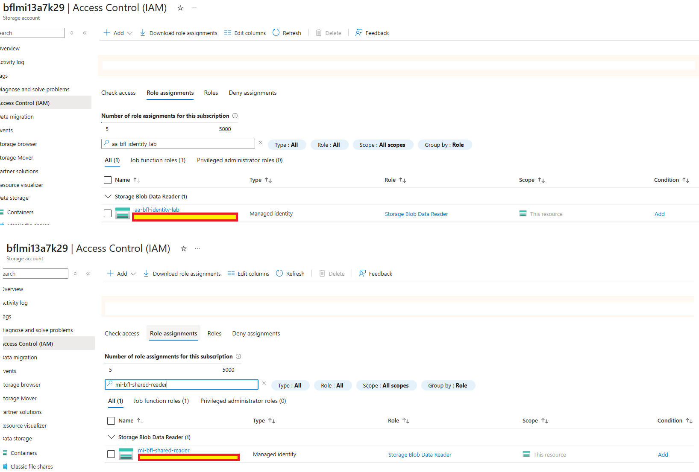

**Shows:** Name-filtered Storage IAM views list `aa-bfl-identity-lab` and `mi-bfl-shared-reader` with `Storage Blob Data Reader` at the Storage Account resource scope.

**Why it matters:** Corroborates the Day 13 reader assignments, not all effective permissions. The blanked banner text cannot establish resolution of an earlier elevated-access warning.

## 23 — Centralized diagnostic coverage

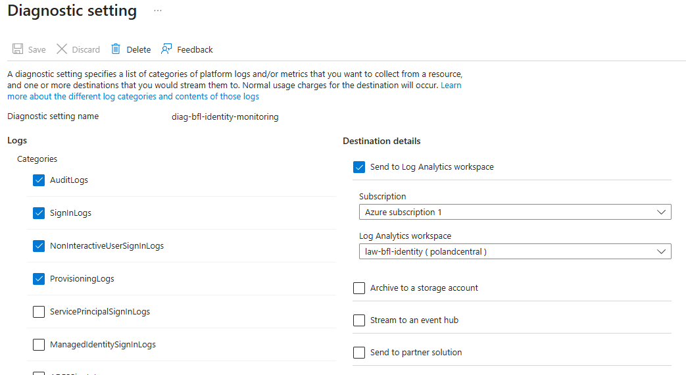

**Shows:** `diag-bfl-identity-monitoring` selects Audit, interactive/non-interactive user Sign-in and Provisioning logs for `law-bfl-identity`; Service Principal and Managed Identity sign-ins are not selected.

**Why it matters:** Documents the workload-monitoring gap and configured destination; selected categories alone do not prove ingestion into every table.

## 24 — Conditional Access outcomes in Log Analytics

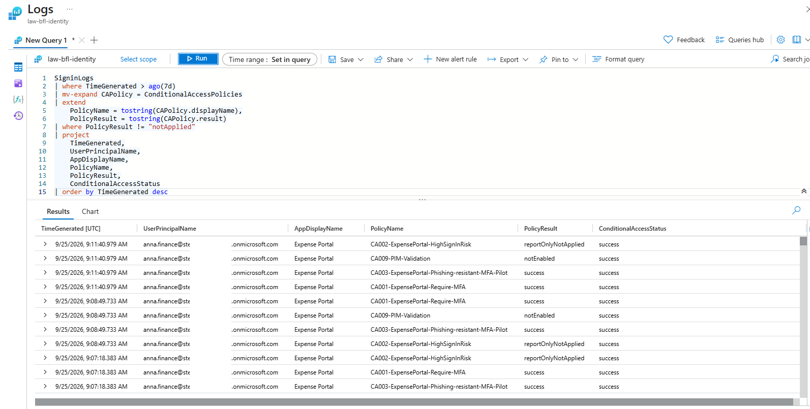

**Shows:** A seven-day query expands `ConditionalAccessPolicies`; visible Expense Portal rows show `CA001` / `CA003` success, `CA002` reportOnlyNotApplied and `CA009` notEnabled.

**Why it matters:** Corroborates policy outcomes on other sign-ins than screenshot 13. The query has no app filter and excludes only `notApplied`, retaining report-only and disabled results.

## 25 — Final Identity Secure Score snapshot

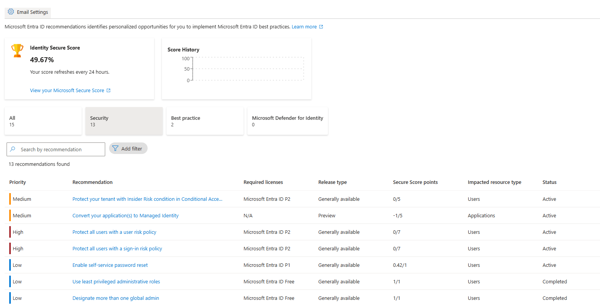

**Shows:** Identity Secure Score is `49.67%`, with 15 total recommendations: 13 Security and two Best practice. User-risk and sign-in-risk policy recommendations remain Active.

**Why it matters:** Records an observed increase from the Day 16 baseline of `43.82%`; the snapshot does not attribute that change to a specific remediation or prove complete security or compliance.

Sensitive credentials, identifiers and tenant-specific values were redacted before publication.
